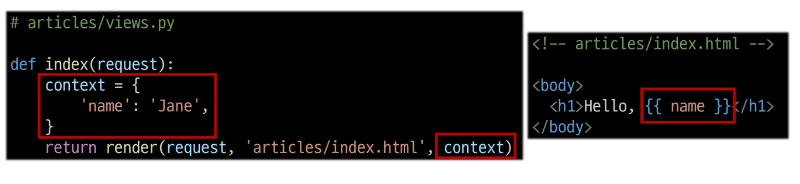
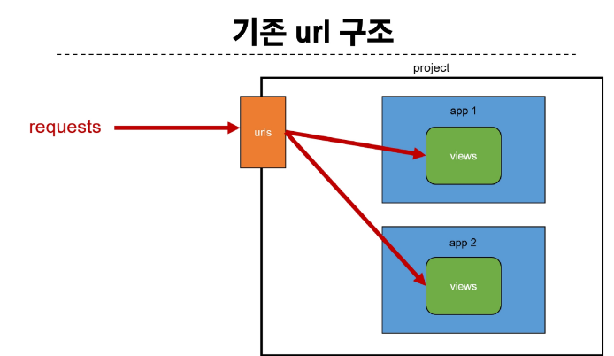
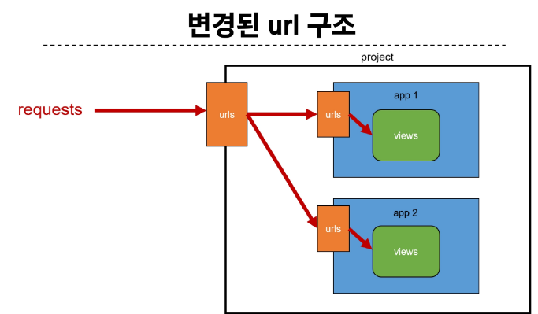
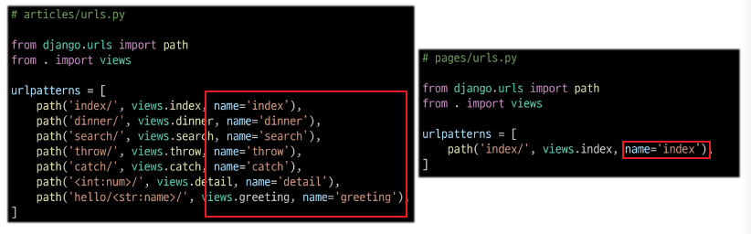
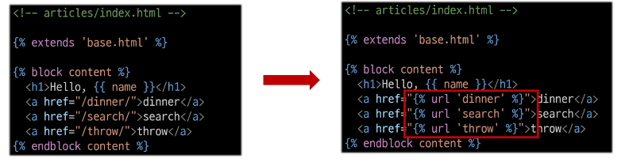
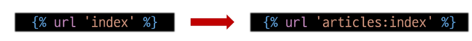

# Django Template System
- 데이터 표현을 제어하면서, 표현과 관련된 부분을 담당

## HTML의 컨텐츠를 변수 값에 따라 변경하기


## Django Template Language (DTL)
- Template에서 조건, 반복, 변수등의 프로그래밍적 기능을 제공하는 시스템

### DTL Syntax
1. Variable
  - render 함수의 세번째 인자로 딕셔너리 데이터를 사용
  - 딕셔너리 key에 해당하는 문자열이 template에서 사용 가능한 변수명이 됨
  - dot ('.')을을 사용하면 변수 속성에 접근할 수 있음
2. Filters
  - 표시할 변수를 수정할 때 사용 (변수 + | + 필터)
  - chained(연결) 이 가능하며 일부 필터는 인자를 받기도 함
  - 약 60개의 built-in template filter를 제공
  ```py
  {{ variable|filter}}
  {{ name|truncatewords:30}}
  ```
3. Tags 
  - 반복 또는 논리를 수행하여 제어 흐름을 만듦
  - 일부 태그는 시작과 종료 태그가 필요함
  - 약 24개의 built-in template tags를 제공
  - 출력이 되지는 않음
  ```py
  
   
  ```
4. Comments
  - DTL에서의 주석
  ```py
  
  ...
  
  ```

## 템플릿 상속 (Template inheritance)
- 페이지의 공통요소를 포함하고 하위 템플릿이 재정의 할 수 있는 공간을 정의하는 기본 'skeleton' 템플릿을 작성하여 상속 구조를 구축

### 상속 관련 DTL 태그
- extends 태그
  - 자식 템플릿이 부모 템플릿을 확장한다는 것을 알림
  - 반드시 자식 템플릿 최상단에 작성 (1개만 작성 가능)

- block 태그
  - 자식 템플릿에서 재정의 할 수 있는 블록을 정의
  - 부모 템플릿에 작상하며 자식 템플릿이 작성할 수 있는 공간을 지정하는 것


## 요청과 응답
### 데이터를 복내고 가져오기
- HTML 'form' element를 통해 사용자와 애플리케이션 간 상호작용 이해

### 'form' element
- 사용자로부터 할당된 데이터를 서버로 전송
  - 웹에서 사용자 정보를 입력하는 여러 방식 (text, password, checkbox 등)을 제공 

### HTML form 핵심 속성
- 'action' & 'method'
- form의 핵심 속성 2가지
- 데이터를 어디(action)로 어떤 방식(method)으로 요청할지

- action
  - 입력 데이터가 전송될 URL을 지정 (목적지)
  - 지정하지 않는다면 현재 form이 있는 페이지의 URL로 보내짐

- method
  - 데이터를 어떤 방식으로 보낼 것인지 정의
  - 데이터의 HTTP request methods (GET, POST)를 지정

- 'input' element
  - 사용자의 데이터를 입력받을 수 있는 요소
  - type 속성 값에 따라 다양한 유형의 입력 데이터를 받는다.
    - 핵심속성 - 'name'
      - input의 핵심 속성
      - 사용자가 입력한 데이터에 붙이는 이름(key)
      - 데이터를 제출했을 때 서버는 name 속성에 설정된 값을 통해서만 사용자가 입력한 데이터에 접근할 수 있음

### Query String Parameters
- 사용자의 입력 데이터를 URL 주소에 파라미터를 통해 서버로 보내는 방법
- 문자열의 앰퍼샌드 ('&') 로 연결된 key=value 쌍으로 구성되며, 기본 URL과는 물음표 ('?') 로 구분 됨
- ex) http://host:port/path ? key=value & key=value

## Django URLs
### URL dispatcher (운항 관리자, 분배기)
- URL 패턴을 정의하고, 해당 패턴이 일치하는 요청을 처리할 view 함수를 연결 (매핑)

### Variable Routing
- 템플릿의 많은 부분이 중복되고 URL일부만 변경되는 상황이라면?
- URL 일부에 변수를 포함 시키는 것 (변수는 view함수의 인자로 전달할 수 있음)

### Variable Routing 작성법
<path_converter:variable_name>
```py
ex) path('articles/<int:num>', views.detail)
```

### Path converters
- URL 변수의 타입을 지정 (str, int 등 5가지 타입 지원)
- urls.py 에서 생성 시 설정
- view에서 인자로 받고
- html에서 출력

## App URL 정의
### App URL mapping
- 각 앱에 URL을 지정하는 것
  - 프로젝트와 각 앱이 URL을 나누어 관리를 편하게 하기 위함
  
  

### include()
- 프로젝트 내부 앱들의 URL을 참조할 수 있도록 매핑하는 함수
  - URL의 일치하는 부분까지 잘래내고, 남은 문자열 부분은 후속 처리를 위해 include 된 URL로 전달


## URL 이름 지정
### Naming URL patterns
- URL에 이름을 지정하는 것 (path 함수의 name 인자를 정으해서 사용)

### Naming URL patterns 적용
- path 함수의 name 키워드 인자를 정의
  

### URL 표기 변화
- url을 작성하는 모든 곳에서 변경
  (a 태그의 href 속성 값 뿐만 아니라 form의 action 속성 등도 포함)
  
  

## DTL URL tag
- 주어진 URL 패턴의 이름과 일치하는 절대 경로 주소를 반환
  ```py
  
  ```

## URL 이름 공간
- 앱이 여러개가 될 경우 url 이름이 중복될 수 있기 때문에
- 이름 앞에 구분할 수 있는 key를 붙혀준다.
- 각각의 urls.py에서 app_name = ''을 활용하여 처리

### URL tag의 최종 변화
- 마지막으로 url 태그가 사용하는 모든 곳의 표기 변경하기
  ```py
  
  ```
  
