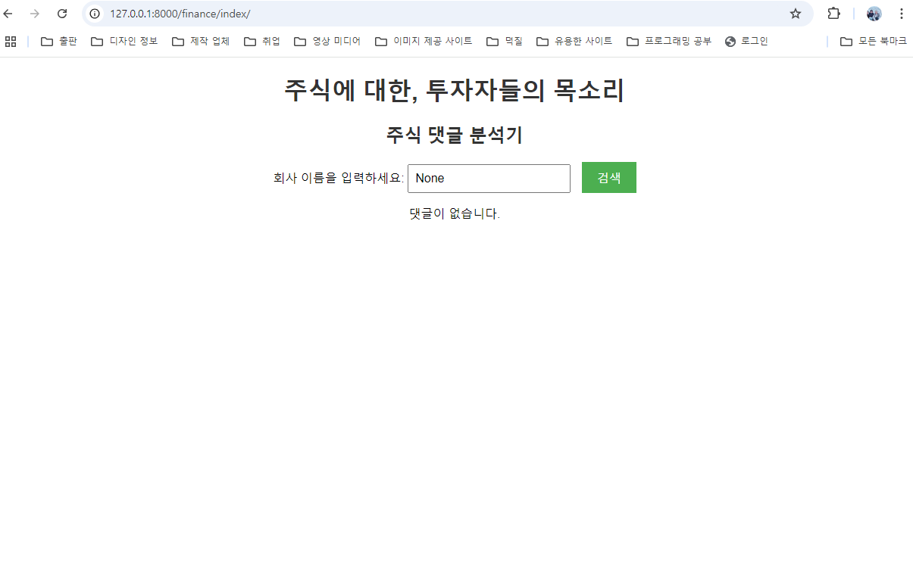
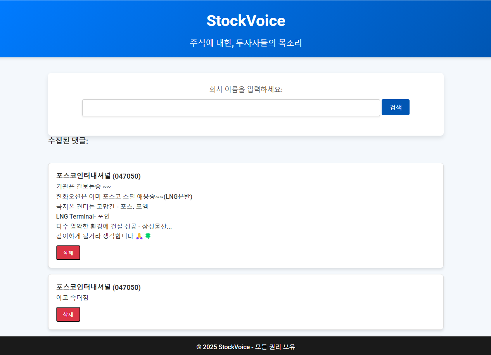

### <역할 분배>

  저희 팀은 금융 프로젝트를 진행했습니다. 협업해서 개발하는 것은 처음이라 어려웠지만 옆자리에 앉아 소통하며 프로젝트를 완성했습니다. 저는 Django 프로젝트와 앱의 전반적인 코드를 작성하는 역할을 맡았고, 재희님은 크롤링을 통해 주식 종목의 토론 데이터를 수집하는 역할을 맡았습니다. 

### <학습한 내용, 배우고 느낀점>

  지금까지 django 시간에 배운 것들을 복습하며 활용하고, 새로운 기능들도 찾아서 학습하는 계기가 되었습니다. 

  구체적으로 설명하자면, 프로젝트와 앱을 생성하고 등록하는 법, urls.py, views.py, index.html 등에서 적절한 코드를 작성하고 연결해서 웹 페이지를 제작하는 법, 원하는 디자인을 css와 html로 구현하는 법을 배웠습니다. 

  기능적인 부분을 구현한 후엔, 추가적으로 UI 도 개선했습니다. 다크블루 톤 배경색과 흰색 텍스트를 사용하여 금융권의 전문적인 느낌을 강조했습니다. 입력 텍스트 박스를 중앙에 정렬하고, 깔끔하게 구분된 입력 폼을 배치하여 사용자가 쉽게 정보를 입력할 수 있게 했습니다. 또한 검색 버튼과 삭제 버튼에 호버 효과를 추가하여 클릭 가능성을 강조했습니다. 

### <어려웠던 부분>

  어려웠던 부분은 공동 개발자의 작업이 완료되어야만 할 수 있는 작업들이 있어서 혼자 작업할 때처럼 진행할 수 없다는 점이었습니다. 하지만 프로젝트가 복잡해지면 협업이 훨씬 효율적인 방식이 된다는 것을 느끼는 계기도 되었습니다. 

  또한 로고 이미지를 삽입하는 부분도 어려웠는데, html 최상단에 를 삽입하고, 이미지 파일 경로를 제대로 설정해주어서 문제는 해결되었지만, ai로 생성한 로고의 퀄리티가 마음에 들지 않아서 최종 버전에서는 제거했습니다. 

 git을 통해서 branch를 생성하고 파일을 주고받으며 작업했는데, 크롤링한 데이터를 DB에 넣는 과정에서 문제가 있었지만 코드를 수정해서 해결되었습니다. 

<초기 페이지> 

<최종 페이지>

