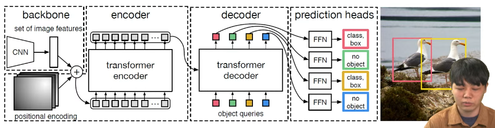

# PyTorch로 배우는 객체 탐지와 딥러닝 기초
## DNN (Deep Neural Network)
- 인간의 신경망을 모사해 원하는 결과를 내도록 만든 알고리즘
- 퍼셉트론
  - 여러 개의 입력 신호에 대해 가중치를 곱해 최종 output을 내는 구조

- MLP (Multi-Layer Perceptron)
  - 퍼셉트론을 여러 층으로 누적시켜 복잡한 모델링을 할 수 있게 만드는 것
  - 

- 딥러닝에서의 학습 ?
  - 원하는 y 값을 얻기 위해 w 값들을 튜닝하는 과정

- Loss 함수
  - x 를 넣었을 때 지금의 y 값과 원하는 y 값과 얼마나 차이가 나는지 수치로 나타낸 값
  - ex) MSE (Mean Squared Error)
  
- Loss 함수를 torch 에 입력하면 학습 과정에서 loss 함수를 줄이는 방향으로 weight를 조정해줌
  - 학습이 완료되면 x 를 넣었을 때 우리가 원하는 y 값이 나오게 됨


## 객체 검출 알고리즘의 평가 지표
### IoU (Intersection over Union)
- Bounding box 가 ground truth box와 얼마나 일치하는지 나타내는 지표
- 0 ~ 1 사이의 값을 가짐
- **모델을 학습 시키기 위한 loss로 활용**


### Precision 과 Recall
- Precision : positive 로 예측한 값 중 실제 positive 의 비율 (TP / TP + FP)
- Recall : 실제값이 positive 인 대상 중 예측값이 positive 로 나온 비율 (TP / TP + FN)
  
- Object Detection 에서의 적용
  - IoU 수치를 기준으로 TP, FP, FN 을 구분함


### Confidence
- 객체 검출이 얼마나 신뢰할 수 있느냐? 에 대한 값 (네트워크가 예측한 출력값) 
- Confidence 의 Threshold를 설정하여 그 이상의 값을 가지는 객체만 Output으로 출력하게 됨

#### Confidence Threshold 특성
- Threshold 에 따라 Precision 과 Recall 값이 달라짐
- Threshold 수치가 높으면 Precision 높고 Recall 낮음 <-> Threshold 수치가 낮으면 Precision 낮고 Recall 높음

#### 예시
- Threshold = 0.6 -> 1, 2, 5 번 출력
- Threshold = 0.45 -> 1, 2, 4, 5 번 출력


### PR Curve
- Confidence Threshold 에 따라 Precision 과 Recall 을 그래프로 나타냄

#### Average Precision (AP)
- PR Curve의 아래 영역의 넓이 
- 0 ~ 1 사이의 값을 가짐

#### Mean Average Precision (mAP)
- 모든 class에 대해 AP의 평균을 나타냄 
- Object Detection 에서 가장 많이 쓰이는 지표


## YOLO (You Only Look Once)
- 빠르고 정확하게 객체를 탐지할 수 있음 (어느 정도의 성능 보장)
- Classification 과 Localization 문제를 한 번에 처리
- 기존보다 빠르고 real-time으로 객체 탐지 가능

### YOLO 동작 방식
1. Resize image
- CNN network input size 에 맞게 image 크기를 조정

2. CNN 네트워크 동작
- 여러 개의 bounding box 후보를 추출하고 각 bounding box의 class 를 계산

3. Non-max supperession (NMS)
- 추출된 bounding box 에서 신뢰도가 높은 bounding box만 남김


#### YOLO는 이미지 영역을 S x S 의 Grid cell로 나누었음
- 각 grid cell 의 output은 총 B * 5 + C 의 channel 을 가짐

- Bounding box channel (B * 5)
  - 각 grid cell 에 대해 상대 좌표로 bounding box 후보 추출
  - 해당 bounding box가 얼마나 신뢰가능한지 여부도 계산 (Confidence)

- class probability map channel (C)
  - 각각의 grid cell은 어떤 물체 class에 속할지 확률을 계산
  - Bounding box 가 어떤 cell 에서 나왔는가에 따라 각 box의 class를 결정


- 학습 loss
  - 각 box 별 bounding box 위치 정확도
  - 예측된 Confidence 의 정확도
  - 예측된 Class 의 정확도

- 최종 Output
  - 학습이 완료되면 총 S * S * B 개의 Bounding box 후보가 출력됨
  - 신뢰도 높은 후보와 낮은 후보 모두 존재

- 너무 많은 후보 bounding 박스가 출력되기 대문에 아래 과정을 수행
### Non-max supperession (NMS) 를 활용해 신뢰도가 높은 bounding box 만 남김
- 동작 방식
  1. confidence 가 가장 높은 bounding box를 찾음
  2. 다른 box 중 선택한 box 와 overlap 정도가 높은 box 를 찾고
  3. overlap 이 가장 많이 일어나는 bounding box를 제거
  4. 1번으로 돌아가 3번까지 과정을 반복한다.


## DETR (DEtcetion TRansformer)
- 기존 objcet detetcion 의 한계 극복을 위해 나온 모델
- 한계
  1. Bounding Box를 실제 물체보다 많이 뽑고 NMS로 줄임
  2. NMS의 한계
    - overlap 되는 bounding box를 모두 지워버리기 때문에 겹쳐있는 물체 를 잘 인식하지 못함

### DETR의 특징
- Transformer Encoder-Decoder 구조 사용
- 기존 CNN 보다 더 적은 수의 Bounding Box 출력
- NMS 사용하지 않음
- YOLO 계열보다 복잡한 구조, 연산량은 많지만 성능은 뛰어남



### DETR 출력값
- DETR에서 사용되는 방식
  - 총 N개의 Bounding box 후보군 출력
  - 각 Output 은 5개의 feature를 가짐
  - (x, y 좌표 + h, w + class 정보)

- NMS 대체 법
  - 일부 bounding box 후보는 no-object class 를 출력
  - 해당 class를 bounding box 는 무시함

### DETR 학습
- 학습 Loss
  - N 개의 Output 과 M 개의 object 를 매칭
  - M개의 output 과 M 개의 GT가 매칭되면 그에 대한 generalized IoU loss 계산
    - 각 pair 가 얼마나 fit 하게 맞아 떨어지는지 계산해주는 함수 - 헝가리안 알고리즘 활용

  - class 에 대한 loss 계산
    - matching 되지 않은 bounding box 는 no-object class 로 학습

  - MNS 기반 알고리즘과 달리 겹쳐 잇는 object에 대해서도 detection 가능


## MMDetection
- PyTorch 기반 Open Source 객체 검출 알고리즘 library
- YOLO, DETR 뿐만 아니라 다양한 객체 검출 알고리즘 구현

- 사전 설치
  - Python 3.7 +
  - CUDA 9.2 +
  - PyTorch 1.8 +

- MMEngine 및 MMCV 설치
```shell
pip install -U openmim
mim install mmengine
mim install "mmcv>=2.0.0" <- mim install mmcv==2.0.0 (mmdet과의 호환성 이슈)
```

- MMDetection 설치
```shell
# git clone https://github.com/open-mmlab/mmdetections.git
git clone https://github.com/open-mmlab/mmdetection.git
cd mmdetcetion
pip install -v -e .
```
  - 설치 중 torch 에러가 발생할 경우
    - pip install wheel 후 재설치
    - torch 를 1.13.0 버전 이하로 설치 후 재설치


### 여기부터 하기
- MMDetection 설치 확인 코드
```shell
mim download mmdet --config rtmdet_tiny_8xb32-300e_coco --dest .
```
  - output/vis 폴더에 이미지가 생성된다면 성공

### Dataset 다운로드
- COCO 2017 데이터
  - MMDetection 폴더로 이동 후

```shell
python tools/misc/download_dataset.py --dataset-name coco2017
```

### Data visualize 예시


### Dataset Customization


### Train 및 Test
- Train code
  - python tools/train.py &{CONFIG_FILE}
  - CONFIG_FILE 변경을 통해 학습 방법, 모델 등을 바꿀 수 있음
  - [참고](https://mmdetection.readthedocs.io/en/latest/user_guides/train.html)

- Test code
  - python tools/test.py ${CONFIG_FILE}${CHECKPOINT_FILE}

  - 학습이 완료되면 work_dirs 폴더에 .pth 파일이 저장됨
  - 이를 테스트 set에 대해 실험해보거나 visualize 할 수 있음
  - [참고](https://mmdetection.readthedocs.io/en/latest/user_guides/test.html)
<br>


### CONFIG_FILE 수정
- 학습 전 수정할 수 있는 영역
  - 네트워크 model 구조
  - data pre-processing 및 data augmentation 방식
  - 학습시간 및 learning late 등

- 해당 file 내에서 dict 형태로 구조와 기타 parameter 등 정의되어 있음
- MMDetection 에서 해당 file 을 읽어서 미리 지정되어 있는 모듈을 불러오게 되는 방식

### Mode Customization
- 원하는 모델로 설정가능

- 예시) ResNet
- mmdet/models/backbones/resnet.py 의 ResNet class

- \_\_init\_\_ 함수 : 모델을 어떻게 설정할지 정의해 둠
- Forward 함수 : 실제 model 이 돌아갈 때 어떻게 동작할지 순서 등을 정의해 둠

