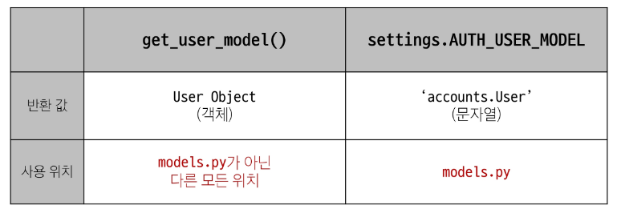

# Many to on relationships 2
## User와 다른 모델 간 모델 관계 설정
1. User & Article
2. User & Comment

### Article - User 모델 관계 설정
- User 외래 키 정의
```py
# articles/models.py
from django.conf import settings

class Article(models.Model):
    user = models.ForeignKey(settings.AUTH_USER_MODEL, on_delete=models.CASCADE)
```

### User 모델을 참조하는 2가지 방법
- django 프로젝트 '내부적인 구동 순서'와 '반환 값'에 따른 이유
- 둘 다 User 모델을 직접 참조하지 않는다.


### Migration
- 기본적으로 모든 필드는 NOT NULL 제약 조건이 있기 때문에 기존 테이블이 있는 상황에서 필드를 추가하는 상황에 발생
- 1 -> 1 입력 시 기 작성된 게시글이 있다면 모두 1번 회원이 작성한 것으로 처리됨
```shell
It is impossible to add a non-nullable field 'user' to article without specifying a default. This is because the database needs something to populate existing rows.
Please select a fix:
 1) Provide a one-off default now (will be set on all existing rows with a null value for this column)
 2) Quit and manually define a default value in models.py.
Select an option: 1
Please enter the default value as valid Python.
The datetime and django.utils.timezone modules are available, so it is possible to provide e.g. timezone.now as a value.
Type 'exit' to exit this prompt
>>> 1
Migrations for 'articles':
  articles\migrations\0004_article_user.py
    - Add field user to article
```
### Comment - User 모델 관계 설정
```py
# articles/models.py
class Comment(models.Model):
    article = models.ForeignKey(Article, on_delete=models.CASCADE)
    user = models.ForeignKey(settings.AUTH_USER_MODEL, on_delete=models.CASCADE)
```

## View decorators
- View 함수의 동작을 수정하거나 추가 기능을 제공하는 데 사용되는 Python 데코레이터
  - 코드의 재사용성을 높이고 뷰 로직을 간결하게 유지

### Allowed HTTP methods
- 특정 HTTP method로만 View 함수에 접근 할 수 있도록 제한하는 데코레이터

### 주요 Allowed HTTP methods
1. require_http_methods(['METHOD1', 'METHOD2', ...])
  - 지정된 HTTP method만 허용
2. require_safe()
  - GET 과 HEAD method만 허용
3. require_POST()
  - POST method만 허용


## ERD
- "Entity-Relationship-Diagram"
- 데이터베이스의 구조를 시각적으로 표현하는 도구
- Entity(개체), 속성, 엔티티 간의 관계를 그래픽 형태로 나타내어 시스템의 논리적 구조를 모델링하는 다이어그램

- [Draw.io](https://app.diagrams.net/)
  - 가입없이 가능 / 무료 / 다양한 템플릿 제공
   
- [ERDCloud](https://www.erdcloud.com/)
  - 실시간 협업 기능 지원/ 무료