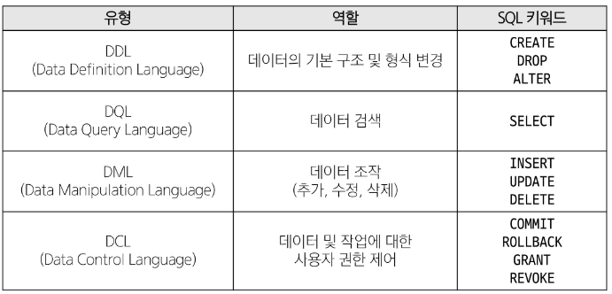

# SQL 
## 개요
### SQL (Structure Query Language)
- 데이터베이스에 정보를 저장하고 처리하기 위한 프로그래밍 언어
- 테이블의 형태로 구조화 된 관계형 데이터베이스에게 요청을 질의(요청)
- 관계형 데이터베이스와의 대화를 위해 사용하는 프로그래밍 언어

### SQL Syntax
```sql
SELECT column_name FROM table_name;
```
1. SQL 키워드는 대소문자를 구분하지 않음
  - But, 대문자로 작성하는 것을 권장 (명시적 구분)
2. 각 SQL Statements의 끝에는 세미콜론 (';') 필요
  - 각 세미콜론은 SQL Statements을 구분하는 방법(명령어의 마침표)

## SQL Statements
- SQL을 구성하는 가장 기본적인 코드 블록

### 수행 목적에 따른 SQL Statements 4가지 유형
1. DDL - 데이터 정의
2. DQL - 데이터 검색
3. DML - 데이터 조작
4. DCL - 데이터 제어
  


## Querying data
### SELECT
- SELECT statement
  - 테이블에서 데이터를 조회

```sql
SELECT
  select_list
FROM
  table_name;
```
- SELECT 키워드 이후 데이터를 선택하려는 필드를 하나 이상 지정
- FROM 키워드 이후 데이터를 선택하려는 테이블의 이름을 지정

### SELECT 활용
1. 테이블 employees 에서 LastName 필드의 모든 데이터를 조회
```sql
SELECT LastName FROM employees;
```

2. 테이블 employees 에서 LastName, FirstName 필드의 모든 데이터를 조회
```sql
SELECT LastName, FirstName FROM employees;
```

3. 테이블 employees 에서 필드의 모든 데이터를 조회
```sql
SELECT * FROM employees;
```

4. 테이블 employees 에서 FirstName 필드의 모든 데이터를 조회
  - 단, FirstName이 아닌 '이름' 으로 출력 될 수 있도록 변경
```sql
SELECT FirstName AS '이름' FROM employees;
```

5. 테이블 tracks 에서 Name, Milliseconds 필드의 모든 데이터 조회
  - 단 Milliseconds 필드는 60000을 나눠 분 단위 값으로 출력
```sql
SELECT Name, Milliseconds / 60000 AS '재생 시간(분)' FROM tracks;
```

### SELECT 정리
- 테이블의 데이터 조회 및 반환
- '*' asterisk 를 사용하여 해당 테이블의 모든 필드 선택 가능

## Sorting data
### ORDER BY
- ORDER BY statement
  - 조회 결과의 레코드를 정렬

### ORDER BY syntax
- FROM clause 뒤에 위치
- 하나 이상의 컬럼을 기준으로 결과를 오름차순(ASC, 기본 값) 또는 내림차순 (DESC) 으로 정렬
```sql
SELECT
  select_list
FROM
  table_name
ORDER BY
  column1 [DESC]
```

### ORDER BY 활용
1. 테이블 customers 에서 Country 필드를 기준으로 내림차순, City 필드 기준으로 오름차순 조회
```sql
SELECT Country, City FROM customers
ORDER BY Country DESC, City;
```
2. 테이블 tracks 에서 Milliseconds 필드를 기준으로 내림차순 정렬 후  Name, Milliseconds 필드의 모든 데이터를 조회 - 단 Milliseconds 필드는 60000을 나눠 분 단위 값으로 출력
```sql
SELECT Name, Milliseconds / 60000 AS '재생 시간 (분)' FROM tracks
ORDER BY Milliseconds DESC;
```
3. 정렬에서의 NULL
 - NULL 값이 존재할 경우 오름차순 정렬 시 결과에 NULL이 먼저 출력됨.

## Filtering Data
### Filtering Data 관련 Keywords
- Clause
  - DISTINCT
  - WHERE
  - LIMIT

- Operator
  - BETWEEN
  - IN
  - LIKE
  - Comparison
  - Logical

### DISTINCT statement
- 조회 결과에서 중복된 레코드를 제거

### DISTINCT syntax
```sql
SELECT DISTINCT
  select_list FROM table_name;
```
- SELECT 키워드 바로 뒤에 작성해야 함
- SELECT DISTINCT 키워드 다음에 고유한 값을 선택하려는 하나 이상의 필드를 지정

### WHERE statement
- 조회 시 특정 검색 조건을 지정

### WHERE syntax
```sql
SELECT select_list FROM table_name
WHERE
  search_condition;
```
- FROM clause 뒤에 위치
- search_condition은 비교연산자 및 논리연사자 (AND, OR, NOT 등)를 사용하는 구문을 사용

### WHERE 활용
1. 테이블 coustomer에서 City 필드 값이 'Prague'인 데이터의 LastName, FirstName, City 조회
```sql
SELECT LastName, FirstName, City FROM customers
WHERE
  City == 'Prague';
```

2. 테이블 coustomer에서 City 필드 값이 'Prague'가 아닌닌 데이터의 LastName, FirstName, City 조회
```sql
SELECT LastName, FirstName, City FROM customers
WHERE
  City != 'Prague';
```

3. 테이블 coustomers 에서 Company 필드 값이 NULL 이고 Country 필드 값이 USA 인 데이터의 LastName, FirstName, Company, Country 조회
```sql
SELECT LastName, FirstName, Company, Country FROM customers
WHERE
  Company IS NULL AND Country == 'USA';
```

4. 테이블 tracks에서 Bytes 값이 10,000 이상 500,000 이하인 데이터의 Name, Bytes 조회
```sql
SELECT Name, Bytes FROM tracks
WHERE
  Bytes BETWEEN 10000 AND 500000 ;
```

5. 테이블 tracks에서 Bytes 값이 10,000 이상 500,000 이하인 데이터의 Name, Bytes를 Bytes 기준으로 오름차순 조회
```sql
SELECT Name, Bytes FROM tracks
WHERE
  Bytes BETWEEN 10000 AND 500000
ORDER BY
  Bytes;
```

6. 테이블 customers 에서 Country 필드 값이 'Canada' 또는 'Germany' 또는 'France' 인 데이터의 LastName, FirstName, Country 조회
```sql
SELECT LastName, FirstName, Country From customers
WHERE
  Country IN ('Canada', 'Germany', 'France');
```

7. 테이블 customers 에서 LastName 필드 값이 'son'으로 끝나는 데이터의 LastName, FirstName 조회
```sql
SELECT LastName, FirstName From customers
WHERE
  LastName LIKE '%son';
``` 

8. 테이블 customers 에서 FirstName 필드 값이 4자리 면서 'a'로 끝나는 데이터의 LastName, FirstName 조회
```sql
SELECT LastName, FirstName From customers
WHERE
  FirstName LIKE '___a';
```

## Operators
### Comparison Operators (비교 연산자)
- =, >=, <=, !=, IS, LIKE, IN, BETWEEN ... AND

### Logical Operators(논리 연산자)
- AND(&&), OR(||), NOT(!)

### IN Operator
- 값이 특정 목록 안에 있는지 확인
### LIKE Operator
- 값이 특정 패턴에 일치하는지 확인 (Wildcards와 함께 사용)

### Wildcard Characters
- '%'
  - 0 개 이상의 문자열과 일치 하는지 확인
- '_'
  - 단일 문자와 일치하는지 확인

### LIMIT clause
- 조회하는 레코드 수를 제한
### LIMIT syntax
```sql
SELECT select_list FROM table_name
LIMIT[offset,] row_count;
```
- 하나 또는 두 개의 인자를 사용 (0 또는 양의 정수)
- row_count 는 조회 하는 최대 레코드 수를 지정

### LIMIT 활용
1. 테이블 tracks 에서 TrackId, Name, Bytes 필드 데이터를 Bytes 기준으로 내림차순 하여 7개 조회
```spl
SELECT TrackId, Name, Bytes FROM tracks ORDER BY Bytes DESC
LIMIT 7;
```
2. 테이블 tracks 에서 TrackId, Name, Bytes 필드 데이터를 Bytes 기준으로 내림차순 하여 3번째 부터 7번째 까지 조회
```spl
SELECT TrackId, Name, Bytes FROM tracks ORDER BY Bytes DESC
LIMIT 4 OFFSET 3;
```

## Grouping data
### GROUP BY clause
- 레코드를 그룹화하여 요약본 생성 ('집계 함수' 와 함께 사용)

### Aggregation Functions (집계 함수)
- 값에 대한 계산을 수행하고 단일한 값을 반환하는 함수 (SUM, AVG, MAX, MIN, COUNT)

### GROUP BY syntax
```sql
SELECT 
  c1, c2,  .... cn aggregate_function(ci)
FROM
  table_name
GROUP BY
  c1, c2, ... cn;
```
- FROM 및 WHERE 절 뒤에 배치
- GROUP BY 절 뒤에 그룹화 할 필드 목록을 작성

### GROUP 예시
- Count 필드를 그룹화 한 뒤, 각 그룹 별 개수
```sql
SELECT
  Country, COUNT(*)
FROM
  customers
GROUP BY
  Country;
```

### GROUP BY의 조건
- HAVING 절 활용하여 조건 진행
