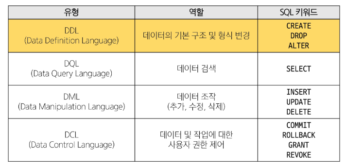
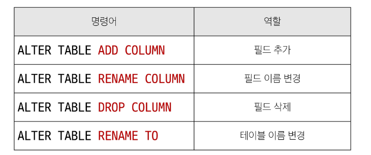

# SQL
## Managing Tables (DDL)
### SQL Statements 유형


### CREATE TABLE statement
- 테이블 생성

### CREATE TABLE syntax
```sql
CREATE TABLE table_name (
  column_1 data_type constraints,
  column_1 data_type constraints,
  ...
)
```
- 각 필드에 적용할 데이터 타입 작성
- 테이블 및 필드에 대한 제약조건(constraints) 작성

### CREATE TABLE 활용
- examples 테이블 생성
```sql
CREATE TABLE examples (
  ExamId INTEGER PRIMARY KEY AUTOINCREMENT,
  LastName VARCHAR(50) NOT NULL,
  FirstName VARCHAR(50) NOT NULL
);
```

#### PRAGMA
- 테이블 schema(구조) 확인
```sql
PRAGMA table_info('examples');
```
- cid : Column ID를 의미하며 각 컬럼의 고유한 식별자를 나타내는 정수 값으로 직접 사용하지 않으며 메타데이터 조회에서 출력값으로 활용

### SQLite 데이터 타입
1. NULL
  - 아무런 값도 포함하지 않음을 나타냄
2. INTEGER
  - 정수
3. REAL
  - 부동소수점
4. TEXT
  - 문자열
5. BLOB
  - 이미지, 동영상, 문서 등의 바이너리 데이터

### Constraints (제약조건)
- 테이블의 필드에 적용되는 규칙 또는 제한 사항
- 데이터의 무결성을 유지하고 데이터베이스의 일관성을 보장

### 대표 제약 조건 3가지
1. PRIMARY KEY
  - 해당 필드의 '기본키'로 지정
  - INTEGER 타입에만 적용되며 INT, BIGINT 등 다른 정수 유형은 적용되지 않는다.
2. NOT NULL
  - 해당 필드에 NULL 값을 허용하지 않도록 지정
3. FOREIGN KEY
  - 다른 테이블과 외래 키 관계를 정의

### AUTOINCREMENT keyword
- 자동으로 고유한 정수 값을 생성하고 할당하는 필드 속성
  - 필드의 자동 증가를 나타내는 특수 키워드
  - 주로 primary key 필드에 적용
  - INTEGER PRIMARY KEY AUTOINCREMENT 가 작성된 필드는 항상 새로운 레코드에 대해 이전 최대값 보다 큰 값을 할당
  - 삭제된 값은 무시되며 재사용할 수 없음

## Modifying table fields
### ALTER TABLE statement
- 테이블 및 필드 조작

### ALTER TABLE 역할


### 1. ALTER TABLE ADD COLUMN syntax
```sql
ARTER TABLE
  table_name
ADD COLUMN
  column_definition;
```
- ADD COLUMN 키워드 이후 추가하고자 하는 새 필드 이름과 데이터 타입 및 제약 조건 작성
  - 단, 추가하고자 하는 필드에 NOT NULL 제약 조건이 있을 경우 기존 데이터에 NULL이 아닌 기본 값 설정 필요

### 2. ALTER TABLE DROP COLUMN syntax
```sql
ARTER TABLE
  table_name
RENAME COLUMN
  current_name TO new_name;
```
- RENAME COLUMN 키워드 뒤에 이름을 바꾸려는 필드의 이름을 지정하고 TO 키워드 뒤에 새 이름을 지정

### 3. ALTER TABLE DROP COLUMN syntax
```sql
ARTER TABLE
  table_name
DROP COLUMN
  column_name;
```
- DROP COLUMN 키워드 뒤에 삭제 할 필드 이름 지정

### 4. ALTER TABLE RENAME TO syntax
```sql
ARTER TABLE
  table_name
RENAME TO
  new_table_name;
```
- RENAME TO 키워드 뒤에 새로운 테이블 이름 지정

## Delete a table
### DROP TABLE statement
- 테이블 삭제

### DROP TABLE syntax
```sql
DROP TABLE table_name;
```
- DROP TABLE statement 이후 삭제할 테이블 이름 작성

## Modifying Data (DML)
### Insert data
### INSERT statement
- 테이블 레코드 삽입
```sql
INSERT INTO table_name (c1, c2, ...)
VALUES (v1, v2, ...);
```
- INSERT INTO 절 다음에 테이블 이름과 괄호 안에 필드 목록 자성
- VALUES 키워드 다음 괄호 안에 해당 필드에 삽입할 값 목록 작성

### Update data
### UPDATE statement
- 테이블 레코드 수정
```sql
UPDATE table_name
SET column_name = expression,
[WHERE
  condition];
```
- SET 절 다음 수정할 필드와 새 값을 지정
- WHERE 절에서 수정 할 레코드를 지정하는 조건 작성
- WHERE 절을 작성하지 않으면 모든 레코드를 수정

### Delete data
### DELETE statement
- 테이블 레코드 삭제
```sql
DELETE FROM table_name
[WHERE
  condition];
```
- DELETE FROM 절 다음 테이블 이름 작성
- WHERE 절에서 삭제할 레코드를 지정하는 조건 작성
- WHERE 절을 작성하지 않으면 모든 레코드를 삭제

# Multi table queries
## Join
### 관계
- 여러 테이블 간의 (논리적) 연결

### JOIN이 필요한 순간
- 테이블을 분리하면 데이터 관리는 용이해질 수 있으나 출력시에 문제가 있다.
- 테이블 한 개 만 출력할 수 밖에 없어 다른 테이블과 결합하여 출력하는 것이 필요함
- 이 때 사용하는 것이 'JOIN'

## Joining tables
### JOIN clause
- 둘 이상의 테이블에서 데이터를 검색하는 방법

### JOIN 종류
1. INNER JOIN
2. LEFT JOIN

### INNER JOIN clause
- 두 테이블에서 값이 일치하는 레코드에 대해서만 결과를 반환

### INNER JOIN syntax
```sql
SELECT select_list
FROM table_a
INNER JOIN table_b
ON table_b.fk = table_a.pk;
```
- FROM 절 이후 메인 테이블 지정(table_a)
- INNER JOIN 절 이후 메인 테이블과 조인할 테이블을 지정 (table_b)
- ON 키워드 이후 조인 조건을 작성 (table_a와 table_b 간 레코드를 일치시키는 규칙을 지정)

### LEFT JOIN clause
- 오른쪽 테이블의 일치하는 레코드와 함께 왼쪽 테이블의 모든 레코드를 반환
### LEFT JOIN syntax
```sql
SELECT select_list
FROM table_a
LEFT JOIN table_b
ON table_b.fk = table_a.pk;
```
- FROM 절 이후 왼쪽 테이블 지정(table_a)
- INNER JOIN 절 이후 오른쪽 테이블을 지정 (table_b)
- ON 키워드 이후 조인 조건을 작성 (왼쪽 테이블의 각 레코드를 오른쪽 테이블의 모든 레코드와 일치시킴)

### LEFT JOIN 특징
- 왼쪽 테이블의 모든 레코드를 표기
- 오른쪽 테이블과 매칭되는 레코드가 없으면 NULL을 표시
