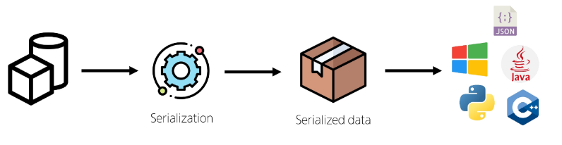
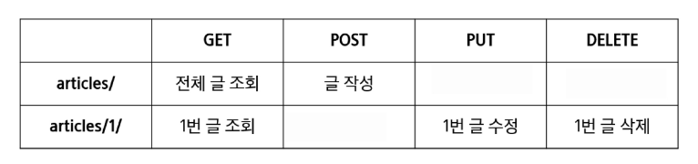

# DRF with Single Model
## DRF
### Django Rest framework
**DRF**
- Django 에서 RESTful API 서버를 쉽게 구축할 수 있도록 도와주는 오픈소스 라이브러리
- 설치 후 프로젝트 setting.py에 "rest_framework"추가 필수
```cmd
pip install djangorestframework
```
```py
# project/settings.py
INSTALLED_APPS = [
    "rest_framework",
]
```

## Serializer
### Serialization (직렬화)
- 여러 시스템에서 활용하기 위해 데이터 구조나 객체 상태를 나중에 재구성할 수 있는 포맷으로 변환하는 과정
- 어떠한 언어나 환경에서도 나중에 다시 쉽게 사용할 수 잇는 포맷으로 변환하는 과정
  

### Serializer
- Serialization을 진행하여 Serialized data를 반환해주는 클래스

### ModelSerializer
- Django 모델과 연결된 Serializer 클래스
- 일반 Serializer와 달리 사용자 입력 데이터를 받아 자동으로 모델 필드에 맞추어 Serialization을 진행

### ModelSerializer class 사용예시
- Article 모델을 토대로 직렬화를 수행하는 ArticleSerializer 정의
```py
# articles/serializers.py

from rest_framework import serializers
from .models import Article

class ArticleListSerializer(serializers.ModelSerializer):
    class Meta:
        model = Article
        fields = '__all__'
```

## CRUD with ModelSerlalizer
### URL과 HTTP requests methods 설계


### GET method - 조회
- 게시글 데이터 목록 조회하기
- 게시글 데이터 목록을 제공하는 ArticleListSerializer 정의
```py
from rest_framework import serializers
from .models import Article

# 전체 게시글 데이터를 직렬화 하는 클래스
class ArticleListSerializer(serializers.ModelSerializer):
    class Meta:
        model = Article
        fields = ('id', 'title', 'content')

```

### ModelSerializer의 인자 및 속성

```py
serializer = ArticleListSerializer(articles, many=True)
return Response(serializer.data)
```
- many 옵션
  - Serialize 대상이 QuerySet 인 경우 입력
- data 속성
  - Serialized data 객체에서 실제 데이터를 추출

### 'api_view' decorator
- DRF view 함수에서는 필수로 작성되며 view 함수를 실행하기 전 HTTP 메서드를 확인
- 기본적으로 GET 메서드만 허용되며 다른 메서드 요청에 대해서는 405 Method Not Allowed로 응답
- DRF view 함수가 응답해야 하는 HTTP 메서드 목록을 작성

### POST method - 생성
- 게시글 데이터 생성하기
1. 데이터 생성 성공 시 201 Create 응답
2. 데이터 생성 실패 시 400 Bad request 응답

### DELETE method - 삭제
- 게시글 데이터 삭제하기
  - 요청에 대한 데이터 삭제가 성공했을 경우는 204 No Content 응답
  

### PUT method - 수정
- 게시글 데이터 수정하기
  - 요청에 대한 데이터 수정이 성공했을 경우 200 OK 응답

### 'partial' argument
- "부분 업데이트" 를 허용하기 위한 인자
```py
ArticleSerializer(article, data=request.data, partial=True)
```

### raise_exception
- is_valid() 의 선택 인자
- 유효성 검사를 통과하지 못할 경우 ValidationError 예외를 발생시킴
- DRF에서 제공하는 기본 예외 처리기에 의해 자동으로 처리되며 기본적으로 HTTP 400 응답을 반환

