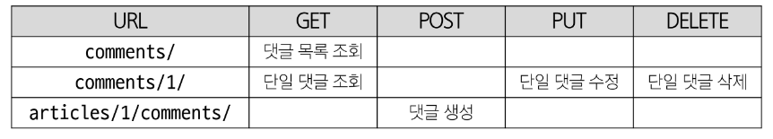

# DRF with N:1 Relation
## 사전 준비
### Comment 모델 정의 및 데이터 로드
```py
class Comment(models.Model):
    article = models.ForeignKey(Article, on_delete=models.CASCADE)
    content = models.CharField(max_length=200)
    created_at = models.DateTimeField(auto_now_add=True)
    updated_at = models.DateTimeField(auto_now=True)

```

```shell
$ python manage.py migrate
$ python manage.py loaddata articles.json comments.json
```

### URL 및 HTTP request method 구성




## GET method
1. 댓글 조회를 위한 CommentSerializer 정의

```py
# articles/serializers.py
class CommnetSerializer(serializers.ModelSerializer):
    class Meta:
        model = Comment
        fields = '__all__'
```
2. url 작성
```py
# articles/urls.py
urlpatterns = [
    path('comments/', views.comments_list),
]
```

3. view 함수 작성
```py
# articles/views.py
@api_view(['GET'])
def comments_list(request):
    # 댓글 전체 조회
    comments = Comment.objects.all()
    # 댓글 데이터 가공
    serializer = CommnetSerializer(comments, many=True)
    return Response(serializer.data)
```

## POST method
1. 댓글 생성을 위한 url 및 view 함수 작성
2. serializer 인스턴스의 save() 메서드는 특정 Serializer 인스턴스를 저장하는 과정에서 추가 데이터를 받을 수 있음

```py
# 추가 데이터는 save 메서드의 인자로 작성
serializer.save(article=article)
```

3. CommentSerializer에서 외래 키에 해당하는 article field 도한 사용자로 입력 받도록 설정 되었기 때문에 서버에서는 누락 되었다 판단 -> 유효성 검사 목록에서 제외 필요 -> article field를 **읽기 전용 필드**로 설정
   - 응답 데이터에는 포함되어 있어야 하며, 유효성 검사 목록에서만 제외 !!
```py
# serializers.py
class CommnetSerializer(serializers.ModelSerializer):
    class Meta:
        model = Comment
        fields = '__all__'

        read_only_fields = ('article', )
```

### 읽기 전용
- 클라이언트가 데이터 생성 또는 수정 요청을 보낼 때 해당 필드에 값을 제공하거나 변경할 수 없으며, 서버가 응답 시에만 값을 표시하는 필드
- 데이터를 전송 받은 시점에 **유효성 검사에서 제외** -> **데이터 조회 시에는 츨력**

### 읽기 전용 필드 사용 목적
- 클라이언트 측에서 직접 수정하면 안 되는 경우
- 서버 로직에 의해 자동 생성/관리되는 값 활용
- 입력은 받지 않지만 정보를 제공해야 하는 경우
- 새로운 필드 값(추가 계산, 가공)을 만들어 제공해야 하는 경우

### 읽기 전용 필드 특징 및 주의사항
- 유효성 검사에서 제외됨
  - 읽기 전용 필드는 클라이언트가 보내는 요청 데이터에서 고려되지 않으므로, 유효성 검사 대상에서 제외
  - 클라이언트가 해당 필드에 값을 넣어도 무시되며 검증오류 X
  
- 생성/수정 요청 모두에서 적용 가능
  - 읽기 전용 필드라 하여 생성(POST) 단계에서만 무의미 한것은 아님
  - 수정(PUT) 요청에서도 해당 필드는 여전히 클라이언트 입력을 받지 않고 응답시에만 노출

## DELETE & PUT method
1. 댓글 삭제 및 수정을 위한 view 함수 작성
```py
@api_view(['GET', 'PUT', 'DELETE'])
def comments_detail(request, comment_pk):
    comment = Comment.objects.get(pk = comment_pk)
    if request.method == 'GET':
        serializer = CommnetSerializer(comment)
        return Response(serializer.data)
    
    elif request.method == 'PUT':
        # 사용자가 보낸 새로운 댓글 데이터와 기존 데이터를 활용하여 수정
        serializer = CommnetSerializer(comment, data = request.data)
        if serializer.is_valid(raise_exception=True):
            serializer.save()
            return Response(serializer.data)

    elif request.method == 'DELETE':
        comment.delete()
        return Response(status=status.HTTP_204_NO_CONTENT)
```


## 응답 데이터 재구성
### 댓글 조회 시 게시글 출력 내역 변경
- 댓글 조회 시 게시글 번호가 아닌 **게시글 제목** 까지 제공하기
- 필요한 데이터를 만들기 위한 Serializer 내부에서 추가 선언
```py
# serializers.py
class CommnetSerializer(serializers.ModelSerializer):

    # 외래 키 필드 article 의 데이터를 재구성 하기 위한 도구
    class ArticleTitleSerializer(serializers.ModelSerializer):
        class Meta:
            model = Article
            fields = ('title',)
        
    # 외래 키 필드인 article 데이터 재구성
    article = ArticleTitleSerializer(read_only=True)
        
    class Meta:
        model = Comment
        fields = '__all__'
        
        # 위에서 read_only 처리를 해주어야 함.
        # read_only_fields = ('article', )
```

### 읽기 전용 필드 주의사항
- 특정 필드를 override 혹은 추가한 경우 read_only_fields 는 동작하지 않음
- 새로운 필드에 read_only 키워드 인자로 작성해야 함!!

## 역참조 데이터 구성
### 역참조 관계를 활용한 JSON 데이터 재구성
- 아래 2가지 사항에 대한 데이터 재구성하기
  - 단일 게시글 조회 시 **해당 게시글에 작성된 댓글 목록**도 함께 붙여서 응답 == (역참조)
  - 단일 게시글 조회 시 **해당 게시글에 작성된 댓글 개수**도 함께 붙여서 응답 == (새로운 데이터)

## 단일 게시글 + 댓글 목록
- Nested relationships (역참조 매니저 활용)
  - 모델 관계 상으로 참조하는 대상은 참조되는 대상의 표현에 포함되거나 중첩될 수 있음
  - 중첩된 관계는 serializers를 필드로 사용하여 표현 가능

- models.py 에서 related_name 설정 시 comment_set 의 이름을 수정 가능함.
  - 단, makemigrations 과정 재진행 필요

```py
# serializers.py
# 게시글의 전체 필드를 직렬화 하는 클래스
class ArticleSerializer(serializers.ModelSerializer):

    # 기존 역참조 매니저 commnet_set 의 값을 덮어쓰기    
    class CommentDetailSerializer(serializers.ModelSerializer):
        class Meta:
            model = Comment
            fields = ('id', 'content',)

    comment_set = CommentDetailSerializer(many=True, read_only=True)

    class Meta:
        model = Article
        fields = '__all__'
```

## 단일 게시글 + 댓글 개수
###  View 로직 개선 : annotate 사용
- View 에서 Article 객체를 조회할 때 annotate 를 활용해 num_of_comments 필드를 추가
  - annotate는 Django ORM 함수로, SQL의 집계 함수를 활용하여 쿼리 단계에서 데이터 가공을 수행

- serializer.data 를 반환 하면, 해당 article 객체에는 num_of_comments 라는 annotate 필드가 포함 됨
```py
# views.py

@api_view(['GET', 'DELETE', 'PUT'])
def article_detail(request, article_pk):
    # 단일 게시글 데이터 조회 + 해당 게시글에 작성된 댓글의 개수를 DB에 한번에 요청 
    article = Article.objects.annotate(num_of_comments=Count('comment')).get(pk=article_pk)
```

### Serializer 개선 : SerializerMethodField 사용
- SerializerMethodField 는 읽기 전용 필드를 커스터마이징 하는데 사용
- 필드 선언 후 get_<필드명> 메서드를 정의하면 해당 메서드의 반환값이 직렬화 결과에 포함된다.
- serializer.data를 호출할 때 get_num_of_comments 메서드가 실행되어 num_of_comments값이 자동으로 포함됨
- view 에서 data를 딕셔너리로 변환하거나 수정할 필요 없이 serializer.data 로 바로 반환해도 최종 JSON 응답에 num_of_comments 값이 반영

```py
# 게시글의 전체 필드를 직렬화 하는 클래스
class ArticleSerializer(serializers.ModelSerializer):

    ...

    # 댓글 개수를 담기 위한 새로운 필드 생성
    num_of_comments = serializers.SerializerMethodField()

    def get_num_of_comments(self, obj):
        # 여기서 obj는 Serializer가 처리하는 Article 인스턴스
        # view에서 annotate 한 필드를 그대로 사용가능
        return obj.num_of_comments
```

### SerializerMethodField 란
- DRF에서 제공하는 읽기 전용 필드
- -Serializer 에서 추가적인 데이터 가공을 하고 싶을 때 사용
  - 특정 필드값을 조합해 새로운 문자열 필드나 부가적인 계산을 하는 경우 등에 활용

- 유연성
  - 다양한 계산 로직을 손쉽게 추가 가능
- 가독성
  - 데이터 변환 과정을 Serializer 내부 메서드로 명확히 분리
- 유지보수성
  - view 나 model에 비해 Serializer 측 로직 변경이 용이
- 일관성
  - view 에서 별도로 data 수정 없이도 직렬화 결과를 제어

### SerializerMethodField 주의사항
- 읽기 전용으로, 생성(POST), 수정(PUT) 요청 시에는 사용되지 않음
- get_메서드는 반드시 (self, obj) 형태로 정의해야 하며, obj 는 현재 직렬화 중인 모델 인스턴스를 의미


## API 문서화
### OpenAPI Specification (OAS)
- RESTful API를 설명하고 시각화하는 표준화된 방법
  - API에 대한 세부사항을 기술하는 공식 표준
- OSA 기반 API에 대한 문서를 생성하는데 도움을 주는 오픈소스 프레임워크
- Swagger
- Redoc

### 문서화 활용
### drf-spectacular 라이브러리 
- DRF를 위한 OpenAPI 3.0 구조 생성을 도와주는 라이브러리
- 설치 및 등록
- 관련 설정 코드 입력 (OpenAPI 구조 자동 생성코드)

```py
# project/settings.py
REST_FRAMEWORK = {
    # YOUR SETTINGS
    'DEFAULT_SCHEMA_CLASS': 'drf_spectacular.openapi.AutoSchema',
}

SPECTACULAR_SETTINGS = {
    'TITLE': 'Your Project API',
    'DESCRIPTION': 'Your project description',
    'VERSION': '1.0.0',
    'SERVE_INCLUDE_SCHEMA': False,
    # OTHER SETTINGS
}
```
- swagger, redoc 페이지 제공을 위한 url 작성

```py
# project/urls.py
from drf_spectacular.views import SpectacularAPIView, SpectacularRedocView, SpectacularSwaggerView
urlpatterns = [
    # YOUR PATTERNS
    path('api/schema/', SpectacularAPIView.as_view(), name='schema'),
    # Optional UI:
    path('api/schema/swagger-ui/', SpectacularSwaggerView.as_view(url_name='schema'), name='swagger-ui'),
    path('api/schema/redoc/', SpectacularRedocView.as_view(url_name='schema'), name='redoc'),
]
```

### "설계 우선" 접근법
- OAS의 핵심 이점
- API를 먼저 설계하고 명세를 작성한 후, 이를 기반으로 코드를 구현하는 방식
- API의 일관성을 유지하고 API 사용자는 더 쉽게 API를 이해하고 사용할 수 있음
- 또한 OAS를 사용하면 API가 어떻게 작동하는지를 시각적으로 보여주는 문서를 생성할 수 있으며 이는 API를 이해하고 테스트 하는데 매우 유용

### View 와 Serializer의 역할
- DRF에서는 비즈니스 로직(데이터 가공, annotate, 필터링)을 view나 queryset 로직에서 처리하고, serializer는 그 결과물을 직렬화하는 역할에 집준하은 것이 일반적 권장사항

- 복잡한 query나 로직은 View 함수에서 진행
  - 여러 모델을 조인하거나 복잡한 집계가 필요한 경우 View 함수에서 처리
  - 필요한 경우 View 함수에서 select_related() 나 prefetch_related()를 사용하여 query를 최적화
