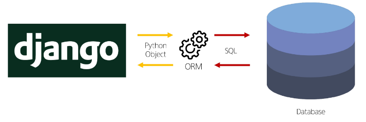
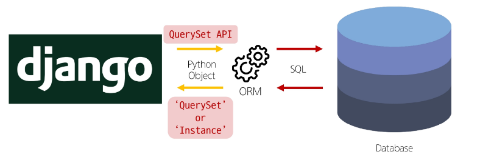
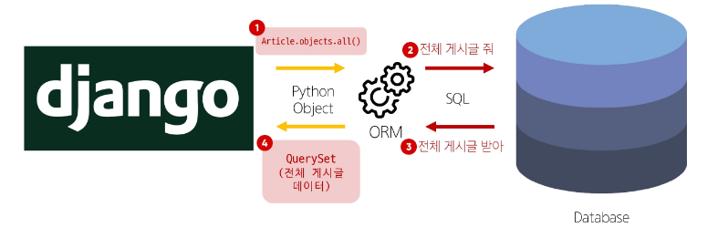
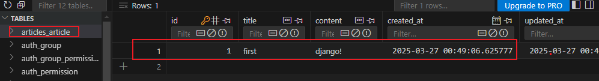

# ORM
## ORM (Object-Relationl-Mapping)
- 객체 지향 프로그래밍 언어를 사용하여 호환되지 않는 유형의 시스템 간 데이터를 변환하는 기술

### ORM의 역할
- Django와 DB간 사용하는 언어가 다르기 때문에 Django에 내장된 ORM이 중간에서 이를 해석
  


## QuerySet API
- ORM에서 데이터를 검색, 필터링, 정렬 및 그룹화 하는데 사용하는 도구
  - API를 사용해 SQL이 아닌 Python 코드로 데이터를 처리
  

### QuerySet API 구문

```py
Article.objects.all()
# Article = Model class
# objects = Manager       / 클래스가 바로 메서드를 사용할 수 없기 때문에 사용되는 매니저
# all()   = Queryset API  /
```

### QuerySet API 구문 동작 예시
  

### Query
- 데이터베이스에 특정한 데이터를 보여 달라는 요청
- "쿼리문을 작성한다."
  - "원하는 데이터를 얻기 위해 데이터베이스에 요청을 보낼 코드를 작성"
- 파이썬으로 작성한 코드가 ORM에 의해 SQL로 변환되어 데이터베이스에 전달되며 데이터베이스의 응답 데이터를 ORM이 Queryset 이라는 자료 형태로 변환하여 우리에게 전달.

### QuerySet
- 데이터베이스에서 전달 받은 객체 목록(데이터 모음)
  - 순회 가능한 데이터로써 1개 이상의 데이터를 불러와 사용할 수 있음
- Django ORM을 통해 만들어진 자료형
- 단, 데이터베이스가 단일한 객체를 반환할 때는 QuerySet이 아닌 Class의 인스턴스로 반환

```
QuerySet API는 
Python의 모델 클래스와 인스턴스를 활용해
DB에 데이터를 저장, 조회, 수정, 삭제 하는 것
```

### CRUD
- 소프트웨어가 가지는 기본적인 데이터 처리 기능
- Create(저장) / Read(조회) / Update(갱신) / Delete(삭제)


# QuerySet API 실습
### QuerySetAPI 실습 사전 준비
- 외부 라이브러리 설치 및 설정
```bash
pip install ipython django-extensions
```
- django-extensions의 경우 앱에 등록
```py
# project/setting.py
INSTALLED_APPS = [
    'articles',
    'django_extensions',
]
```
### INSTALLED_APPS 작성 권장 순서
1. 직접 생성한 APAP
  - articles
2. 설치한 앱 (3rd Party library)
  - django_extensions
3. 내장 앱 - 기본 작성되어 있는 것


## Creat
### Django Shell 실행
```bash
python manage.py shell_plus
```

### Django Shell
- Django 환경 안에서 실행되는 python shell
  - 입력하는 QuerySet API 구문이 Django 프로젝트에 영향을 미침

### 데이터 객체를 만드는(생성하는) 3가지 방법
- Django Shell 상에서
1. 생성한 클래스의 인스턴스를 활용해 생성
```shell
# Article(class)로 부터 article(instance) 생성
In [1]: article = Article()
In [2]: article
Out[2]: <Article: Article object (None)>

# 인스턴스 변수 title에 값을 할당
In [3]: article.title = 'first'
# 인스턴스 변수 content에 값을 할당
In [4]: article.content = 'django!'

# save를 하지 않으면 아직 DB에 값이 저장되지 않음
# 셋팅만 한 상태
In [5]: article
Out[5]: <Article: Article object (None)>
In [7]: Article.objects.all()
Out[7]: <QuerySet []>

# 저장
In [8]: article.save()
In [9]: Article.objects.all()
Out[9]: <QuerySet [<Article: Article object (1)>]>

# 인스턴스 article을 활용해 인스턴스 변수 활용
In [10]: article.id
Out[10]: 1

In [11]: article.title
Out[11]: 'first'

In [12]: article.content
Out[12]: 'django!'

In [13]: article.pk
Out[13]: 1
```
  

2. 인스턴스를 생성하면서 초기값을 삽입
```bash
In [14]: article = Article(title = 'second', content = 'django!')

In [15]: article.title
Out[15]: 'second'

In [16]: article.content
Out[16]: 'django!'

# DB에 저장되지 않았기 때문에 출력 X 
# save()를 해주어야 함.
In [17]: article.pk

# 저장
In [18]: article.save()

# 테이블에 행이 작성되었기 때문에 pk 조회 가능
In [19]: article.pk
Out[19]: 2
```

3. QuerySet API 중 creat() 메서드를 활용
  - 초기값을 바로 받아 테이블에 저장까지 진행
  - create() 는 QuerySet API 메서드
```bash
In [26]: Article.objects.create(title = 'third', content = 'django!')
Out[26]: <Article: Article object (3)>

In [27]: Article.objects.all()
Out[27]: <QuerySet [<Article: Article object (1)>, <Article: Article object (2)>, <Article: Article object (3)>]>
```
  - 위 두가지 방법과 달리 저장 후 바로 생성된 데이터가 반환됨.

## Read
### 대표적인 조회 메서드
- Return new QuerySets (= 변수에 담을 수 있다.)
  - all()
  - filter()
  - 매개변수에 담아서 for문 가능.
  ```bash
  In [38]: articles = Article.objects.all()

  In [39]: articles
  Out[39]: <QuerySet [<Article: Article object (1)>, <Article: Article object (2)>, <Article: Article object (3)>]>

  In [40]: for article in articles:
      ...:     print(article.title)
      ...:
  first
  second
  third
  ```

- Do not return QuerySets
  - get()

### all()
- 전체 데이터 조회
```bash
In [34]: Article.objects.all()
Out[34]: <QuerySet [<Article: Article object (1)>, <Article: Article object (2)>, <Article: Article object (3)>]>
```

### filter()
- 주어진 매개변수와 일치하는 객체를 포함하는 QuerySet 반환
- 결과값이 0개라도 빈 QuerySet을 반환함
```bash
In [35]: Article.objects.filter(content = 'django!')
Out[35]: <QuerySet [<Article: Article object (1)>, <Article: Article object (2)>, <Article: Article object (3)>]>

In [36]: Article.objects.filter(title = 'abc')
Out[36]: <QuerySet []>

In [37]: Article.objects.filter(title = 'first')
Out[37]: <QuerySet [<Article: Article object (1)>]>
```

### get()
- 주어진 매개변수와 일치하는 객체를 반환
- 변수에 담아 활용 가능

```bash
In [42]: article = Article.objects.get(pk=1)

In [43]: article
Out[43]: <Article: Article object (1)>

In [44]: article.title
Out[44]: 'first'

In [45]: article.content
Out[45]: 'django!'
```
### get() 특징
- 객체를 찾을 수 없으면 DoesNotExist 예외를 발생, 둘 이상의 객체를 찾으면 MultipleObjectsReturned 예외
- 주로 pk를 반환 받아 사용 할 때 사용.

## Update
### 데이터 수정
- 인스턴스 변수를 변경 후 save 메서드 호출
- 조회를 우선적으로 수행해야 한다.
```bash
# 수정 대상 조회
In [48]: Article.objects.get(pk = 1)
Out[48]: <Article: Article object (1)>

# 수정할 인스턴스 변수 재할당.
In [51]: article.content
Out[51]: 'django!'

In [52]: article.content = 'django@@@'

In [53]: article.content
Out[53]: 'django@@@'

# 위 까지는 인스턴스 관점에서만 이루어진 수정
# save() 메서드를 통해 DB에 반영
In [54]: article.save()

In [55]: article.content
Out[55]: 'django@@@'
```

## Delete
### 데이터 삭제
- 삭제하려는 데이터 조회 후 delete 메서드 호출
- 조회를 우선적으로 수행해야 한다.
- 삭제한 데이터는 더 이상 조회할 수 없다.
```bash
# 삭제 대상을 변수에 담고
In [59]: article = Article.objects.get(pk=2)

In [60]: article
Out[60]: <Article: Article object (2)>

# delete() 메서드를 호출하면 삭제 된 내역을 반환해준다.
In [61]: article.delete()
Out[61]: (1, {'articles.Article': 1})

# 전체 조회시 pk가 2인 행은 삭제 됨
In [62]: Article.objects.all()
Out[62]: <QuerySet [<Article: Article object (1)>, <Article: Article object (3)>]>
```

## ORM with view
- Django shell 에서 연습했던 QuerySet API를 직접 view 함수에서 사용하기

### Field lookups
- Query에서 조건을 구성
- QuerySet 메서드 filter(), exclude(), get() 에 대한 키워드 인자로 지정
```bash
# Field lookups 예시

# 내용에 'dja' 가 포함된 게시글 조회
Article.objects.filter(content__contains = 'dja')
# 제목이 'he' 로 싲가하는 모든 게시글 조회
Article.objects.filter(content__startwith = 'he')
```

### ORM, QuerySet API를 사용하는 이유
1. 데이터베으스 추상화
  - 특정 데이터베이스 시스템에 종속되지 않고 일관된 방식으로 데이터를 다룰 수 있음

2. 생산성 향상
  - SQL 쿼리 대신 Python 코드로 데이터 베이스 작업 수행 가능

3. 객체 지향형 접근
  - DB 테이블을 Python 객체로 다룰 수 있어 객체 지향 프로그래밍의 이점 활용 가능

