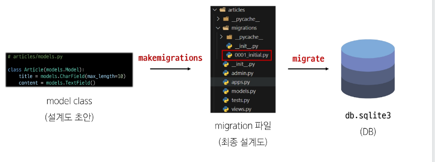
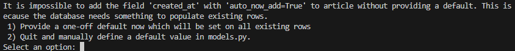
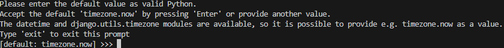
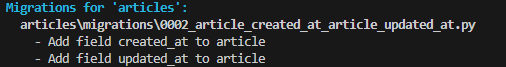

# Model
## Model class
### Django Model
- DB의 테이블을 정의하고 데이터를 조작할 수 있는 기능들을 제공
  - 테이블 구조를 설계하는 설계도 == '청사진(blueprint)' 

### model 클래스 작성
```py
class Article(model.Model):
  title = models.CharField(max_length=10)
  content = models.TextField()
```
- 테이블의 설계는 model.py에서 클래스로 설계하면 SQL 언어로 변환되어 DB에 테이블이 생성된다.
- id 필드는 django가 자동으로 생성함.
- django.db.models 모듈의 Model 이라는 부모 클래스를 상속 받는다.
  - 개발자는 가장 중요한 테이블 구조를 어떻게 설계할지에 대한 코드만 작성하도록 하기 위함 (상속을 활용한 프레임워크의 기능 제공)

- 클래스 변수명
  - 테이블의 각 열은 필드라고 함.

- Model Field
```py
TextField()
CharField(max_length=10)
```
  - 데이터베이스 테이블 열을 나타내는 중요한 구성요소
  - "데이터 유형"과 "제약 조건" 을 정의함


## Model Field
- DB 테이블의 필드(열)를 정의하며 해당 필드에 저장되는 데이터 타입(Field Type)과 제약 조건(Field Option)을 정의함.

### Model Field 구성
1. Field types (필드 유형)
  - 데이터베이스에 저장될 "데이터의 종류"를 정의
2. Field options (필드 옵션)
  - 필드의 "동작" 과 "제약 조건"을 정의

## Field Types
- 데이터베이스에 저장될 "데이터의 종류"를 정의하며 models 모듈의 클래스로 정의되어 있음

### CharField()
- 제한된 길이의 문자열을 저장 (필드의 최대 길이를 결정하는 max_length 는 필수 옵션)

### TextField()
- 길이 제한이 없는 대용량 텍스트를 저장 (사용하는 시스템 환경에 따라 최대치가 달라짐, 무한대 X)

### 주요 필드 유형
- 문자열
  - CharField, TextField
- 숫자
  - IntegerField, FloatField
- 날짜/시간
  - DateField, TimeField, DateTimeField
- 파일
  - FileField, ImageField


## Field options
- 필드의 "동작"과 "제약 조건"을 정의

### 제약 조건 (Constraint)
- 특정 규칙을 강제하기 위해 테이블의 열이나 행에 적용되는 규칙이나 제한사항
  - 숫자만 저장되도록, 문자가 100자 까지만 저장되도록 하는 등.

### 주요 필드 옵션
- null
  - 데이터베이스에서 NULL 값을 허용할지 여부하는 결정 (기본값 : False)
- blank
  - form에서 빈 값을 허용할지 여부를 결정 (기본값 : False)
- default
  - 필드의 기본값을 설정


## Migrations
### Migrations
- model 클래스의 변경사항 (필드 생성, 수정, 삭제 등)을 DB에 최종 반영하는 방법

### Migrations 과정


### Migrations 핵심 명령어 2가지
```py
python manage.py makemigrations
# model class를 기반으로 최종 설계도(migration) 작성

python manage.py migrate
# 최종 설계도를 DB에 전달하여 반영
```
- "앱이름_클래스이름" 조합으로 테이블 이름을 생성함

### 추가 Migrations
- 이미 생성 된 테이블에 필드를 추가하는 경우
  1. 추가 모델 필드 작성
  ```py
  created_at = models.DateTimeField(auto_now_add=True)
  updated_at = models.DateTimeField(auto_now=True)
  ```
  - DateTimeField의 필드 옵션 (optional)
  - auto_now : 데이터가 저장될 때 마다, 자동으로 현재 날짜시간을 저장
  - auto_now_add : 데이터가 처음! 생성될 때만, 자동으로 현재 날짜 시간을 저장
  
  2. 이미 기존 테이블이 존재하기 때문에 필드를 추가 할 때 추가되는 필드의 기본값 설정이 필요함
  
  - 1번은 현재 대화를 유지하면서 기본값을 입력하는 방법
  - 2번은 현재 대화에서 나간 후 models.py에 기본값 관련 설정을 하는 방법


  3. 추가하는 필드의 기본 값을 입력해야 하는 상황
  
  - 날짜 데이터이기 때문에 직접 입력하기 보다는 Django가 제안하는 기본값을 사용하는 것을 권장.
  - 아무것도 입력하지 않고 enter를 누르면 Django가 제안하는 기본 값으로 설정 됨

  4. migrations 과정 종료 후 2번째 파일이 생성됨
  
  - 2번 파일은 테이블을 생성하는 내용이 없고, 필드만 추가하는 설계만 되어있기 때문에 1번 설계도에 의존이 되어있으므로 1번 설계도가 없으면 무용지물

  5. migrate 후 테이블 필드 확인하면 끝. 
   
- model class에 변경사항(1)이 생겼다면, 반드시 새로운 설계도를 생성(2)하고 이를 DB에 반영(3)해야 한다.

1. model class 변경 발생 -> 2. makemigrations -> 3. migrate

## Admin site
### 관리자 인터페이스
### Automatic admin interface
- Django가 추가 설치 및 설정 없이 자동으로 제공하는 관리자 인터페이스
  - 데이터 확인 및 테스트 등을 진행하는데 매우 유용

1. admin 계정 생성
  - Username은 아이디 개념
  - email은 선택사항이기 때문에 입력하지 않고 진행가능
  - 비밀번호 입력 시 보안상 터미털에 출력되지 않으니 무시하고 입력 이어가기
  ```bash
  pyhton manage.py createsuperuser
  ```
  - 처음 migrate 과정에서 user 관련 table이 DB에 생성되었기 때문에 가능함.
2. DB에 생성된 계정 확인
  - runserver 후 /admin/ 에 접속 후 로그인 가능
  - 관리자 기능 수행 가능
  
3. admin에 모델 클래스 등록
  - 등록하지 않으면 생성한 페이지에 모델 class가 노출되지 않음.
  - articles/admin.py 수정
  ```py
  from django.contrib import admin

  # 명시적 상대경로
  from .models import Article

  # Register your models here.
  admin.site.register(Article)
  ```

4. 로그인 후 데이터 생성, 수정, 삭제 테스트 수행


## 데이터베이스 초기화
1. migration 파일 삭제
2. db.sqlite3 파일 삭제


## Migrations 기타 명령어
```bash
python manage.py showmigrations
# migrations 파일들이 migrate 됐는지 안됐는지 여부를 확인
# [X] 표시가 있으면 migrate가 완료되었음을 의미

python manage.py sqlmigrate articles 0001
# 해당 migrations 파일이 SQL 언어로 어떻게 번역 되어 전달되는지 확인
```
