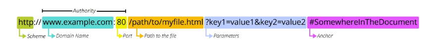
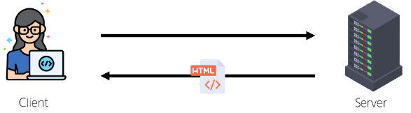
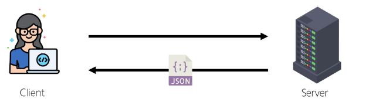
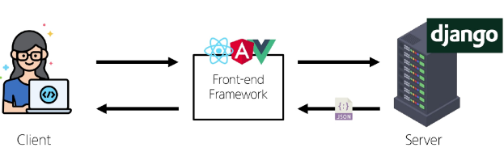
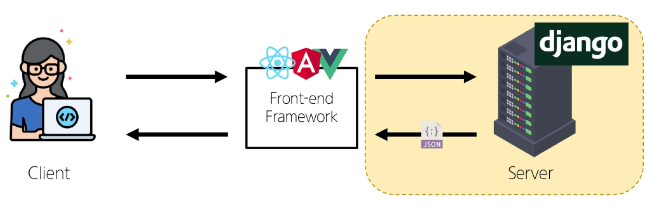

# REST API
## API
- 두 소프트웨어가 서로 통신할 수 있게 하는 메커니즘
- 클라이언트-서버와 같이 서로 다른 프로그램에서 요청과 응답을 받을 수 있도록 만든 체계
- ex. 날씨 데이터 받기

### Web API
- 웹 서버 또는 브라우저를 위한 API
- 현대 웹 개발은 여러 Open API를 활용하는 추세

## REST API
### REST (Representational State Transfer)
- API Server를 개발하기 위한 일종의 소프트웨어 설계 방법론 (규칙 X)

### REST API
- REST 라는 설계 디자인 약속을 지켜 구현한 API

### RESTful API
- REST 원리를 따르는 시스템을 **"RESTful 하다."** 라고 함
- "자원(데이터)을 정의" 하고 "자원에 대한 주소를 지정" 하는 전반적인 방법을 서술

### REST 에서 자원을 젖의하고 주소를 지정하는 방법
1. 자원의 **"식별"**
  - URI
2. 자원의 **"행위"**
  - HTTP Methods
3. 자원의 **"표현"** 
  - JSON 데이터 (궁극적으로 표현되는 데이터 결과물)

## 자원의 식별
### URI
**Uniform Resource Identifier (통합 자원 식별자)**
- 인터넷에서 리소스(자원)를 식별하는 문자열
  - 가장 일반적인 URI는 웹 주소로 알려진 URL

### URL
**Uniform Resource Locator (통합 자원 위치)**
- 웹에서 주어진 리소스의 주소
  - 네트워크 상 리소스가 어디 있는지 알려주기 위한 약속

### 1. Scheme (or Protocol)
- 브라우저가 리소스를 요청하는 데 사용해야 하는 규약
- URL의 첫 부분으로 브라우저가 어떤 규약을 사용하는지 나타냄
- 기본적으로 웹은 http(s)를 요구

### 2. Domain Name
- 요청 중인 웹 서버를 나타냄
- 어떤 웹 서버가 요구되는지 가리키며 직접 IP 주소를 사용하는 것도 가능하지만, IP를 외우기 어렵기 때문에 Domain Name을 사용

### 3. Port
- 웹 서버의 리소스에 접근하는데 사용되는 기술적인 문 (Gate)
- HTTP 프로토콜의 표준 포트 (HTTP - 80 / HTTPS - 443)
- 표준 포트만 작성 시 생략 가능

### 4. Path
- 웹 서버의 리소스 경로
- 실제 파일이 위치한 물리적 위치를 표현 했지만 오늘날에는 실제 위치가 아닌 추상화 된 형태의 구조를 표현함

### 5. Parameters
- 웹 서버에 제공하는 추가적인 데이터
- '&' 기호로 구분되는 key-value 쌍 목록
- 서버는 리소스를 응답하기 전 이러한 파라미터를 사용하여 추가 작업을 수행할 수 있음

### 6. Anchor
- '북마크'를 나타내며 브라우저에 해당 지점에 있는 콘텐츠를 표시
- '#' (fragment identifier, 부분 식별자) 이후 부분은 서버에 전송되지 않음

## 자원의 행위
### HTTP Requset Methods
- 리소스에 대한 행위(수행하고자 하는 동작)를 정의
  - HTTP verbs 라고도 함

**1. GET**
- 서버에 리소스의 표현을 요청
- GET을 사용하는 요청은 데이터만 검색해야 함

**2. POST**
- 데이터를 지정된 리소스에 제출
- 서버의 상태를 변경

**3. PUT**
- 요청한 주소의 리소스를 수정

**4. DELETE**
- 지정된 리소스를 삭제

### HTTP response status codes
- 특정 HTTP 요청이 성공적으로 완료 되었는지 여부를 나타냄
- 5가지 응답 그룹으로 분류
  1. Informational responses (100 - 199)
  2. Successful responses (200 - 299)
  3. Redirection responses (300 - 399)
  4. Clinet error responses (400 - 499)
  5. Server error responses (500 - 599)

## 자원의 표현
- 서버는 페이지(html) 뿐 아니라 다양한 데이터 타입을 응답할 수 있음
- REST API는 이 중에서 **JSON** 타입으로 응답하는 것을 권장

### 응답 데이터 타입의 변화
1. 페이지 (html) 만을 응답하는 서버
  

2. JSON 데이터를 응답하는 REST API 서버로의 변환
  

3. Django는 더 이상 Template 부분에 대한 역할을 담당하지 않게 되며, Front-end와 Back-end가 분리되어 구성 됨
  

4. Django를 사용한 RESTful API 서버를 구축
  

