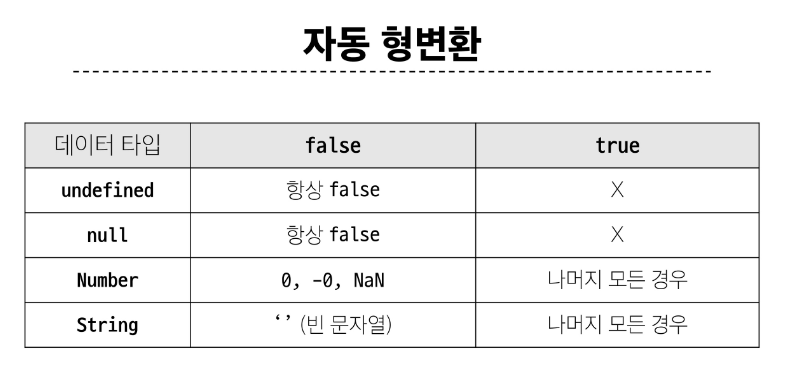
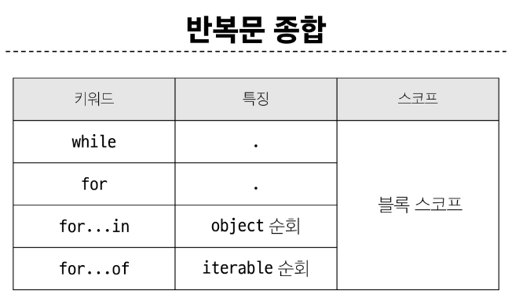

# Basic syntax
## 데이터 타입
- 원시 자료형 (Primitive type)
  - 변수에 값이 직접 저장되는 자료형 (불변, 값이 복사)
  - Number, String, Boolean, null, undefined

- 참조 자료형 (Reference type)
  - 객체의 주소가 저장되는 자료형 (가변, 주소가 복사)
  - Objects
    - Object, Array, Function

### 원시 자료형
#### Number
- 정수 또는 실수형 숫자를 표현하는 자료형
- 모든 연산은 부동소수점 연산으로 진행 됨

```js
const a = 13
const b = -5
const c = 3.14
const d = 2.998e8
const e = Infinity
const f = -Infinity
const g = NaN // Not a Number를 나타내는 값
```

#### String
- 텍스트 데이터를 표현하는 자료형
- '+' 연산자를 이용해 문자열끼리 결합 (뺄셈, 곱셈, 나눗셈 불가)
```js
const firstName = 'Tony'
const lastName = 'Stark'
const fullName = firstName + lastName

console.log(fullName) // TonyStark
```

#### Template literals (템플릿 리터럴)
- 내장된 표현식을 허용하는 문자열 작성 방식
- Backtick(``)을 이용해 여러줄에 걸쳐 문자열 정의가 가능하며 JavaScript의 변수를 문자열 안에 바로 연결할 수 있음
- 표현식은 '$' 와 중괄호 ({expression}) 로 표기
- ES6+ 부터 지원
```js
// Python 의 f-string 같음
const age = 100
const message = `홍길동은 ${age}세 입니다.`
console.log(message) // 홍길동은 100세 입니다.
```

#### null 과 nudefined
- null 
  - 프로그래머가 의도적으로 '값이 없음'을 나타낼 때 사용
```js
let a = null
console.log(a) // null
```
- undefined
  - 시스템이나 JavaScript 엔진이 '값이 할당되지 않음'을 나타낼 때 사용
```js
let b
console.log(b) // undefined
```

### Boolean
- true / false
- 조건문 또는 반복문에서 Boolean이 아닌 데이터 타입은 "자동 형변환 규칙"에 따라 true 또는 false로 변환됨


## 연산자
### 할당 연산자
- 피연산자의 평과 결과를 피연산자에 할당하는 연산자
- 단축 연산자 지원

### 증가 & 감소 연산자
- 증가 연산자 ('++')
  - 피연산자를 증가 (1을 더함) 시키고 연산자의 위치에 따라 증가하기 전이나 후의 값을 반환
- 감소 연산자 ('--')
  - 피연산자를 감소 (1을 뺌) 시키고 연산자의 위치에 따라 감소하기 전이나 후의 값을 반환

### 동등 연산자 ( == )
- 두 연산자가 같은 값으로 평가되는지 비교 후 boolean 값을 반환
- '암묵적 타입 변환'을 통해 타입을 일치시킨 후 같은 값인지 비교함
- 두 연산자가 모두 객체일 경우 메모리의 같은 객체를 바라보는지 판별
```js
console.log(1 == 1) // true
console.log('hello' == 'hello') // true
console.log('1' == 1) // true
console.log(0 == false) // true
```

### 일치 연산자 ( === )
- 두 피연산자의 값과 타임이 모두 같은 경우 true 반환
- 같은 객체를 가리키거나, 같은 타입이면서 같은 값인지를 비교
- '암묵적 타입 변환'이 발생하지 않음
- 특수한 경우를 제외하고는 동등 연산자가 아닌 일치 연산자 사용을 권장
```js
console.log(1 == 1) // true
console.log('hello' == 'hello') // true
console.log('1' == 1) // false
console.log(0 == false) // false
```

### 논리 연산자
- and 연산
  - &&
- or 연산
  - ||
- not 연산
  - !
- 단축 평가 지원

```js
true && false   // false
true && true    // true
false || true   // true
false || false  // false
!true           // false
```

## 조건문
```js
if (name === 'admin') {
  console.log('관리자님 환영해요')
} else if (name === 'customer') {
  console.log('고객님 환영해요')
} else {
  console.log(`반갑습니다. ${name}님`)
}
```
### 삼항 연산자
- 간단한 조건부 로직을 간결하게 표현할 때 유용
  - 복잡한 로직은 가독성이 떨어질 수 있음

```js
condition ? expression1 : expression2
```
- condition
  - 평가할 조건 (true 또는 false로 평가)
- expression1
  - 조건이 true 일 경우 반환할 값 또는 표현식
- expression2
  - 조건이 false 일 경우 반환할 값 또는 표현식

## 반복문
### while
- 조건문이 참이면 문장을 계속해서 수행
```js
while (조건문) {
  // do something
}

let i = 0
while (i < 6) {
  console.log(i)
  i += 1
}
```

### for
- 특정한 조건이 거짓으로 판별될 때까지 반복
```js
for ([초기문]; [조건문]; [증감문]){
  // do something
}

for (let i = 0; i < 6; i++){
  console.log(i)
}
```

### for in
- 객체의 열거 가능한 속성 (property) 에 대해 반복
```js
for (variable in object) {
  statement
}

const fruits = {a : 'apple', b : 'banana'}

for (const property in object) {
  console.log(property)         // a, b
  console.log(object[property]) // apple, banana
}
```

### for of
- 반복 가능한 객체 (배열, 문자열 등)에 대해 반복
```js
for (variable of iterable) {
  statement
}

const numbers = [0, 1, 2, 3]
for (const number of numbers) {
  console.log(number) // 0, 1, 2, 3
}
```

### 배열 반복과 for in
- for in은 배열의 반복자가 아닌 속성 열거를 사용하기 때문에 특정 순서에 따라 인덱스를 반환하는 것을 보장할 수 없음 (순서 보장 X)
- 배열에서는 for문, for of문을 사용

### 반복문 사용 시 const 사용 여부
- for in / for of 를 수행 하는 동안 i 값이 재할당 되는것이 아니라, 매 반복마다 다른 속성 이름이 변수에 지정되는 것이므로, const를 사용해도 에러가 발생하지 않음
- const 특징에 따라 블록 내부에서 변수를 수정할 수 없음



## 함수
### Function
- 참조 자료형에 속하며 모든 함수는 Function object

### 함수 정의
#### 함수 구조
```js
function 함수이름 ([param[, param,[..., param]]]) {
  statement
  return value
}
```
- function 키워드
- 함수의 이름
- 함수의 매개변수
- 함수의 body를 구성하는 statement
  - return 값이 없다면 undefined 를 반환

### 함수 정의 2가지 방법
1. 선언식 (function declaration)
```js
function funcName () {
  statements
}

function add (num1, num2) {
  return num1 + num2
}

add(1, 2) // 3
```
- 코드의 구조와 가독성 면에서는 표현식에 비해 장점이 있으나 호이스팅 현상 발생

2. 표현식 (function expression)
```js
const funcName = function () {
  statements
}

const sub = function (num1, num2) {
  return num1 - num2
}

sub(2, 1) // 1
```
- 호이스팅 발생하지 않음
- 함수 이름이 없는 '익명 함수'를 사용할 수 있음 (python 의 lambda처럼)


### 표현식 사용을 권장하는 이유
1. 예측 가능성
  - 호이스팅의 영향을 받지 않기 때문에 코드의 실행 흐름을 더 명확하게 예측 가능
2. 유연성
  - 변수에 할당되므로 함수를 값으로 다루기 쉬움
3. 스코프 관리
  - 블록 스코프를 가지는 let 이나 const와 함께 사용하여 더 엄격한 스코프 관리 가능

## 매개변수
### 매개변수 정의 방법
1. 기본 함수 매개변수
2. 나머지 매개변수

### 1. 기본 함수 매개변수 (Default function parameter)
- 전달하는 인자가 없거나 undefined가 전달될 경우 매개변수를 기본 값으로 초기화
```js
const greeting = function (name = 'Anonymous') {
  return `Hi ${name}`
}

greeting() // Hi Anonymous
```

###  2. 나머지 매개변수 (Rest parameters)
- 임의의 수의 인자를 '배열'로 허용하여 가변 인자를 나타내는 방법
- 작성 규칙
  - 함수 정의 시 나머지 매개변수는 하나만 작성할 수 있음
  - 나머지 매개변수는 함수 정의에서 매개변수 마지막에 위치해야 함
```js
const myFunc = function (param1, param2, ...restParams) {
  return [param1, param2, restParms]
}

myFunc(1, 2, 3, 4, 5) // [1, 2, [3, 4, 5]]
myFunc(1, 2)          // [1, 2, []]
```

### 매개변수와 인자 개수가 불일치 할 때
- 매개변수 개수 > 인자 개수
  - 누락된 인자는 undefined로 할당
- 매개변수 개수 < 인자 개수
  - 초과 입력한 인자는 사용하지 않음

## Spread syntax (전개구문)
- 배열이나 문자열과 같이 반복 가능한 항목을 펼치는 것 (확장, 전개)
- 전개 대상에 따라 역할이 다름
  - 배열이나 객체의 요스를 개별적인 값으로 분리하거나 다른 배열이나 개체의 요소를 현재 배열이나 객체에 추가하는 등

## 화살표 함수 표현식
- 함수 표현식의 간결한 표현법
```js
const arrow = function (name) {
  return `hello, ${name}`
}
// 화살표 함수로 변경 결과
const arrow = name => `hello, ${name}`

// 보통 아래와 같은 형식으로 화살표 함수를 작성
const arrow2 = (name) => { return `hello, ${name}` }
```
