# Basic Syntax 1
## Template Syntax
- DOM을 기본 구성 요소 인스턴스의 데이터에 **선언적으로 바인딩**할 수 있는 HTML 기반 **템플릿 구문**을 사용
  - **선언적으로 바인딩** : Vue Instance와 DOM을 연결
  - **템플릿 구문** : 확장된 문법 제공

### Template Syntax 종류
1. Text Interpolation
```html
<p>Message : {{ msg }}</p>
```
- 데이터 바인딩의 가장 기본적 형태
- 이중 중괄호 구문 (콧수염 구문)을 사용
- 콧수염 구문은 해당 구성 요소 인스턴스의 msg 속성 값으로 대체
- msg 속성이 변경 될 때 마다 업데이트 됨

2. Raw HTML
```html
<div v-html="rawhtml"> </div>
```
```js
const rawHtml = ref('<span style="color:red"> This should be red. </span>')
```
- 콧수염 구문은 데이터를 일반 텍스트로 해석하기 때문에 실제 HTML을 출력하려면 v-html을 사용해야 함

3. Attribute Bindings
```html
<div v-bind:id="dynamicId"></div>
```
```js
const dynamicId = ref('my-id')
```
- 콧수염 구문은 HTML 속성 내에서 사용할 수 없기 때문에 v-bind를 사용
- HTML의 id 속성 값을 vue의 dynamicId 속성과 동기화 되도록 함
- 바인딩 값이 null 이나 nudefind 인 경우 렌더링 요소에서 제거됨

4. JavaScript Expressions
```html
{{ number + 1 }}

{{ ok ? 'YES' : 'NO'}}

{{ message.split('').reverse().join('') }}

<div v-bind:id="`list-${id}`"></div>
```
- Vue 는 모든 데이터 바인딩 내에서 JavaScript 표현식의 모든 기능을 지원
- Vue 템플릿에서 JavaScript 표현식을 사용할 수 있는 위치
  1. 콧수염 구문 내부
  2. 모든 directive 의 속성 값 ("v-" 로 시작하는 특수 속성)

4-1. Expressions 주의사항
- 각 바인딩에는 하나의 단일 표현식만 포함될 수 있음
  - 표현식은 값으로 평가할 수 있는 코드 조각 (return 뒤에 사용할 수 있는 코드여야 함)

- 작동하지 않는 경우
```html
<!-- 표현식이 아닌 선언식 -->
{{ const number = 1}}

<!-- 제어문은 삼항 표현식을 사용해야 함 -->
{{ if (ok) { return message } }}
```

### Directive
- 'v-' 접두사가 있는 특수 속성

### Directive 특징
- Directive 의 속성값은 단일 JavaScript 표현식 이어야함 
  - 단, v-for, v-on 제외

- 표현식 값이 변경될 때 DOM에 반응적으로 업데이트를 적용

### Directive 전체 구문
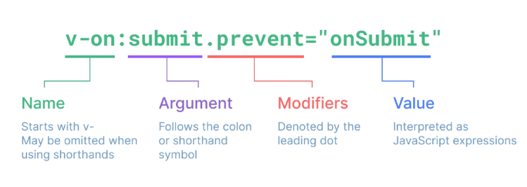

1. Directive - "Arguments"
- 일부 directive 는 뒤에 콜론 (":") 으로 표시되는 인자 사용 가능

2. Directive - "Modifiers"
- ". (dot)"로 표시되는 특수 접미사로 directive가 특별한 방식으로 바인딩 되어야 함을 나타냄
```html
<form v-on:submit.prevent="onSubmit">
  <input type="submit">
</form>
```
- 위 예시의 **.prevent** 는 발생한 이벤트에서 event.preventDefault()를 호출하도록 v-on에 지시하는 modifier

### [Built-in Directives](https://vuejs.org/api/built-in-directives.html/)

## Dynamically data binding
### v-bind
- 하나 이상의 속성 또는 컴포넌트 데이터를 표현식에 동적으로 바인딩
- v-bind 사용처
  1. Attribute Bindings
  2. Class and Style Bindings

### Attribute Bindings (속성 바인딩)
- HTML 속성 값을 Vue의 상태 속성값과 동기화 되도록 함
```html

<a v-bind:href="myUrl">Move to url</a>
```
- v-bind shorthand (약어)
  - ':' (colon)
```html

<a :href="myUrl">Move to url</a>
```

### Dynamic attribute name (동적 인자 이름)
- 대괄호( [] ) 로 감싸서 directive argument에 JavaScript 표현식을 사용할 수 있음
- 표현식에 따라 동적으로 평가된 값이 최종 argument 값으로 사용 됨
```html
<button :[key]="myValue"></button>
```
- 대괄호 안에 작성하는 이름은 반드시 소문자로만 구성 가능함 (브라우저가 속성 이름을 소문자로 강제 변환하기 때문)


### Class and Style Bindings (클래스와 스타일 바인딩)
- class 와 style 은 모두 HTML 속성이므로 다른 속성과 마찬가지로 v-bind 를 사용해 동적으로 문자열 값 할당 가능
- Vue 는 class 및 style 속성 값을 v-bind로 사용할 때 **객체 또는 배열**을 활용하여 작성할 수 있도록 함
  - 단순 문자열 연결을 사용하여 이러한 값을 생성할 경우 번거롭고 오류 발생가능성이 높기 때문

### Class and Style Bindings 가 가능한 경우
1. Binding HTML Classes
  1. Binding to Objects
  - 객체를 :class에 전달하여 클래스를 동적으로 전환할 수 있음
  - isActive 의 Boolean 값에 의해 active 클래스의 존재가 결정됨
    - 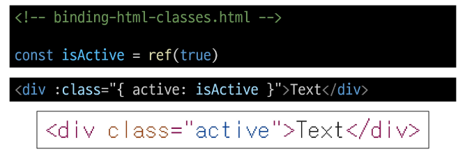
  
  - 객체에 더 많은 필드를 포함하여 여러 클래스를 전환할 수 있음
    - :class directive를 일반 클래스 속성과 함께 사용 가능
      - 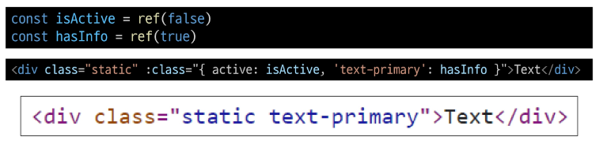

  - inline 방식이 아닌 반응형 변수를 활용해 객체를 한번에 작성하는 방법
    - 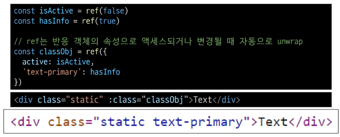
  
  2. Binding to Arrays
  - :class 를 배열에 바인딩하여 클래스 목록을 적용할 수 있음
    - 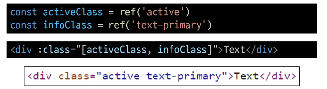


2. Binding Inline Styles
  1. Binding to Objects
  - :style 은 JavaScript 객체 값에 대한 바인딩을 지원 (HTML style 속성)
    - 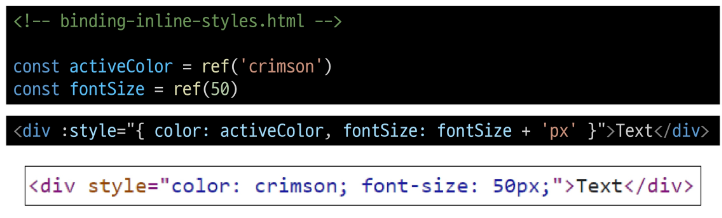

  - 실제 CSS에서 사용하는 것처럼 :style 은 kebab-cased 키 문자열도 지원 (단, camelCase 작성을 권장)
    - 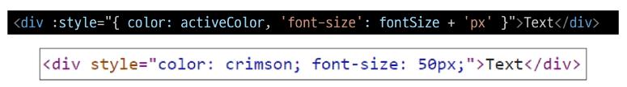
  
  2. Binding to Arrays
  - 여러 스타일 객체를 배열에 작성해서 :style 을 바인딩 할 수 있음
  - 작성한 객체는 병합되어 동일한 요소에 적용
    - 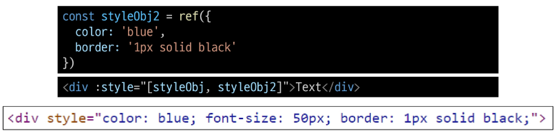

## Event Handling
### v-on
- DOM 요소에 이벤트 리스너를 연결 및 수신
- v-on 구성
  - 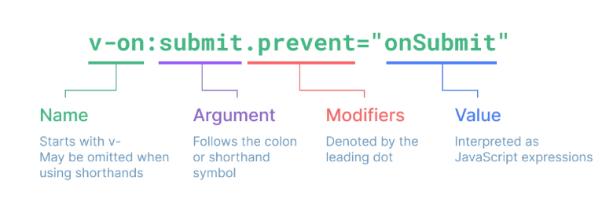
```html
v-on:event="handler"
```
- handler 종류
  - Inline handlers : 이벤트가 트리거 될 때 실행 될 JavaScript 코드
  - Method handlers : 컴포넌트에 정의된 메서드 이름
- v-on shorthand (약어)
  - '@'
```html
@event="handler"
```

1. Inline Handlers
- 주로 간단한 상황에 사용
  - 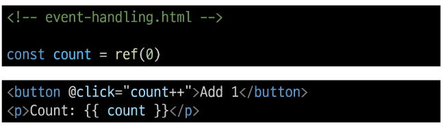

2. Method Handlers
- 메서드를 작성하여 호출하는 방식
- Inline handlers로는 불가능한 대부분의 상황에서 사용
  - 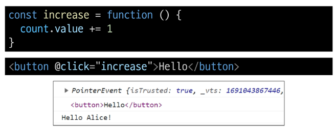

### Method Handlers 에서의 event 객체
- Mehtod Handlers 는 이를 트리거 하는 기본 DOM Event 객체를 자동으로 수신
  - 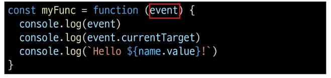

- 기본 이벤트 대신 사용자 지정 진자를 전달할 수 있음
  - 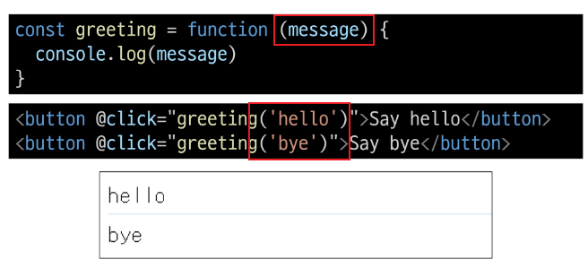

### Inline Handlers 에서의 event 인자 접근
- Inline Handlers 에서 원래 DOM 이벤트에 접근하기
- $event 변수를 사용하여 메서드에 전달
  - $event 변수를 전달하는 위치는 상관 없음 
  - 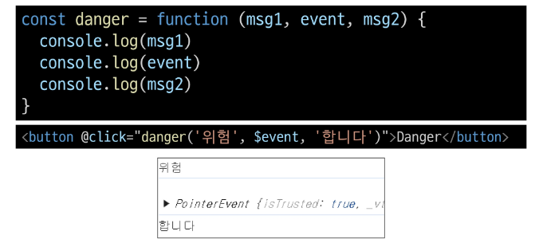

### Modifiers
- Vue 에서는 이벤트 처리 시 Event Modifiers를 활용해 event.prevenetDefault() 나 event.stopPropagation() 같은 브라우저 기본 동작 차단 코드를 직접 메서드 안에 작성하지 않고 템플릿에서 간단한 문법으로 처리할 수 있도록 함
  - 이벤트의 세부 제어는 템플릿에서 modifiers 로 처리하고, 메서드는 데이터에 관한 논리를 작성하는 것에 집중하기 위함
  - Modifiers는 체이닝 되게끔 작성할 수 있으며 이때는 작성된 순서로 실행되기 때문에 작성 순서에 유의해야 함

### Modifiers 예시
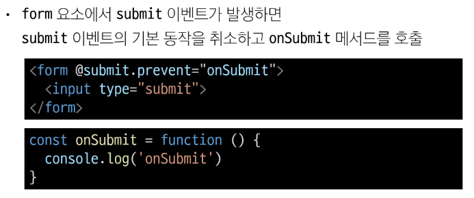

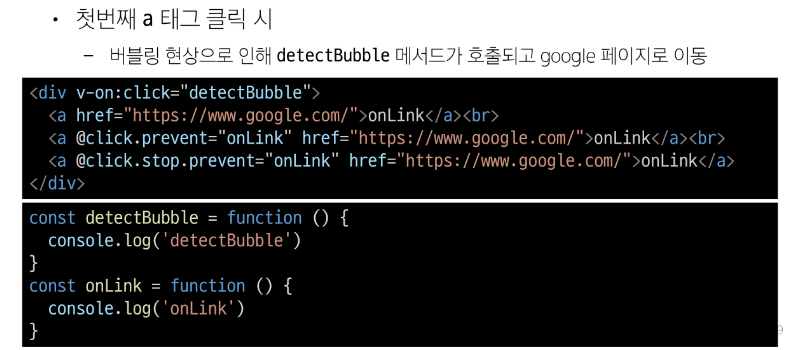

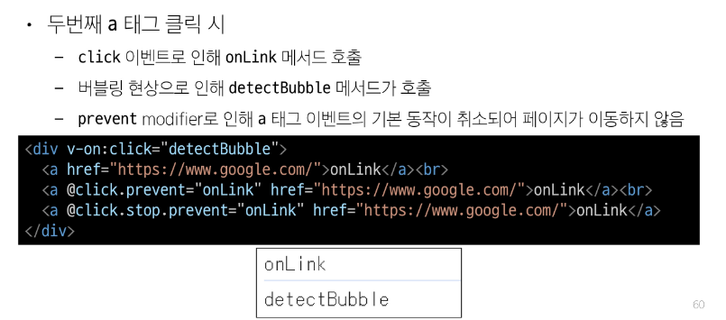

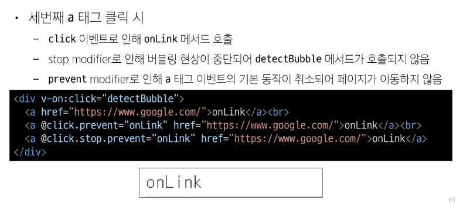

### Key Modifiers
- 키보드 이벤트를 수신할 때 특정 키에 관한 별도 modifires를 사용할 수 있음
- 예시
  - Enter 키가 입력 되었을 때만 onSubmit 이벤트 호출하기
```html
<input @keyup.enter="onSubmit">
```

## Form Input Bindings (폼 입력 바인딩)
- form 을 처리할 때 사용자가 input 에 입력하는 값을 실시간으로 JavaScript 상태에 동기화해야 하는 경우 (양방향 바인딩)
- 양방향 바인딩 방법
  1. v-bind 와 v-on을 함께 사용
  2. v-model 사용

### v-bind with v-on
1. v-bind 를 사용하여 input 요소의 value 속성 값을 입력 값으로 사용
2. v-on 을 사용하여 input 이벤트가 발생할 때 마다 input 요소의 value 값을 별도 반응형 변수에 저장하는 핸들러를 호출

### v-model
- form input 요소 또는 컴포넌트에서 양방향 바인등을 만듦
- 사용자 입력 데이터와 반응형 변수를 실시간 동기화
  - IME가 필요한 언어(한국어, 중국어, 일본어 등)의 경우 v-model이 제대로 업데이트 되지 않음
  - v-bind 와 v-on 방법을 사용해야 함


### v-model 활용
- v-model 은 단순 Text input 뿐만 아니라 Checkbox, Radio, Select 등 다양한 타입의 사용자 입력 방식과 함께 사용 가능

- Checkbox 활용
  - 단일 체크박스와 boolean 값 활용
  - 여러 체크박스와 배열 활용
    - 해당 배열에는 현재 선택된 체크박스의 값이 포함
    - 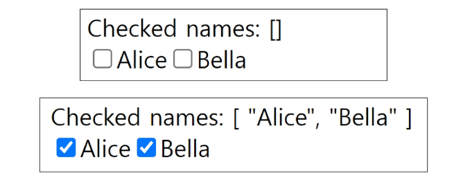
    - 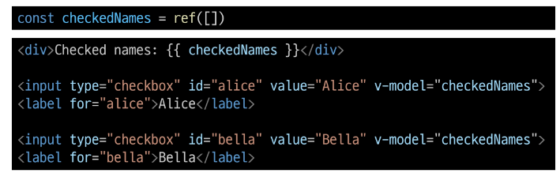

- Select 활용
  - select 에서 v-model 표현식의 초기 값이 어떤 option과도 일치하지 않는 경우 select 요소는 "unselectd" 상태로 렌더링 됨
  - 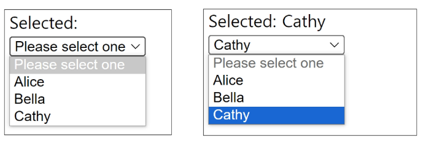
  - 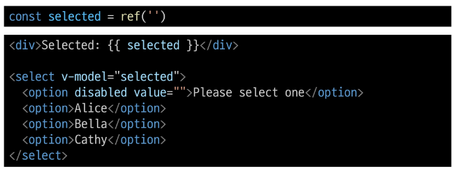

## 접두어 $
- Vue 인스턴스 내에서 제공되는 내부 변수
  - 사용자가 지정한 반응형 변수나 메서드와 구분하기 위함
  - 주로 Vue 인스턴스 내부 상태를 다룰 때 사용

## IME (Input Method Editor)
- 사용자가 입력 장치에서 기본적으로 사용할 수 없는 문자를 입력할 수 있도록 하는 운영 체제 구성 프로그램
- 일반적으로 키보드 키보다 자모가 더 많은 언어에서 사용