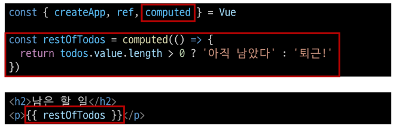

# Basic Syntax 2
## Computed Properties
### Computed()
- "계산된 속성"을 정의하는 함수
  - 미리 계산된 속성을 사용하여 템플릿에서 표현식을 단순하게 하고 불필요한 반복 연산을 줄임

### Computed 가 필요한 경우
- 할 일이 남았는지 여부에 따라 다른 메시지를 출력하기
- Computed 적용 전
  - 
  - 템플릿이 복잡해지며 todos 에 따라 계산을 수행하게 되고 템플릿을 여러 번 사용하는 경우 반복이 발생

- Computed 적용 후
  - 
  - 반응형 데이터를 포함하는 복잡한 로직의 경우 computed 를 활용하여 미리 값을 계산하여 계산 된 값을 

### computed 특징
- 반환되는 값은 computed ref 이며 일반 ref와 유사하게 계산된 결과를 .value 로 참조할 수 있음
- computed 속성은 의존된 반응형 데이터를 **자동으로 추적**
- 의존하는 데이터가 **변경될 때만 재평가**
  - rest0fTodos 의 계산은 todos 에 의존하고 있음
  - 따라서 todos 가 변경될 때만 rest0fTodos 가 업데이트 됨
```js
const rest0fTodos = computed(() => {
  return todos.value.length > 0 ? '아직 남았다' : '퇴근!'
})
```

### 메서드와 차이
- computed 속성 대신 method 로도 동일한 기능을 정의할 수 있으나
- computed 속성은 **의존된 반응형 데이터를 기반으로 캐시(cached)됨**
- 의존하는 데이터가 변경된 경우에만 재평가 됨
  - 의존된 반응형 데이터가 변경되지 않는 한 이미 계산된 결과에 대한 여러 참조는 다시 평가할 필요 없이 이전 계산되 결과를 즉시 반환

- 반면 method 호출은 다시 렌더링이 발생할 때 마다 항상 함수를 실행

### 적절한 사용
- computed
  - 의존하는 데이터에 따라 결과가 바뀌는 계산딘 속성을 만들 때 유용
  - 동일한 의존성을 가진 여러 곳에서 사용할 때 계산 결과를 캐싱하여 중복 계산 방지
  - 의존된 데이터가 변경되면 자동으로 업데이트

- method
  - 단순히 특정 동작을 수행하는 함수를 정의할 때 사용
  - 데이터에 의존하는지 여부와 관계없이 항상 동일한 결과를 반환하는 함수
  - 호출해야만 실행됨

## Conditional Rendering
### v-if
- 표현식 값의 true/false 를 기반으로 요소를 조건부로 렌더링

### v-if / v-else
  - 'v-if' directive 를 사용하여 조건부로 렌더링
  - 'v-else'  directive 를 사용하여 v-if 에 대한 else 블록을 나타낼 수 있음
```js
const isSeen = ref(true)
```
```html
<p v-if="isSeen">true일때 보여요</p>
<p v-else>false일때 보여요</p>
<button @click="isSeen = !isSeen">토글</button>
```

### v-else-if
- 'v-else-if' directive 를 사용하여 v-if 에 대한 else if 블록을 나타낼 수 있음
```js
const name = ref('Cathy')
```
```html
<div v-if="name === 'Alice'">Alice입니다</div>
<div v-else-if="name === 'Bella'">Bella입니다</div>
<div v-else-if="name === 'Cathy'">Cathy입니다</div>
<div v-else>아무도 아닙니다.</div>
```

### 여러 요소에 대한 v-if 적용
- HTML template 요소에 v-if 를 사용하여 하나 이상의 요소에 대해 적용할 수 있음 (v-else, v-else-if 모두 적용 가능)
```html
<template v-if="name === 'Cathy'">
  <div>Cathy입니다</div>
  <div>나이는 30살입니다</div>
</template>
```

### v-show
- 표현식 값의 true/false 를 기반으로 요소의 가시성(visibility)을 전환
- v-show 요소는 항상 DOM에 렌더링 되어 있고 CSS display 속성만 전환하여 보여거나 가림
- 초기 조건에 관계 없이 항상 렌러링 되기 때문에 
  - v-if 에 비해 초기 렌더링 비용이 더 높음 (단, 토글 비용은 더 저렴함)
  - v-if 에 비해 초기 렌더링 시간이 더 오래 걸림 (단, 전환 시간은 더 빠름)

#### 컨텐츠를 자주 전환해야 하는 경우 v-show를, 실행 중에 조건이 변경되지 않는 경우에는 v-if를 권장

## List Rendering
### v-for
- 소스 데이터를 기반으로 요소 또는 템플릿 블록을 화면에 반복적으로 렌더링

### v-for 구조
- v-for 는 alias in expression 형식의 특수 구문을 사용
```html
<div v-for="item in items">
  {{ item.text }}
</div>
```
- 인덱스 (객체에서는 key) 에 대한 별칭을 지정할 수 있음
```html
<!-- item이 먼저, index가 나중에 -->
<div v-for="(item, index) in arr"></div>

<!-- python 이나 js 에서는 기대값이 key값 이기 때문에 key를 반환 했으나
     Vue 에서는 Rendering 시킬 요소가 필요하기 때문에 value를 반환함  -->
<div v-for="value in object"></div>

<div v-for="(value, key) in object"></div>
<div v-for="(value, key, index) in object"></div>
```

### 여러 요소에 대한 v-for 적용
- HTML template 요소에 v-for 를 사용하여 하나 이상의 요소에 대해 반복 렌더링 가능

### 중첩된 v-for
- 각 v-for 의 하위 영역(scope)은 상위 영역에 접근할 수 있음

## v-for 와 key
- Vue 에서는 반드시 v-for 와 key를 함께 사용해야 함
  - 내부 컴포넌트의 상탤를 일관되게 하여 데이터의 예측 가능한 행동을 유지하기 위함

- key 는 반드시 각 요소에 대한 **고유한 값을 나타낼 수 있는 식별자**여야 함
```js
let id = 0
const items = ref([
  { id : id++, name : 'SSAFY' },
  { id : id++, name : 'SSAFY2' },
])
```
```html
<div v-for="item in items" :key="item.id">
</div>
```

### 내장 특수 속성 key
- 각 항목이 서로 구분되는 고유 식별자 역할
- number 혹은 string 으로만 사용해야 함
- Vue 내부 가상 DOM 알고리즘이 이전 목록과 새 노드 목록을 비교할 때 각 node를 식별하는 용도로 사용
- 권장되는 Key 값
  - 데이터 베이스의 고유 ID
  - 항목 고유 식별자 (UUID 등)
- 피해야 할 Key 값
  - 배열 인덱스
  - 객체 자체

## v-for 와 v-if
- 동일 요소에 v-for 와 v-if 를 함께 사용하지 않는다
  - 동일한 요소에서 v-if 가 우선순위가 더 높기 때문
  - v-if 에서의 조건은 v-for 범위의 변수에 접근할 수 없음

### v-for 와 v-if 해결법
1. computed 를 활용해 이미 필터링 된 목록을 반환하여 반복하도록 설정
```js
const completeTodos = computed(() => {
  return todos.value.filter((todo) => !todo.isComplete)
})
```
```html
<ul>
  <li v-for="todo in completeTodos" :key="todo.id">
    {{ todo.name }}
  </li>
</ul>
```

2. v-for 와 template 요소를 사용해 v-if 위치를 이동
```html
<ul>
  <template v-for="todo in todos" :key="todo.id">
    <li v-if="!todo.isComplete">
      {{ todo.name }}
    </li>
  </template>
</ul>
```

## Watchers
### watch()
- 하나 이상의 반응형 데이터를 감시하고 감시하는 데이터가 변경되면 콜백 함수를 호출

### watch 구조
```js
wacth(source, (newValue, oldValue) => {
  // do something
})
```
- 첫번째 인자 (source)
  - watch 가 감시하는 대상 (반응형 변수, 값을 반환하는 함수 등)
- 두번째 인자 (callback function)
  - source 가 변경될 때 호출되는 콜백 함수
  1. newValue
    - 감시하는 대상이 변화된 값
  2. oldValue (optional)
    - 감시하는 대상의 기존 값

### computed 와 watchers

- computed 와 watch 모두 의존(감시)하는 원본 데이터를 직접 변경하지 않는다.

## Lifecycle Hooks
- Vue 컴포넌트가 생성부터 소멸까지 각 단계에서 실행되는 함수
- 컴포넌트의 생애 주기 중간 중간에 함수를 제공
  - 개발자는 컴포넌트의 특정 시점에 원하는 로직을 실행할 수 있음

### 주요 Lifecycle Hooks - onMounted
- Vue 컴포넌트 인스턴스가 초기 렌더링 및 DOM 요소 생성이 완료된 후 (부착 되자마자) 특정 로직을 수행하기
```js
const { createApp, ref, onMounted } = Vue

setup() {
  onMounted(() => {
    console.log('mounted')
  })
}
```


### 주요 Lifecycle Hooks - onUpdated
- 반응형 데이터의 변경으로 인해 컴포넌트의 **DOM이 업데이트 된 후**특정 로직을 수행
```html
<button @click="count++">Add 1</button>
<p>Count: {{ count }}</p>
<p>{{ message }}</p>
```
```js
const { createApp, ref, onMounted, onUpdated } = Vue

onUpdated(() => {
  message.value = 'updated!'
})
```

## Vue Style Guide
- Vue 스타일 가이드 규칙은 우선순위에 따라 4가지 범주로 나뉨
- 우선순위 A : 필수 (Essential)
  - 오류를 방지하는 데 도움이 되므로 어떤 경우에도 규칙을 준수
- 우선순위 B : 적극 권장 (Strongly Recommended)
  - 가독성 및 개발자 경험 향상
- 우선순위 C : 권장 (Recommended)
  - 일관성을 보장하도록
- 우선순위 D : 주의 필요 (Use with Caution)
  - 잠재적 위험 특성 고려

