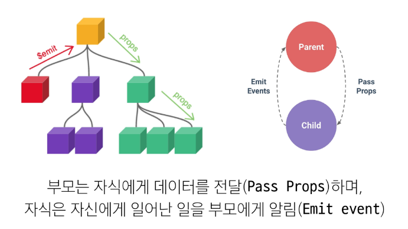
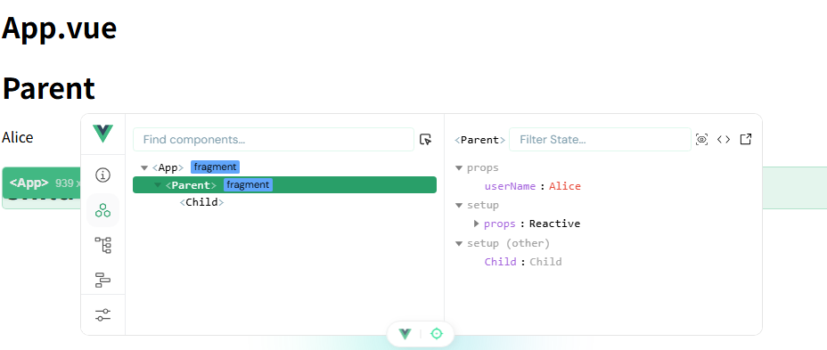
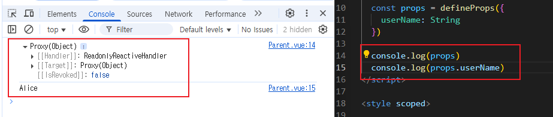
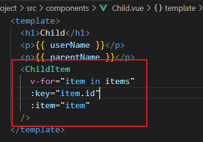
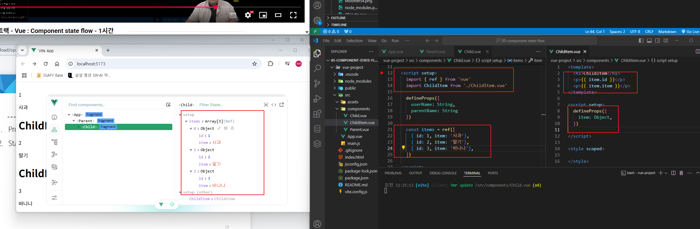
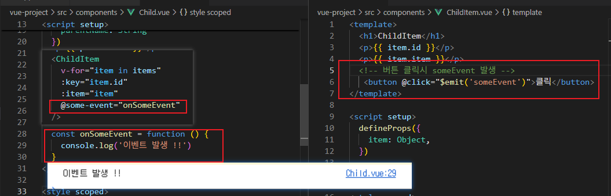
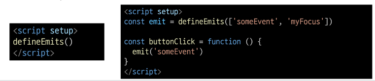
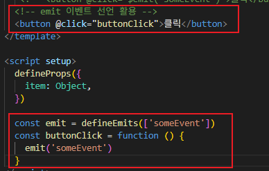

# Passing Props
## Props
- 부모 컴포넌트로부터 자식 컴포넌트로 데이터를 전달하는데 사용되는 속성

### Props 특징
- 부모 속성이 업데이트되면 자식으로 전달 되지만 반대의 경우는 불가
- 부모 컴포넌트가 업데이트 될 때 마다 이를 사용하는 자식 컴포넌트의 모든 props 가 최신 값으로 업데이트 됨
<br>

  - 

### One-Way Data Flow
- 모든 props 는 자식 속성과 부모 속성 사이에 **하향식 단방향 바인딩 (one-way-down binding)**을 형성
- 데이터 흐름의 일관성을 유지하고 단순화하기 위해 **하향식 단방향 바인딩**으로 형성

## Props 선언
- 부모 컴포넌트에서 내려보낸 Props를 사용하기 위해서는 자식 컴포넌트에서 명시적인 props 선언이 필요

### Props 작성
1. 부모 컴포넌트에서 자식 컴포넌트로 보낼 props 작성
```
my-msg = "message" 
props 이름 = props 값
```
2. prop 받을 자식 태그에 데이터 담길 변수명은 HTML 속성 형태로 작성하고 바인딩 시켜 추가
```vue
<!-- App.vue -->
<template>
  <h1>App.vue</h1>
  <Parent :user-name="userName"/>
</template>

<script setup>
  import Parent from '@/components/Parent.vue';

  import { ref } from 'vue'
  const userName = ref('Alice')
</script>
```
3. 상속 받는 컴포넌트의 script에 props 받은 정보를 정의
  - defineProps() 를 사용하여 props 선언

```vue
<script setup>
  ...
  // 항상 변수의 타입까지 작성해줘야 함
  // 키 = 전달받은 props의 이름
  // 값 = 데이터의 타입에 해댕하는 생성자 함수
  defineProps({
    userName: String
  })
</script>
```
<br>

4. 상속 받을 컴포넌트의 template 에 props 작성
<br>

  - 

  - props는 객체로 반환하기 때문에 필요한 경우 JS에서 접근 가능
<br>

  - 

<br>

```vue
<template>
  <h1>Parent</h1>
  <p>{{ userName }}</p>
  <Child />
</template>
```

5. 객체 상태로도 props 가능
<br>

  
<br>

  

## Componet Events
### $emit()
- 자식 컴포넌트가 이벤트를 발생시켜 부모 컴포넌트로 데이터를 전달하는 역할의 메서드

```js
$emit(event, ...args)
```
- event
  - 커스텀 이벤트 이름
- args
  - 추가 인자

### 이벤트 발신 및 수신
- $emit 을 사용하여 템플릿 표현식에서 직접 사용자 정의 이벤트를 발신
```html
<button @click="$emit('someEvent')"> 클릭 </button>
```
- 이후 부모는 v-on 을 사용하여 수신 가능
```html
<ParentComp @some-event="someCallback" />
```



### emit 이벤트 선언
- defineEmits() 를 사용해 발신할 이벤트를 선언
- defineEmits() 는 $emit 대신 사용할 수 잇는 동등한 함수를 반환
  - script 에서는 $emit 메서드를 접근할 수 없기 때문
- 이벤트 결과에 대해 인자를 넘기거나, 다양한 로직을 실행 가능함.





### emit 이벤트 실행 과정
1. defineEmits() 으로 정의해둔 이벤트 발생
2. 해당 이벤트 발생 시 해당하는 함수 실행
  - 인자로 넘겨 받은 데이터가 있는 경우 해당 인자를 활용하여 함수가 실행됨
3. 부모 컴포넌트가 가진 데이터가 변경될 수 있음
  - 다시 자식 컴포넌트에게 전달되고 렌더링 됨

## 정적 & 동적 props 주의사항
```vue
<!-- 1 -->
<SomeComponent num-props="1"/>

<!-- 2 -->
<SomeComponent :num-props="2"/>
```
- 첫 번째는 정적 props로 문자열 "1" 을 전달
- 두 번째는 동적 props로 숫자 1을 전달

