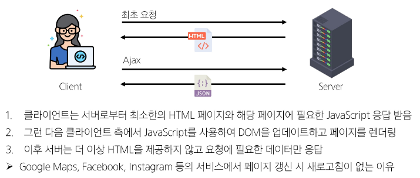
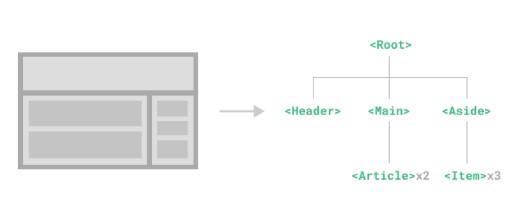
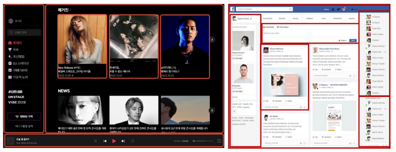
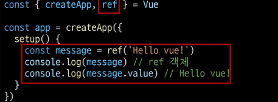
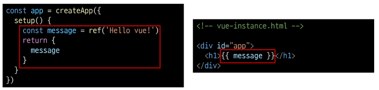

## Frontend Development
- 웹 사이트와 웹 애플리케이션의 사용자 인터페이스(UI)와 사용자 경험(UX)을 만들고 디자인하는 것
  - HTML, CSS, JavaScript 등을 활용하여 사용자가 직접 상호작용하는 부분을 개발

## Client-Side frameworks
- 클라이언트 측에서 UI와 상호작용을 개발하기 위해 사용되는 JavaScript 기반 프레임워크

### Client-Side frameworks 가 필요한 이유
1. 웹이 단순히 무언가를 읽는 곳 -> 무언가를 하는 곳으로
  - 웹에서 문서를 읽는 것 뿐만 아니라 음악을 스트리밍하고, 영화를 보고, 텍스트나 영상 채팅을 통해 즉시 통신하고 있음
  - 웹 애플리케이션 : 현대적이고 복잡한 대화형 웹 사이트
  - JavaScript 기반의 Client-Side frameworks가 등장하며 매우 동적인 대화형 애플리케이션을 더 쉽게 구축할 수 있음

2. 웹에서 다루는 데이터 양의 증가
  - 애플리케이션의 상태를 변경할 때마다 일치하도록 UI를 업데이트 해야함

### Client-Side frameworks 의 필요성
1. 동적이고 반응적인 웹 애플리케이션 개발
  - 실시간 데이터 업데이트

2. 코드 재사용성 증가
  - 컴포넌트 기반 아키텍처
  - 모듈화된 코드 구조

3. 개발 생산성 향상
  - 강력한 개발 도구 지원

# SPA
## Single Page Application
- 단일 페이지에서 동작하는 웹 애플리케이션

### SPA 작동 원리
- 최초 로드 시 필요한 모든 리소스 다운로드
- 이후 페이지 갱신에 대해 필요한 데이터만을 비동기적으로 전달받아 화면의 필요한 부분만 동적으로 갱신
  - AJAX 와 같은 기술을 사용해 필요한 데이터만 비동기적으로 로드
  - 페이지 전체를 다시 로드 할 피요 없이 데이터만 서버로부터 가져와 화면에 표시
- JavaScript를 사용하여 클라이언트 측에서 동적으로 콘텐츠를 생성하고 업데이트 
  - CSR 방식

## CSR (Client-Side Rendering)
- 클라이언트에서 콘텐츠를 렌더링 하는 방식

### CSR 작동 원리
1. 사용자가 웹 사이트에 요청을 보냄
2. 서버는 최소한의 HTML과 JavaScript 파일을 클라이언트로 전송
3. 클라이언트는 HTML과 JavaScript를 다운로드 받음
4. 브라우저가 JavaScript를 실행하여 동적으로 페이지 콘텐츠를 생성
5. 필요한 데이터는 API를 통해 서버로부터 비동기적으로 가져옴 



## SPA와 CSR의 장점
1. 빠른 페이지 전환
  - 페이지가 처음 로드된 후 필요한 데이터만 가져오면 되고 JavaScript는 전체 페이지를 새로고침 할 필요 없이 페이지의 일부만 렌더링 할 수 있기 때문
  - 서보로 전송되는 데이터의 양을 최소화 (서버 부하 방지)
2. 사용자 경험
  - 새로고침이 발생하지 않아 네이티브 앱과 유사한 사용자 경험을 제공
3. Frontend 와 Backend의 명확한 분리
  - Frontend는 UI 렌더링 및 사용자 상호 작용 처리를 담당 Backend는 데이터 및 API 제공을 담당
  - 대규모 애플리케이션을 더 쉽게 개발하고 유지 관리 가능

## SPA와 CSR의 단점
1. 느린 초기 로드 속도
  - 전체 페이지를 보기 전에 약간의 지연을 느낄 수 있음
  - JavaScript가 다운로드, 구문 분석 및 실행될 때까지 페이지가 완전히 렌더링 되지 않기 때문
2. SEO(검색 엔진 최적화) 문제
  - 페이지를 나중에 그려 나가는 것이기 때문에 검색을 잘 노출되지 않을 수 있음
  - 검색엔진 입장에서 HTML을 읽어서 분석해야 하는데 아직 콘텐츠가 모두 존재하지 않기 때문

### SPA vs MPA // CSR vs SSR
- MPA (Multi Page Application)
  - 여러개의 HTML 파일을 서버로부터 각각 로드
  - 사용자가 다른 페이지로 이동할 때 마다 새로운 HTML 파일이 로드 됨
- SSR (Server-side Rendering)
  - 서버에서 화면을 렌더링 하는 방식
  - 모든 데이터가 담긴 HTML을 서버에서 완성 후 클라이언트에게 전달

# Vue
- 사용자 인터페이스를 구축하기 위한 JavaScript 프레임워크
- Evan You 에 의해 발표 (2014)
  - Angular 개발팀 출신
- 최신 버전은 ['Vue 3' (2024)](https://vuejs.org/)

## Vue를 학습하는 이유
1. 낮은 학습 곡선
  - 간결하고 직관적인 문법을 가지고 있어 빠르게 익힐 수 있음
  - 잘 정리된 문서를 기반으로 어렵지 않게 학습할 수 있음

2. 확장성과 생태계
  - 다양한 플러그인과 라이브러리를 제공하는 높은 확장성
  - 활성화된 커뮤니티를 기반으로 많은 개발자들이 새로운 기능을 개발하고 공유

3. 유연성 및 기능
  - 작은 규모 ~ 대규모 다양한 프로젝트에 적합

## Vue의 2가지 핵심 기능
1. 선언적 렌더링 (Declarative Rendering)
  - 표준 HTML을 확장하는 Vue "템플릿 구문"을 사용하여 JavaScript 상태(데이터)를 기반으로 화면에 출력될 HTML을 선언적으로 작성
2. 반응성 (Reactivity)
  - JavaScript 상태 변경을 추적하고, 변경사항이 발생하면 자동으로 DOM을 업데이트

## Vue의 주요 특징
1. 반응형 데이터 바인딩
  - 데이터 변경 시 자동 UI 업데이트
2. 컴포넌트 기반 아키텍처
  -  재사용 가능한 UI 조각
3. 간결한 문법과 직관적인 API
  - 낮은 학습 곡선
  - 높은 가독성
4. 유연한 스케일링
  - 작은 프로젝트 부터 대규모 애플리케이션까지 적합

## Vue 기본 구조
- cerateApp() 에서 전달되는 객체는 Vue 컴포넌트
- 컴포넌트의 상태는 setup() 함수 내에서 선언되어야 하며 객체를 반환해야함
```js
const app = createApp({
  setup() {
    const message = ref('Hello vue!')
    return {
      // message : message
      message
    }
  }
}) 
```
- 반환된 객체의 속성은 템플릿에서 사용
- Mustache syntax(콧수염 구문)을 사용하여 메세지 값을 기반으로 동적 텍스트를 렌더링
```html
<div> 
  <h1> {{ message }} </h1>
</div>
```
- 컨텐츠는 식별자나 경로에만 국한되지 않으며 유효한 JavaScript 표현식을 사용할 수 있음
```html
<h1>{{ message.split('').resverse().join('') }}</h1>
```

### Event Listeners in Vue
- 'v-on' directive 를 사용해 DOM 이벤트 수신 가능
- 함수 내에서 반응형 변수를 변경하여 구성 요소 상태를 업데이트

### Component
- 재사용 가능한 코드 블록
- UI를 독립적이고 재사용 가능한 일부분으로 분할하고 각 부분을 개별적으로 다룰 수 있음
  - 자연스럽게 애플리케이션은 중첩된 Component 트리 형태로 구성
  - 

- 웹 서비스는 여러 개의 Component로 이루어져 있음



### 반응형 상태 ref()
- 반응형 상태(데이터)를 선언하는 함수
  - 반응형을 가지는 참조 변수를 만드는 것 (ref === reactive reference)
  - Declaring Reactive State

- .value 속성이 있는 ref 객체로 래핑하여 반환하는 함수
- ref 로 선언된 변수의 값이 변경되면, 해당 값을 사용하는 템플릿에서 자동으로 업데이트
- 인자는 어떠한 타입도 가능


- 템플릿의 참조에 접근려하면 setup 함수에서 선언 및 반환 필요함
- 편의상 템플릿에서 ref 를 사용할 때는 .value 없이 사용 (automatically unwrapped)


### ref 객체가 필요한 이유
- Vue는 템플릿에서 ref 를 사용하고 ref 값이 변경되면 자동으로 변경 사항을 감지하고 DOM을 업데이트 함
  - 의존성 추적 기반의 반응형 시스템
- 렌더링 중에 사용된 모든 ref를 추적하며 ref가 변경되면 이를 추적하는 구성 요소에 대해 다시 렌더링
- 이를 위해 참조 자료형의 객체 타입으로 구현한 것
  - JavaScript에서는 일반 변수의 접근 또는 변형을 감지할 방법이 없기 때문

### Ref Unwrap 주의 사항
- 템플릿에서의 unwrap은 ref가 최상위 속성인 경우에만 적용가능
- 이 문제를 해결하기 위해서는 id를 최상위 속성으로 분해해야 함
- 단 ref 가 "{{ }}" 의 최종 평가 값이 경우는 unwrap 가능

### SEO (Search Engine Optimization)
- 검색 엔진 등에 내 서비스나 제품 등이 효율적으로 검색 엔진에 노출 되도록 개선하는 과정을 일컫는 작업
- 정보의 대상은 주로 HTML 에 작성된 내용

