# Router
## Routing
- 네트워크에서 경로를 선택하는 프로세스
  - 웹 애플리케이션에서 다른 페이지 간의 전환과 경로를 관리하는 기술

### SSR 에서의 Routing
- SSR에서 Routing은 서버 측에서 수행
- 사용자가 방문한 URL 경로를 기반으로 응답을 전송
- 링크를 클릭하면 브라우저는 서버로부터 HTML응답을 수신하고 새 HTLM로 전체 페이지를 다시 로드

### CSR 에서의 Routing
- CSR에서 Routing은 **클라이언트 측**에서 수행
- 클라이언트 측 JavaScript가 새 데이터를 동적으로 가져와 전체 페이지를 다시 로드하지 않음

### SPA 에서의 Routing
- SPA에서 Routing은 하나의 페이지로 여러 컴포넌트를 새로 렌더링 하여 마치 여러 페이지를 사용하는 것 처럼 보여야하기 때문에 필수적
  - URL을 통한 페이지 변화, 브라우저의 뒤로 가기 기능 등

## Vue Router
- Vue 공식 Router
  - Vite로 프로젝트 생성 시 Router 추가 가능

### RouterLink
- 페이지를 다시 로드하지 않고 URL을 변경하여 URL 생성 및 관련 로직을 처리함
- HTML의 <a\> 태그를 렌더링

  - 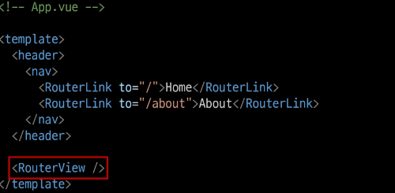
  <br>

### RouterView
- RouterLink URL에 해당하는 컴포넌트를 표시함
- 원하는 곳에 배치하여 컴포넌트 레이아웃을 표시 가능
  - 
  <br>

### router/index.js
- 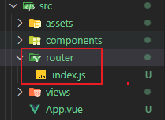
<br>

  - 라우팅 관련 정보 및 설정이 작성되는 곳
  - router에 URL과 컴포넌트를 매핑

### views
- 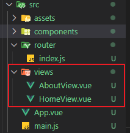
<br>

  - RouterView 위치에 렌더링 할 컴포넌트를 배치
  - 기준 components 폴더와 기능적으로 다른 것은 없으며 단순 분류의 의미로 구성됨
    - 일반 컴포넌트와 구분하기 위해 컴포넌트 이름을 View로 끝나도록 작성하는것을 권장

## Basic Routing
1. index.js 에 라우터 관련 설정 작성 (주소, 이름, 컴포넌트)
2. RouterLink 에 'to' 속성으로 index.js 에서 정의한 주소 값 사용
3. RouterLink 클릭 시 경로와 일치하는 컴포넌트가 RouterView 에서 렌더링 됨

### Router 관리
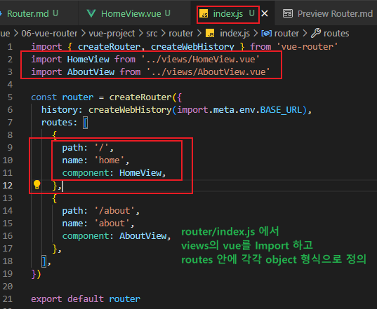
<br>

## Named Routes
- 경로에 이름을 지정하는 라우팅
- name 속성 값에 경로에 대한 이름을 지정
- 경로에 연결하기 위해서는 RouterLink에 v-bind를 사용해 'to' props 객체로 전달
  - 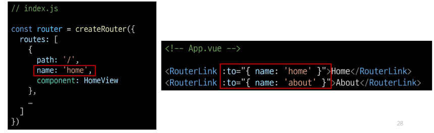
<br>

- 하드코딩 된 URL을 사용하지 않아도 되며 URL 입력 시 오타를 방지하는 장점

## Dynamic Route Matching
- URL의 일부를 변수로 사용하여 경로를 동적으로 매칭
  - 매개변수를 사용한 동적 경로 매칭

1. views 폴더 내 컴포넌트 작성
2. router/index.js 라우트 등록
  - 매개변수는 콜론 (:) 으로 표기
  - UserView 컴포넌트 라우트 등록
  - 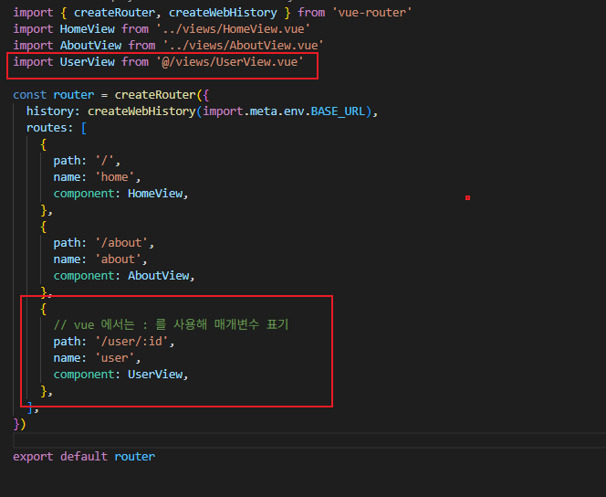
  <br>

3. 매개변수는 객체의 params 속성의 객체 타입으로 전달함
  - 단, 객체의 key 이름은 index.js 에서 지정한 매개변수 이름과 같아야 한다.
  - 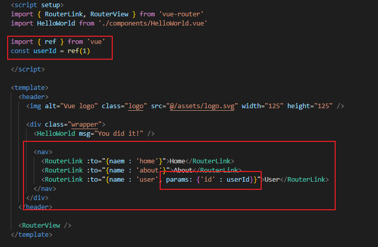
  <br>

4. 경로가 일치하면 라우트의 매개변수는 컴포넌트에서 **$route.params** 로 참조가 가능하다.
  - 현재 사용자에 대한 정보를 가져 오는것이 가능해짐
  - 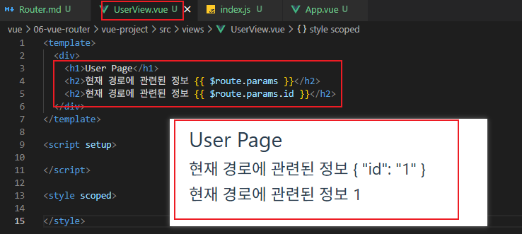
  <br>

5. 단, useRoute() 함수를 사용해 스크립트 내에서 반응형 변수에 할당 후 템플릿에 출력하는 것을 권장함
  - 템플릿에서 $route 를 사용하는 것과 동일
  - 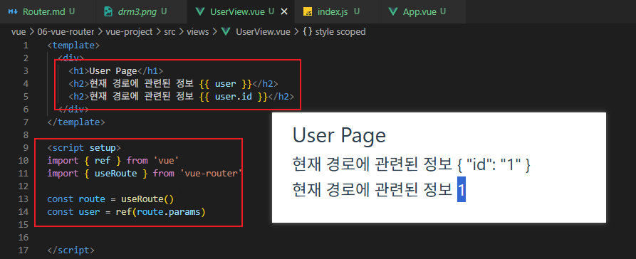
  <br>

## Nested Routes
- 중첩된 라우팅
- 애플리케이션의 UI는 여러 레벨 깊이로 중첩된 컴포넌트로 구성되기도 함
- URL을 중첩된 컴포넌트 구조에 따라 변경되도록 관계를 표현할 수 있음
  - 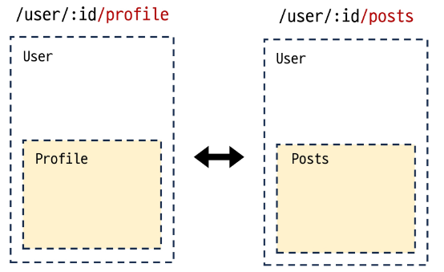
  <br>

1. componets 폴더 내 중첩 구조로 사용될 컴포넌트 작성

2. router/index.js 라우트 등록
  - 두 컴포넌트를 import

3. "children" 옵션을 사용해 중첩된 라우터에 컴포넌트를 등록
  - children 옵션
    - 배열 형태로 필요한 만큼 중첩 관계를 표현할 수 있음
  - 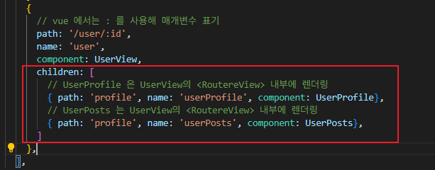
  <br>

4. 두 컴포넌트에 대한 RouterLink 및 RouterView 작성
  - 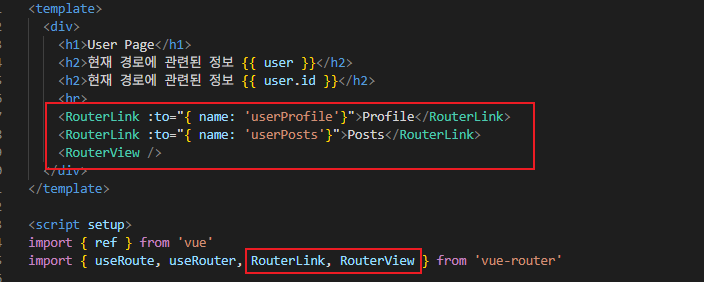
  <br>

### 중첩 라우팅 주의사항
- 컴포넌트 간 부모-자식 관계 관점이 아닌 **"URL에서의 중첩된 관계를 표현"**하는 관점으로 바라보기

## Programmatic Navigation
- RouterLink 대신 JavaScript를 사용해 페이지를 이동하는 것
- 프로그래밍으로 URL 이동
- router 의 인스턴스 메서드를 사용해 RouterLink로 <a\> 태그를 만드는 것처럼 프로그래밍으로 네비게이션 작업 수행

### router의 메서드
1. 다른 위치로 이동
  - router.push()

2. 현재 위치 바꾸기
  - router.replace()

### router.push()
- 다른 URL로 이동하는 메서드
- 새 항목을 history stack 에 push 하므로 사용자가 브라우저 뒤로가기 버튼을 클릭하면 이전 URL로 이동 가능
- RouterLink (선언적 표현) 를 클릭하는 것은 router.push() (프로그래밍적 표현) 를 호출하는 것 과 같음

- 함수를 선언할 때 내부에 router.puhs() 를 작성하고 이동할 url을 작성해주면 됨.
  -  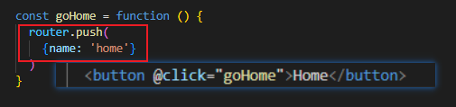
  <br>

### router.replace()
- push 메서드와 달리 history stack에 새로운 항목을 push 하지 않고 다른 URL로 이동 (뒤로가기 불가)


## Route 와 Router
### useRoute()
- 현재 활성화된 "경로 정보(route)"를 담은 route 객체를 반환

### route 객체 특징
- 읽기 전용
  - 현재 URL, 파라미터, 쿼리, name, matched 된 라우트 정보 등을 담고 있음
- 반응형
  - URL이 변경되면 route 객체도 자동으로 변경됨

### route 객체의 역할
- 현재 경로에 대한 정보 확인
  - 경로 파라미터를 통해 현재 페이지가 어떤 상태인지 알 수 있음
- route 객체 자체를 통한 페이지 이동(네이게이션)을 직접 제어할 수 없다.

**useRoute()는 현재 URL 상태를 읽기 위한 객체(route)를 제공하는 것**

### useRouter()
- 라우터 인스턴스 router 객체를 반환

### router 객체 특징
- 애플리케이션 전체 라우팅 로직을 제어할 수 있는 핵심 객체
- 페이지 이동, 네비게이션 관련 메서드 제공
  - 프로그래밍적으로 라우트 변경 가능

### router 객체 역할
- 프로그램적으로 경로 변경(리다이렉트), 뒤로 가기, 앞으로 가기
- 새로운 라우트 추가, 라우트 변경 등 다양한 라우팅 관련 동작 제어

**useRouter()는 라우터 전체 제어를 담당하는 객체(router)를 제공하며 관련 메서드를 사용해 경로 이동을 실행 할 수 있음**

### 정리
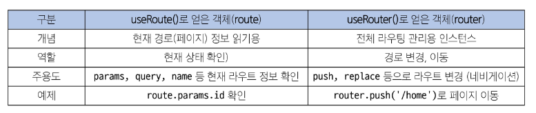

- useRoute()
  - 현재 라우트 "상태"를 읽어오는 전용 객체
- useRouter()
  - 라우팅 로직 "제어" 및 페이지 이동을 담당하는 인스턴스

## Navigation Guard
- Vue router를 통해 특정 URL에 접근할 때 다른 URL로 redirect 하거나 취소하여 네비게이션을 보호
  - 라우트 전환 전/후 자동으로 실행되는 Hook

### Navigation Guard 종류
1. Globally (전역 가드)
2. Per-route (라우터 가드)
3. In-component(컴포넌트 가드)

### Globally Guard
- 애플리케이션 전역에서 모든 라우트 전환에 적용되는 가드
  - 작성 위치 : index.js

#### router.beforeEach()
- 다른 URL로 이동하기 직전에 실행되는 함수 (Global Before Guards)
- 구조
```js
router.beforeEach((to, from) => {
  ...
  return false 또는 return { name:'About' }
})
```
- 모든 가드의 콜백 함수는 2개의 인자를 받음
  - to : 이동 할 URL 정보가 담긴 Route 객체
  - from : 현재 URL 정보가 담긴 Route 객체

- 선택적으로 다음 값 중 하나를 반환
  - false : 현재 네비게이션을 취소하고 from 경로의 url로 재설정
  - about : router.push() 를 호출하는 것과 같이 다른 위치로 redirect
  - return이 없다면 자동으로 'to' 의 URL Route 객체로 이동


### Per-route Guard
- 특정 라우터에만 적용되는 가드
  - 작성 위치 : index.js 의 각 routes

#### router.beforeEnter()
- 특정 route에 진입했을 때만 실행되는 함수
  - 단순히 URL의 매개변수나 쿼리 값이 변경될 때 실행되지 않고, 다른 URL에서 탐색해 올 때 만 실행됨
- 구조
  - routes 객체 내 정의
```js
routes:[
  {
    path: '/',
    name: 'home',
    component: HomeView,
    beforeEnter: (to, from) => {
      ...,
      return false
    }
  }
]
```


### In-component Guard
- 컴포넌트 내에서만 동작하는 가드
  - 작성 위치 : 각 컴포넌트의 <scirpt\>내부

#### onBeforeRouteLeave()
- 현재 라우트에서 다른 라우트로 이동하기 전에 실행
  - 사용자가 현재 페이지를 떠나는 동작에 대한 로직을 처리

#### onBeforeRouteUpdate()
- 이미 렌더링 된 컴포넌트가 같은 라우트 내에서 업데이트 되기 전에 실행
  - 라우트 업데이트 시 추가적인 로직을 처리


