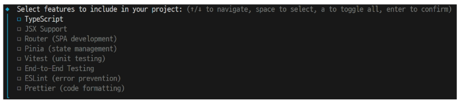

# Single File Component
## Component
- 재사용 가능한 코드 블록
- UI를 독립적이고 재사용 가능한 일부분으로 분할하고 각 부분을 개별적으로 다룰 수 있다는 특징을 가짐
  - 자연스럽게 애플리케이션은 중첩된 Component의 트리 형태로 구성됨

## Single File Components (SFC)
- 컴포넌트의 템플릿, 로직 및 스타일을 하나의 파일로 묶어낸 특수한 파일 형식 **(*.vue 파일)**
- Vue SFC 는 HTML, CSS 및 JavaScript 를 단일 파일로 합친 것
  - <template\>, <script\> 및 <style\> 블록은 하나의 파일에서 컴포넌트의 뷰, 로직 및 스타일을 독립적으로 배치
```js
<!-- MyComponent.vue -->

<template>
  <div class="greeting">{{ msg }}</div>
</template>

<script setup>
import { ref } from 'vue'

const msg = ref('Hello World!')
</script>

<style scoped>
.greeting {
  color: red;
}
</style>
```

### SFC 구성 요소
- 각 *.vue 파일은 세 가지 유형의 최상위 언어 블록 <template\>, <script\>, <style\> 으로 구성됨
  - 언어 블록의 작성 순서는 상관없으나 일반적으로 template -> script -> style 순서로 작성

### <template\> 블록
- 각 *.vue 파일은 최상위 \<template\> 블록을 하나만 포함할 수 있음
  
### <script setup\> 블록
- 각 *.vue 파일은 <script setup\> 블록을 하나만 포함할 수 있음
  - (일반 <script\> 제외)

- 컴포넌트의 setup() 함수로 사용되며 컴포넌트 각 인스턴스에 대해 실행
  - 변수 및 함수는 동일한 컴포넌트의 템플릿에서 자동으로 사용 가능함

### <style scoped\> 블록
- *.vue 파일에는 여러 <style\> 태그가 포함될 수 있으며 scoped가 지정되면 CSS 현재 컴포넌트에만 적용됨

## SFC build tool
### Vite
- 프론트 엔드 개발 도구 (빠른 개발 환경을 위한 빌드 도구와 개발 서버를 제공)

#### Build
- 프로젝트의 소스 코드를 최적화하고 번들링하여 배포할수 있는 형식으로 변환하는 과정
- 개발 중에 사용되는 여러 소스 파일 및 리소스 (JavaScript, CSS, 이미지 등) 를 최적화된 형태로 조합하여 최종 소프트웨어 제품을 생상하는 것
- Vite는 이러한 빌드 프로세스를 수생하는데 사용되는 도구

### Vue Project 생성
- Vue Project 생성 (Vite 기반)
```bash
$ npm create vue@latest
```
- 프로젝트 명 설정
  - tab 클릭 시 기본값 사용
  - enter 클릭 시 결정 후 진행
  - 

- 프로젝트에 추가 할 설정 선택
  - space 클릭 시 중복 선택 가능
  - enter 클릭 시 결정 후 진행
  - 

- 프로젝트 생성 완료
  - 

- 프로젝트 폴더 이동
```bash
$ cd vue-project
```

- 패키지 설치
```bash
$ npm install
```


- Vue 프로젝트 서버 실행
```bash
$ npm run dev
``` 


### NMP (Node Package Manager)
- Node.js 의 기본 패키지 관리자
- 기존 브라우저 안에서만 동작할 수 있었던 JS를 브라우저가 아닌 서버측에서도 실행할 수 있게 함
  - 프론트엔드와 백엔드에서 동일한 언어로 개발할 수 있게 됨

- NPM을 활용해 수많은 오픈 소스 패키지와 라이브러리를 제공하여 개발자들이 손쉽게 코드를 공유하고 재사용할 수 있게 함

### 모듈과 번들러
### Module
- 프로그램을 구성하는 독립적인 코드 블록 (*.js 파일)
- 파일 하나에 모든 기능을 담기 어려워지기 때문에 파일을 여러 개로 분리하여 관리를 하게 되고, 이때 분리된 각 파일이 모듈
- *.js 파일 하나가 하나의 모듈

- JS 모듈의 수가 증가할 경우 성능 병목 현상 / 의존성 문제가 발생하여 이 문제를 해결하기 위한 도구가 바로 Bundler

### Bundler
- 여러 모듈과 파일을 하나 (혹은 여러개)의 번들로 묶어 최적화하여 애플리케이션에서 사용할 수 있게 만들어주는 도구
- 의존성 관리, 코드 최적화, 리소스 관리 등의 역할
- Bundler가 하는 작업을 Bundling 이라고 함

## Vue Project 구조
### 기본 구조
#### public 디렉토리

- 주로 정적 파일을 위치 시킴 (static 파일)
  - 소스코드에 참조되지 않는
  - 항상 같은 이름을 갖는
  - import 할 필요가 없는 

- 항상 root 절대 경로를 사용하여 참조

#### src 디렉토리

- 프로젝트의 주요 소스 코드를 포함하는 곳
- 실제 작업한 대부분의 소스 코드가 위치
- 컴포넌트, 스타일, 라우팅 등 프로젝트의 핵심 코드를 관리

#### src/assets

- 프로젝트 내에서 사용되는 정적 자원을 관리
- 컴포넌트 자체에서 참조하는 내부 파일을 저장하는데 사용
- 컴포넌트가 아닌 다른 곳에서는 public 디렉토리에 위치한 파일을 사용

#### src/components

- 실제 페이지에서 사용하게 될 개별 Vue 컴포넌트들이 위치

#### src/App.vue

- Vue 앱의 Root 컴포넌트
- 다른 하위 컴포넌트들을 포함
- 애플리케이션 전체의 레이아웃과 고통적인 요소를 정의

#### src/main.js

- Vue 애플리케이션을 초기화하고, App.vue를 DOM에 마운트하는 시작점
- 필요한 라이브러리를 import 하고 전역 설정을 수행

#### index.html

- Vue 앱의 기본 HTML 파일
- main.js 에서 App.vue 컴포넌트를 엔더링하여 index.html 의 특정 위치에 마운트 시킴
  - Vue 앱이 SPA인 이유
- 필요한 스타일 시트, 스크립트 등의 외부 리소스를 로드할 수 있음 (ex. bootstrap CDN 등)

#### 기타 설정 파일

- jsconfig.json
  - 컴파일 옵션, 모듈 시스템 등 설정

- vite.config.js
  - Vite 프로젝트 설정 파일
  - 플러그인, 빌드 옵션, 개발 서버 설정 등

### 패키지 관리
#### package.json

- 프로젝트에 관한 기본 정보와 패키지 의존성을 정의하는 "설계도 파일" (메타 데이터 파일)
- 프로젝트가 어떤 패키지를 사용하고 어떤 스크립트를 실행할 수 있는지 명시
- nmp install 시 이를 참조하여 패키지를 설치 (어떤 패키지를 설치해야 하는지 결정하는 기준 제공)

- 프로젝트 이름, 버전, 스크립트 명령, 패키지 의존성 등 메타데이터가 명시
- 어떤 패키지를 사용하는지, 어떤 버전 범위를 허용하는지 의존성 목록을 기록

#### package-lock.json

- package.json 을 기반으로 실제 설치된 패키지들의 **정확한 버전 정보**를 기록하는 파일
- 프로젝트를 설치할 때 실제로 어떤 버전의 패키지가 설치 되었는지를 기졹하여 정확한 버전을 고정함
- 협업 또는 배포 환경에서 모든 개발자가 동일한 패키지 버전을 사용하도록 빌드 안정성을 보장함
- npm install 결과가 반영되어 매번 자동 업데이트 됨

#### node_modules

- package.json 과 package-lock.json 에 따라 실제로 설치된 모든 패키지가 저장되는 곳
- 프로젝트 실행 시 필요한 모든 라이브러리와 코드 파일을 보관하고 애플리케이션 구동 시 참조되는 실제 데이터 저장소

- npm install 을 통해 설치된 모든 패키지(모듈)들이 실제로 저장 되며 자동 관리 됨
  - 직접 수정하지 않고, 필요 시 npm install로 언제등 재생성 가능
- 용량이 매우 클 수 있기 때문에 협업 시 일반적으로 Git으로 추적하지 않음 (.gitignore)

## Vue Component 활용
### 컴포넌트 사용 2단계
1. 컴포넌트 파일 생성
2. 컴포넌트 등록 (import)

### 사전 준비
1. App.vue 코드 초기화
  - 기존 작성된 내용 삭제 후 vue 재작성
2. 초기에 생성된 모든 컴포넌트 삭제 (App.vue 제외)
  - src/components 디렉토리 내 모든 파일 삭제
  - src/assets 디렉토리 삭제
3. src/main.js 수정
  - src/assets 에서 import 받고 있던 코드 삭제

### 1. 컴포넌트 파일 생성
- src/components/MyComponent.vue 생성
```js
<template>
  <h2>My Component</h2>
</template>

<script setup>

</script>

<style scoped>

</style>
```
### 2. 컴포넌트 등록
- App 컴포넌트에 MyComponent를 등록
```js
<template>
  <h1>App.vue</h1>
  <MyComponent />
</template>

<script setup>
  import MyComponent from '@/components/MyComponent.vue'

</script>

<style scoped>

</style>
```
- App(부모) - MyComponent(자식) 관계 형성
- "@" - "src/" 경로를 뜻하는 약어

## Virtual DOM
- 가상의 DOM을 메모리에 저장하고 실제 DOM과 동기화하는 프로그래밍 개념
- 실제 DOM과의 변경 사항 비교를 통해 변경된 부분만 실제 DOM에 적용하는 방식
- 웹 애플리케이션의 성능을 향상시키기 위한 Vue의 내부 렌더링 기술

### Virtual DOM 패턴의 장점
- 효율성
  - 실제 DOM 조작을 최소화 하고 변경된 부분만 업데이트하여 성능을 향상
- 반응성
  - 데이터 변경을 감지하고 Virtual DOM을 효율적으로 갱신하여 UI를 자동으로 업데이트
- 추상화
  - 개발자는 실제 DOM 조작을 Vue에게 맡기고 컴포넌트와 템플릿을 활용하는 추상화된 프로그래밍 방식으로 원하는 UI 구조를 구성하고 관리할 수 있음

### Virtual DOM 주의사항
- 실제 DOM에 직접 접근하지 말 것
  - Vue의 ref() 와 Lifecycle Hooms 함수를 사용해 간접적으로 접근하여 조작

## Composition API / Option API
### Composition API
- import 해서 가져온 API 함수들을 사용해 컴포넌트의 로직을 정의
  - Vue3 에서의 권장 방식

### Option API
- data, methods 및 mounted 같은 객체를 사용해 컴포넌트 로직을 정의
  - Vue2 에서의 작성 방식 (Vue3에서도 지원)

## Single Root Element
- 모든 컴포넌트에는 최상단 HTML 요소가 작성되는 것이 권장
- 가독성, 스타일링, 명확한 컴포넌트 구조를 위해 각 컴포넌트에서 최상단 HTML 요소를 작성해야 함 (Single Root Element)

## CSS scoped
- <style scoped\> 를 사용하면 해당 컴포넌트 내부의 스타일이 현재 컴포넌트 내부 요소에게만 적용되도록 범위를 제한
- 스타일이 컴포넌트 바깥으로 유출되거나 다른 컴포넌트에서 정의한 스타일이 현재 컴포넌트를 침험하지 않도록 막음

