# State Management
## 컴포넌트 구조 단순화
- 단방향 데이터 흐름의 같단한 표현
  - 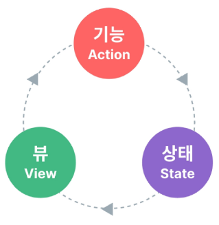
  <br>

- Vue 컴포넌트는 이미 반응형 상태를 관리하고 있음 (상태 === 데이터)
  - 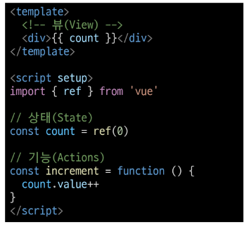
  <br>

  - 상태(state) : 앱 구동에 필요한 기본 데이터
  - 뷰(View) : 상태를 선언적으로 매핑하여 시각화
  - 기능(Action) : 뷰에서 사용자 입력에 대해 반응적으로 상태를 변경할 수 있게 정의된 동작

### 상태관리의 단순성이 무너지는 시점
- "여러 컴포넌트가 상태를 공유할 때 "
  1. 여러 뷰가 동일한 상태에 종속되는 경우
    - 공유 상태를 조상 컴포넌트로 "끌어올린" 다음 props로 전달하는 것
    - 계층 구조가 깊어질수록 비효율적이고 관리가 어려워짐 
    - 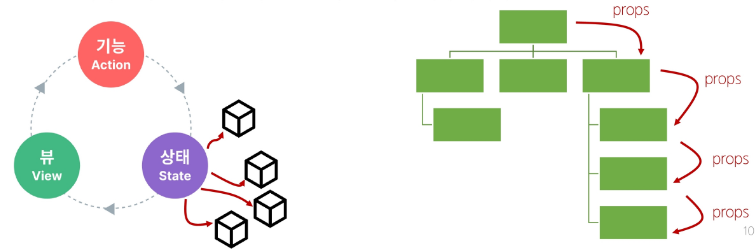
    <br>

  2. 서로 다른 뷰의 기능이 동일한 상태를 변경시켜야 하는 경우
    - 발신(emit)된 이벤트를 통해 상태의 여러 복사본을 변경 및 동기화 하는 것
    - 관리의 패턴이 깨지기 쉽고 유지 관리할 수 없는 코드가 됨
    - 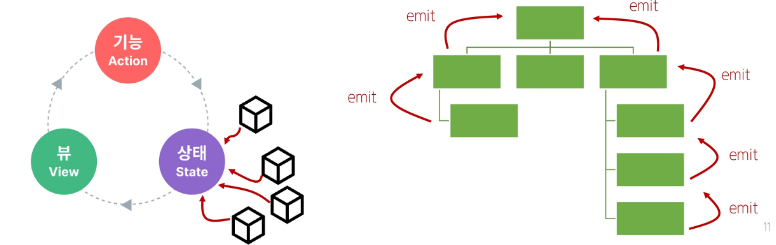
    <br>

### 해결책
- 각 컴포넌트의 공유 상태를 추출하여 전역에서 참조할 수 있는 저장소에서 관리
- 컴포넌트 트리가 하나의 큰 View가 되고 모든 컴포넌트는 트리 계층 구조에 관계 없이 상태에 접근하거나 기능 사용이 가능해짐
  - 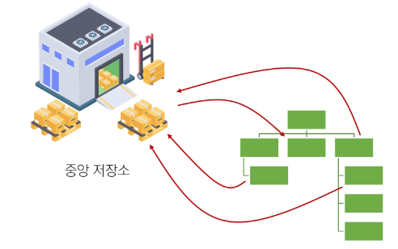
  <br>
<hr>

## Pinia
- Pinia : Vue의 공식 상태 관리 라이브러리 
- 프로젝트 빌드 시 Pinia 라이브러리를 추가하여 설치 가능
  - stores 폴더가 신규 생성됨

### Pinia 구성요소 
1. store
  - 중앙 저장소
  - 모든 컴포넌트가 공유하는 상태, 기능 등이 작성 됨
    - defineStore() 의 반환 값의 이름은 use와 store를 사용하는 것을 권장
    - defineStore() 의 첫번째 인자는 애플리케이션 전체에 걸쳐 사용하는 store의 고유 ID
    - 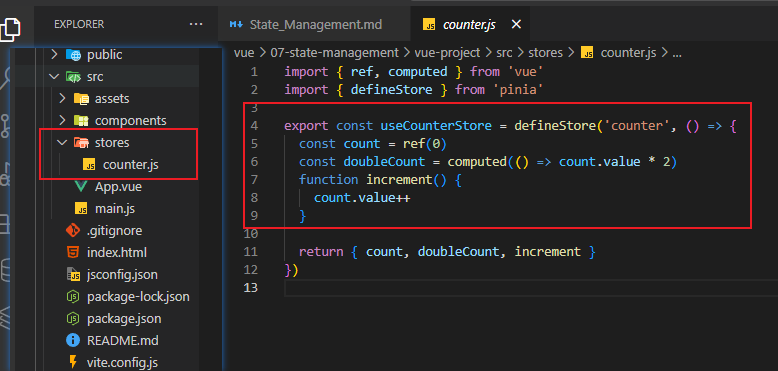
    <br>

2. state
  - 반응형 상태(데이터)
  - ref() === state
  - 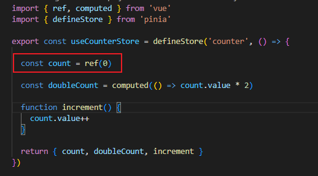
  <br>

3. getters
  - 계산된 값
  - computed() === getters
  - 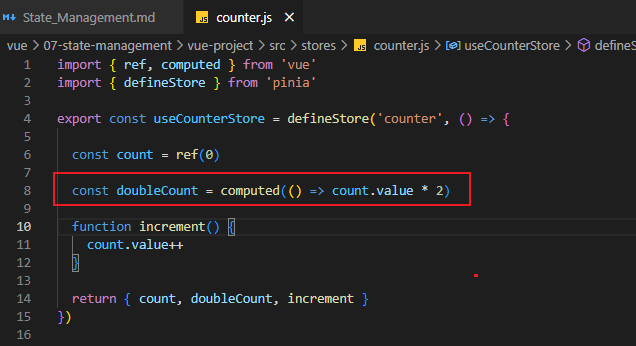
  <br>

4. actions
  - 메서드
  - function === actions
  - 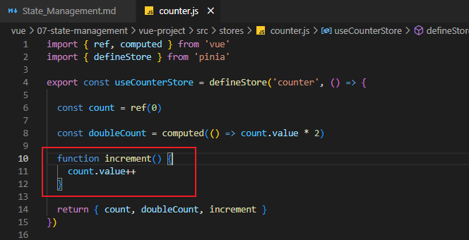
  <br>

  - Setup Stores의 반환 값
  - 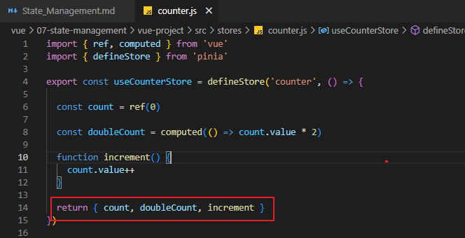
  <br>
  
    - pinia의 상태들을 사용하려면 반드시 반환해야 함
      - store에서는 공유하지 않는 private한 상태 속성을 가지지 않음
  
5. plugin
  - 애플리케이션의 상태 관리에 필요한 추가 기능을 제공하거나 확장하는 도구나 모듈
  - 상태관리를 더욱 간편하고 유연하게 만들어주며 패키지 매니저로 설치 이후 별도 설정을 통해 추가
<br>
<hr>


### Pinia 구성 요소 활용
1. State
  - 각 컴포넌트 깊이에 관계 없이 stroe 인스턴스로 state 에 접근하여 직접 읽고 쓸 수 있음
  - store에 state를 정의하지 않았다면 컴포넌트에 추가할 수 없음
    - 참조 및 변경 시 다른 변수에 할당하여 사용한다.
  - 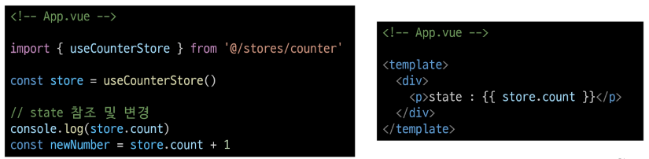
  <br>

2. Getter
  - 모든 getters 또한 state 처럼 직접 접근 가능

3. Actions
  - store의 모든 actions 또한 직접 접근 및 호출 가능
  - getters 와 달리 state 조작, 비동기, API 호출이나 다른 로직을 진행할 수 있음

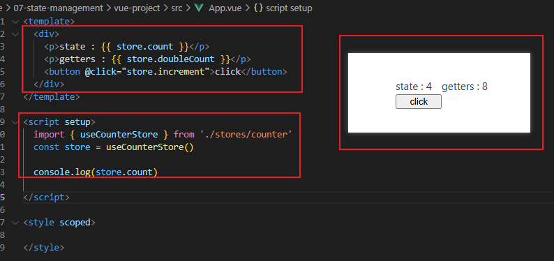
<br>

## Local Storage
- 브라우저 내 key-value 쌍을 저장하는 웹 스토리지 객체
- 페이지를 새로고침 하고 브라우저를 다시 실행해도 데이터가 유지
- 쿠키와 다르게 네트워크 요청 시 서버로 전송되지 않음
- 여러 탭이나 창 간에 데이터 공유 가능

### Local Storage 사용 목적
- 웹 애플리케이션에서 사용자 설정, 상태 정보, 캐시 데이터 등을 클라이언트 측에 보관하여 웹 사이트 성능을 향상 시키고 사용자 경험을 개선하기 위함

### pinia-plugin-presistedstate
- Pinia 의 플러그인 중 하나
- 웹 애플리케이션 상태를 브라우저의 local storage나 session storage에 영구적으로 저장하고 복원하는 기능 제공

- 설치 및 등록
```bash
$ npm i pinia-plugin-persistedstate
```
  - 설치 명령 후 main.js 에 등록
    - 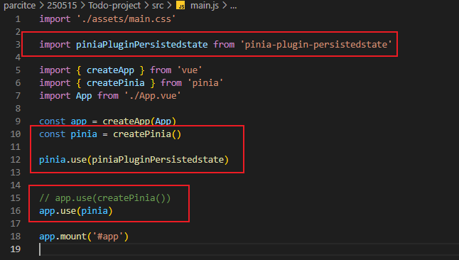
    - <br>

  - stores/counter.js 의 defineStore() 의 3번째 인자로 관련 객체 추가
    - 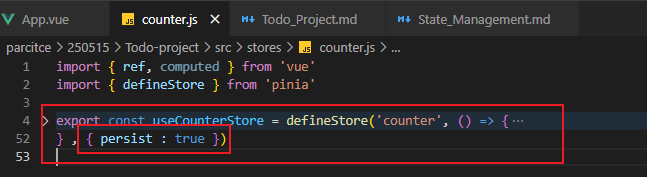

- 적용 결과 (개발자도구 -> Application -> Local Storage)
  - 브라우저의 Local Storage 에 저장되는 todos state 확인 가능

