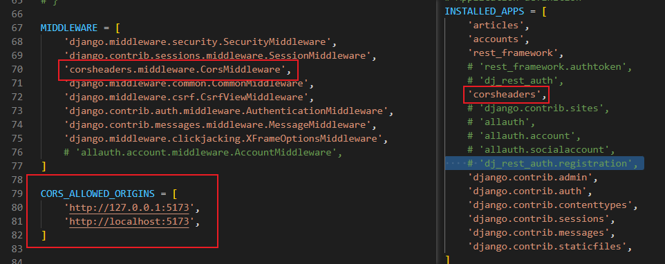

## DRF와의 요청과 응답
- DRF 서버측에서 문제없이 응답 했으나 브라우저에서 거절
  - **CORS policy** 에 의한 차단이 발생함

### SOP (Same-origin policy)
- 동일 출처 정책
- 어떤 출처(Origin)에서 불러온 문서나 스크립트가 다른 출처에서 가져온 리소스와 상호 작용하는 것을 제한하는 보안 방식
  - 다른곳에서 가져온 자료는 일단 막아놓고 상호작용 할지 말지 결정
  - 사용자의 개인 정보와 데이터를 보호하고 잠재적 보안 위협을 방지 -> 잠재적으로 해로울 수 있는 문서를 분리함으로 공격받을 수 있는 경로를 줄임

#### 출처 (Origin)
- URL 의 Protocol, Host, Port 를 모두 포함하여 "출처"라고 함
- Same Origin 예시
  - Protocol, Host, Port 세 영역이 일치하는 경우에만 동일 출처로 인정

### CORS policy
- 기본적으로 웹 브라우저는 동일 출처에서만 요청하는 것으 허용하며 다른 출처로는 보안상의 이유로 차단됨
  - SOP(동일 출처 정책)에 의해 출처가 다르면 리소스와 상호작용을 기본적으로 제한
- 다양한 출처로부터 리소스를 요청하는 경우가 많아졌기 때문에 CORS 정책이 필요하게 됨

- CORS 는 웹 서버가 리소스에 대한 서로 다른 출처 간 접근을 허용하도록 선택할 수 있는 기능을 제공
- 다른 출처에서 온 리소스를 공유하는 것에 대한 정책
- 서버에서 결정되며 브라우저가 해당 정책을 확인하여 요청이 허용되는지 여부를 결정
  - 다른 출처의 리소스를 불러오면 다른 출처에서 올바른 CORS header를 포함한 응답을 반환

### CORS (Cross-Origin Resource Sharing)
- 교차 출처 리소스 공유
- 특정 출처에서 실행중인 웹 애플리케이션이 **다른 출처**의 자원에 접근할 수 있는 **권한**을 부여하도록 브라우저에 알려주는 체제
  - 서버가 브라우저에게 다른 출처지만 접근해도 된다는 사실을 알림으로 SOP(동일 출처 정책) 해제 -> CORS policy (교차 출처 리소스 공유 정책) 허용

## CORS 정리
- 웹 애플리케이션이 다른 도메인에 있는 리소스에 안전하게 접근할 수 있도록 허용 또는 차단하는 보안 메커니즘
- 서버가 약속된 CORS Header를 포함하여 응답한다면 브라우저는 해당 요청을 허용
  - 서버에서 CORS Header를 만들어야 함

- pip 를 통해 django-cors-hearders 설치 후 아래 사진과 같이 프로젝트 셋팅 설정
  - 
   

## 전체 게시글 목록 출력
1. 백엔드가 아직 게시글 조회 기능을 완성하지 않음
2. 프론트에서 게시글 전체 조회 화면 구성
3. 컴포넌트에 대한 적절한 tag 들 작성
4. 게시글 데이터를 화면에 그릴 수 있도록 더미데이터 생성
  - 더비데이터는 백엔드에서 넘겨주기로 햇던 데이터와 생김새와 동일하게 생성 (컨벤션 사전 정의의 필요성)

## 단일 게시글 조회 출력
1. 게시글 상세 조회 페이지 이동 할 수 있어야 함
   1. 게시글 목록 링크 만들기
   2. 게시글 id 기준 params 넘기기

2. 단일 게시글 조회 컴포넌트 구성
   1. back에서 detail get 요청 경로 확인
   2. id 를 기준으로 get 요청 실행 후 응답
   3. 응답 받은 데이터를 화면에 렌더링

## 게시글 작성
1. 게시글 작성 페이지 필요
   1. 사용자가 작성한 내용을 토대로 상태관리 필요 (양방향 바인딩)
   2. 어떤 데이터를 사용자가 작성해야 하는지 체크

2. 게시글 작성 요청 -> POST
   1. 사용자가 작성한 내용을 data로 axios 요청 보내기
   2. 게시글 작성이 완료되면 해당 페이지로 이동 ? 무슨 일을 해야하지 ?