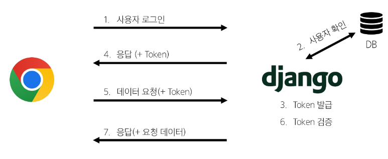
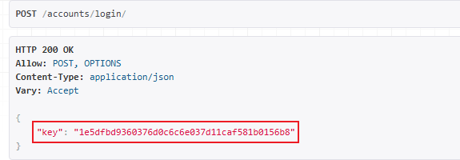
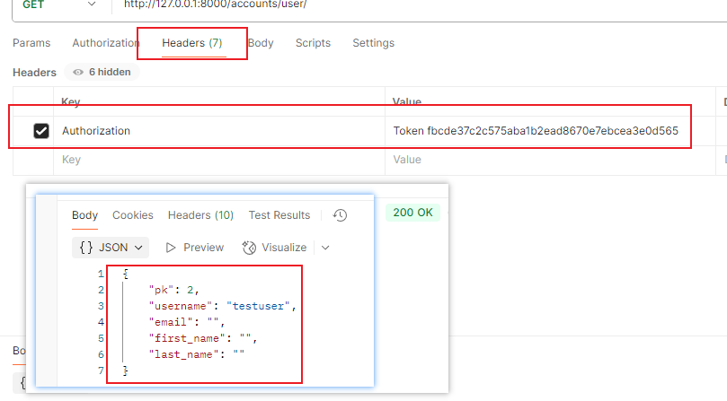

# 인증 With DRF
## Authentication (인증)
- 수신된 요청을 해당 요청의 사용자 또는 자격 증명과 연결하는 메커니즘
  - 누구인지 확인하는 과정
## Permissions (권한)
- 요청에 대한 접근 허용 또는 거부 여부를 결정

### 인증과 권한
- 인증이 먼저 진행되며 수신 요청을 해당 요청의 사용자 또는 해당 요청이 서명된 토큰(Token)과 같은 자격 증명 자료와 연결
- 권한 및 제한 정책은 **인증이 완료된** 해당 자격 증명을 사용하여 요청을 허용해야 하는 지를 결정
 
### DRF 에서의 인증
- 인증은 항상 view 함수 시작 시, 권한 및 제한 확인이 발생하기 전, 다른 코드의 진행이 허용되기 전 실행
  - 인증 자체만으로 요청을 허용하거나 거부할 수 없음
  - 단순히 요청에 사용된 자격 증명만 식별

### 승인되지 않은 응답 및 금지된 응답
- 인증되지 않은 요청이 권한을 거부하는 경우 해당되는 두 가지 오류 코드를 응답
  1. HTTP 401 Unauthorized
    - 요청된 리소스에 대한 요휴한 인증 자격 증명이 없기 때문에 클라이은터 요청이 완료되지 않았음 (누구인지 증명할 자료가 없음)
      - 로그인 정보 없음

  2. HTTP 403 Forbidden (Permission Denied)
    - 서버에 요청이 전달 되었지만 권한이 없음
    - 401과 다른점 : 서버는 클라이언트가 누구인지 알고 있음
<br>
<hr>

## 인증 정책 설정
### 인증 정책 설정 방법
1. 전역 설정
  - 프로젝트 전체에 적용되는 기본 인증 방식을 정의
  - DEFAULT_AUTHENTICATION_CLASSES 를 사용
  - 기본값 : SessionAuthentication 과 BasicAuthentication
  - 사용 예시 [DRF 공식문서](https://www.django-rest-framework.org/api-guide/authentication/#setting-the-authentication-scheme)
```python
  REST_FRAMEWORK = {
    'DEFAULT_AUTHENTICATION_CLASSES': [
        'rest_framework.authentication.BasicAuthentication',
        'rest_framework.authentication.SessionAuthentication',
    ]
}
```

2. View 함수 별 설정
  - authentication_classes 데코레이터를 사용
  - 개별 View에 지정하여 재정의
  - 사용 예시 [DRF 공식문서](https://www.django-rest-framework.org/api-guide/authentication/#setting-the-authentication-scheme)
    - 
```py
from rest_framework.authentication import SessionAuthentication, BasicAuthentication
from rest_framework.permissions import IsAuthenticated
from rest_framework.response import Response
from rest_framework.views import APIView

@api_view(['GET'])
@authentication_classes([SessionAuthentication, BasicAuthentication])
@permission_classes([IsAuthenticated])
def example_view(request, format=None):
    content = {
        'user': str(request.user),  # `django.contrib.auth.User` instance.
        'auth': str(request.auth),  # None
    }
    return Response(content)
```

### DRF가 제공하는 인증 체계
1. BasicAuthentication
2. TokenAuthentication
3. SessionAuthentication
4. RemoteUserAuthentication

### TokenAuthentication
- token 기반 HTTP 인증 체계
- 기본 데스크톱 및 모바일 클라이언트와 같은 클라이언트-서버 설정에 적합
  - 서버가 인증된 사용자에게 토큰을 발급하고 사용자는 매 요청마다 발급받은 토큰을 요청과 함께 보내 인증 과정을 거침
<br>
<hr>

## Token 인증 설정
### TokenAuthentication 적용 과정
1. 인증 클래스 설정
  - TokenAuthentication 활성화 코드 작성
    - 전역 인증 정책을 Token 방식으로 설정
```py
# settings.py

REST_FRAMEWORK = {
    # Authentication
    'DEFAULT_AUTHENTICATION_CLASSES': [
        'rest_framework.authentication.TokenAuthentication',
    ],
}
```

2. INSTALLED_APPS 추가
```py
# settings.py

INSTALLED_APPS = [
    ...
    'rest_framework.authtoken',
    ...
]
```

3. Migrate 진행
```bash
$ python manage.py migrate
```

### 토큰 인증 방식 과정

<br>
<hr>

## Dj-Rest-Auth 라이브러리
- 회원가입, 인증(소셜미디어 인증 등), 비밀번호 재설정, 사용자 세부 정보 검색, 회원 정보 수정 등 다양한 인증 관련 기능을 제공하는 라이브러리

### 설치 및 적용
1. 설치
```bash
$ pip install dj-rest-auth
```

2. INSTALLED_APPS 추가
```py
# settings.py

INSTALLED_APPS = [
    ...
    'dj_rest_auth',
    ...
]
```

3. 추가 URL 작성
```py
# project/urls.py

urlpatterns = [
    ...
    path('accounts/', include('dj_rest_auth.urls')),
    ...
]
```

### Dj-Rest-Auth 의 Registration(등록) 기능 추가 설정
1. 패키지 추가 설치
```bash
$ pip install 'dj-rest-auth[with-social]'
```

2. INSTALLED_APPS 등록
```py
# settings.py

INSTALLED_APPS = [
    ...
    'django.contrib.sites',
    'allauth',
    'allauth.account',
    'allauth.socialaccount',
    'dj_rest_auth.registration',
    ...
]

SITE_ID = 1

```

3. MIDDLEWARE 등록
```py
# settings.py

MIDDLEWARE = [
    ...
    'allauth.account.middleware.AccountMiddleware',
    ...
]
```

4. 추가 URL 작성

```py
# project/urls.py

urlpatterns = [
    ...
    path('accounts/signup/', include('dj_rest_auth.registration.urls')),
    ...
]
```


5. Migrate 진행
```bash
$ python manage.py migrate
```
<br>
<hr>

## Token 발급 및 활용
### Token 발급
1. http://127.0.0.1:8000/accounts/signup/
  - URL 접속 하단 form 활용하여 회원가입

2. http://127.0.0.1:8000/accounts/login/
  - URL 접속 하단 form 활용하여 로그인

3. 로그인 성공 후 DRF 로 부터 발급 받은 Token 확인 가능 
  - 발급 받은 Token을 인증이 필요한 요청마다 함께 보내야 함
  - 


### Token 활용 
1. "Authorzation" HTTP Header 에 Token 포함
2. 키 앞에는 문자열 "Token" 이 와야하며 "공백" 으로 두 문자열을 구분해야함 
- 

<br>
<hr>

# 권한 With DRF
## 권한 정책 설정
1. 전역 설정
  - 프로젝트 전체에 적용되는 기본 권한 방식을 정의
  - DEFAULT_PERMISSION_CALSSES 를 사용
  - 기본 값 : rest_framework.permissions.AllowAny
  - 사용 예시 [DRF 공식문서](https://www.django-rest-framework.org/api-guide/permissions/#setting-the-permission-policy)
```py
# settings.py

REST_FRAMEWORK = {
    # permission
    'DEFAULT_PERMISSION_CLASSES': [
        'rest_framework.permissions.AllowAny',
    ],
}
```

2. View 함수 별 설정
  - permissions_classes 데코레이터 사용
  - 개별 view에 지정하여 재정의
  - 사용 예시 [DRF 공식문서](https://www.django-rest-framework.org/api-guide/permissions/#setting-the-permission-policy)
```py
# permission Decorators
from rest_framework.decorators import permission_classes
from rest_framework.permissions import IsAuthenticated

@api_view(['GET', 'POST'])
@permission_classes([IsAuthenticated])
def article_list(request):
  pass
```

<br>
<hr>

### DRF가 제공하는 권한 정책
1. IsAuthenticated
2. IsAdminUser
3. IsAuthenticatedOrReadOnly
...

### IsAuthenticated
- 개념
  - 인증된 사용자만 접근을 허용하는 권한 클래스
  - 인증되지 않은 사용자의 모든 요청을 거부함
  <br>

- 특징
  - request.user 가 존재하고 인증된 상태인지 확인
  - 보호해야 할 중요한 데이터나 리소스에 적합 (ex. 회원 전용 페이지, 결제, 프로필 수정 등)
  <br>

### AllowAny
- 개념
  - 모든 요청을 무조건 허용하는 권한 클래스
  - 인증된 사용자, 인증되지 않은 사용자 모두 접근을 허용
  <br>

- 특징
  - 권한 검사(Authorization) 로직을 전혀 수행하지 않음
  - API 엔드포인트를 완전히 공개하고 싶을 때 사용
  - 공개 API 에 주로 적용 (ex. 회원가입, 로그인 또는 공개 게시글 조회 등) 
  - 보안이 필요한 리소스에는 부적합
  <br>

## IsAuthenticated 설정
- AllowAny로 권한을 전역 설정 후 (기본적으로 모든 View 함수에 접근을 허용)
- 필요한 View (기능) 별 IsAuthenticated 을 활용해 권한 인증을 진행 

### IsAuthenticatedOrReadOnly
- 인증된 사용자에게는 작성허용, 인증되지 않은 사용자에게는 읽기만 허용
- [DRF 공식문서](https://www.django-rest-framework.org/api-guide/permissions/#isauthenticatedorreadonly)