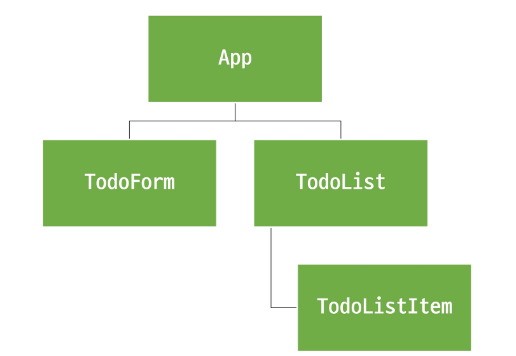

# Pinia를 활용한 Todo 구현
- Todo CRUD 구현
- Todo 개수 계산
  - 완료된 Todo 계산
 

## 컴포넌트 구성

 

## 조회
- store 에 임시 todos 목록 state 정의
- TodoList 에서 store 의 todos state 를 참조
  - 하위 컴포넌트에서 반복하여 개별 todo를 props 로 전달
- TodoListItem 에서 props 정의 후 데이터 출력
 

## 생성
- todos 에 todo 를 생성 및 추가하는 addTodo 액션 정의
- TodoForm 에서 사용자 데이터를 양방향 바인딩하여 반응형 변수로 할당
- addTodo 액션 메서드 정의
  - submit 이벤트 발생 시 기존 이벤트를 취소 시키고 stroe 에서 정의한 addTodo 액션 메서드를 호출
  - 액션 메서드를 사용하는 이유
    - 유지보수성과 확장성 향상
    - 재사용성과 테스트 용이성
 

## 삭제 
- todos 에서 특정 todo를 삭제하는 deleteTodo 액션 정의
- 각 todo 의 삭제 버튼 클릭 시 선택된 todo 의 id 를 인자로 전달해 deleteTodo 액션 메서드 호출

### 2가지 삭제 방법
1. 해당하는 요소 하나만 찾아서 삭제
  - findIndex + splice 를 사용하여 인덱스를 찾고, 해당 위치에서 1개만 제거
   

2. 해당하는 대상 제외 후 전체 배열을 재생성
  - filter 를 사용하여 조건에 맞지 않는(제거 대상이 아닌) 것들만 새 배열로 모아서 반환
   

## 수정
- todos 에서 특정 todo의 isDone 속성을 변경하는 updateTodo 액션 정의
  - 완료 된 todo 에 취소선 스타일 적용

- 수정 로직
  - todo 체크박스 클릭 -> isDone ref변경 -> watch 감지 -> store.updateTodo
  - 이후 todo 객체의 isDone 속성 값에 따라 스타일 바인딩 적용하기 

### 2가지 수정 방법
1. 해당하는 요소 하나만 찾아서 수정
  - forEach 를 사용하여 순회 도중 일치 항목을 찾으면 직접 속성 변경
   

2. 해당하는 대상 수정 후 전체 배열을 재생성
  - map 모든 항목을 순회하며 ID가 일치하면 새 객체를 리턴
   

## Local Stroage 활용

