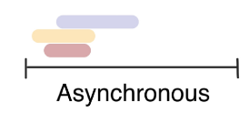
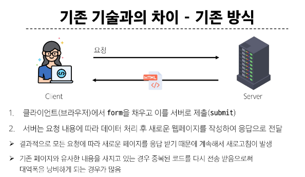
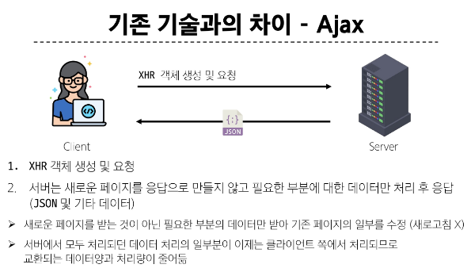
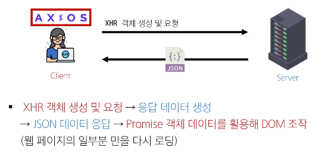

# 비동기
### Synchronous (동기) <-> Asynchronous (비동기)
- 프로그램의 실행 흐름이 순차적으로 진행
  - 하나의 작업이 완료된 후에 다음 작업이 실행되는 방식 

## Asynchronous (비동기)
- 특적 작업의 실행이 완료될 때까지 기다리지 않고, 다음 작업을 즉시 실행하는 방식
  - 작업의 완료 여부를 신경 쓰지 않고 동시에 다른 작업들을 수행할 수 있음
  - 햣 

### Asynchronous 특징
- 병렬적 수행
- 


## JavaScirpt와 비동기
### Single Thread 언어, JavaScript
- Thread란 ?
  - 작업을 처리할 때 실제로 작업을 수행하는 주체로 multi-thread 라면 업무를 수행할 수 있는 주체가 여러 개라는 의미
<br>

- JavaScript는 Single Thread언어이기 때문에 동시에 여러 작업을 처리할 수 없음
- 즉 하나의 작업을 요청한 순서대로 처리할 수 밖에 없다.

## JavaScript Runtime
- JavaScript가 동작할 수 있는 환경(Runtime)
  - 브라우저 또는 Node.js
- JavaScript는 비동기 처리를 할 수 있도록 도와주는 환경이 필요하다.

## 브라우저 환경 비동기 처리 동작 요소
1. JavaScript Engine의 Call Stack
  - 요청이 들어올 때 마다 순차적으로 처리하는 Stack (LIFO)
  - 기본적인 JavaScript의 Single Thread 작업을 처리함
2. Web API
  - JavaScript 엔진이 아닌 브라우저에서 제공하는 runtime 환경
  - 시간이 소요되는 작업을 처리 (setTimeout, DOM Event, 비동기 요청 등)
3. Task Queue (Callback Queue)
  - 비동기 처리된 Callback 함수가 대기하는 Queue (FIFO)
4. Event Loop
  - 태스크(작업)가 들어오길 기다렸다가 태스크가 들어오면 이를 처리하고, 처리할 태스크가 없는 경우 잠드는 끊임없이 돌아가는 JavaScript Loop
  - Call Stack과 Task Queue를 지속적으로 모니터링
  - Call Stack이 비어있는지 확인 후 비었다면 Task Queue에서 대기중인 가장 오래된 작업을 Call Stakc으로 Push

### 브라우저 환경 JavaScript 비동기 처리 동작 방식
1. 모든 작업은 **Call Stack**으로 들어간 후 처리
2. 오래 걸리는 작업이 Call Stack으로 들어오면 **Web API**로 보내 별도로 처리
3. Web API에서 처리가 끝난 작업은 곧 바로 Call Stack으로 들어가지 못하고 **Task Queue**에 순서대로 들어감
4. **Event Loop**가 Call Stack이 비어있는 것을 계속 체크하고 Call Stack이 빈다면 Task Queue에서 가장 오래된 (가장 먼저 들어온) 작업을 Call Stack으로 보낸다.

### 정리
- JavaScript는 Single Thread언어로 동기적 처리를 진행 하지만 브라우저 환경을 이용하면 비동기 작업이 가능한 환경이 됨
- Call Stack -> Web API -> Task Queue -> Event Loop -> Call Stack


# Ajax (Asynchronous JavaScript and XML)
- 비동기적인 웹 애플리케이션 개발을 위한 기술

## Ajax 정의
- XMLHttpRequest 기술을 사용해 복잡하고 동적인 웹 페이지를 구성하는 프로그래밍 방식
- 브라우저와 서버 간 데이터를 비동기적으로 교환하는 기술
- Ajax를 사용하면 페이지 전체를 새로고침 하지 않고 동적으로 데이터를 불러와 화면 갱신이 가능
  - Ajax 의 'x' 가 XML을 뜻하는데 JSON을 많이 씀

## Ajax 목적
1. 비동기 통신
  - 웹 페이지 전체를 새로고침하지 않고 서버와 데이터를 주고받을 수 있음
2. 부분 업데이트
  - 전체 페이지가 다시 로드되지 않고 HTML 페이지 일부 DOM만 업데이트
  - 페이지의 일부분만 동적으로 갱신할 수 있어 사용자 경험이 향상 됨
3. 서버 부하 감소
  - 필요한 데이터만 요청하므로 서버의 부하를 줄일 수 있음

### XMLHttpRequest 객체 (XHR)
- 웹 브라우저와 서버 간 비동기 통신을 가능하게 하는 JavaScript 객체

### XMLHttpRequest 주요 기능
- JavaScript를 사용해 서버에 HTTP요청을 할 수 있는 객체
- 웹 페이지의 전체 새로고침 없이도 서버로부터 데이터를 가져오거나 보낼 수 있음
  - XML 뿐만 아니라 모든 종류의 데이터 교환 가능

### 기존 기술과의 차이
<br>


<br>



## Axios
- 브라우저와 Node.js 에서 사용할 수 있는 Promise 기반의 HTTP 클라이언트 라이브러리

### Axios 정의 및 특징
- 클라이언트와 서버 사이에서 HTTP 요청을 만들고 응답을 간편하게 처리하는데 사용되는 자바스크립트 라이브러리
- 브라우저를 위한 XHR 객체 생성
- 간편한 API를 제공, Promise 기반의 비동기 요청을 처리
  - 주로 웹 애플리케이션에서 서버와 통신할 때 사용


### Ajax를 활용한 클라이언트 서버 간 동작
<br>



### Axios 설치 및 사용
- CDN 방식으로 사용
```html
<script src="https://cdn.jsdelivr.net/npm/axios/dist/axios.min.js"></script>
```

### "Promise" object
- 자바스크립트에서 비동기 작업을 처리하기 위한 객체
- 비동기 작업의 최종 완료(또는 실패) 와 그 결과값을 나타냄

```js
const promiseObj = axios({
  method: 'get',
  url: 'https://api.thecatapi.com/v1/images/search'
})

console.log(promiseObj) // Promise object
```

- 주요 메서드
  - then() : 작업이 성공적으로 완료되었을 때 실행될 콜백 함수를 지정
  - catch() : 작업이 실패했을 때 실행될 콜백 함수를 지정
```js
promiseObj
  .then((response) => {
    console.log(response) // Response object
    console.log(response.data)  // Response data
  })
  .catch((error) => {
    console.error(error)
  })
```

### Axios 기본 구조
- axios 객체를 활용해 요청을 보낸 후 으답 데이터 promise 객체를 받음
```js
axios({
  method: 'get',
  url: 'https://api.thecatapi.com/v1/images/search'
})
  .then((response) => {
    console.log(response)
    console.log(response.data)
  })
  .catch((error) => {
    console.error(error)
  })
```

- 성공 처리
  - then 메서드를 사용해 성공했을 때 수행할 로직을 작성
  - 서버로부터 받은 응답 데이터를 처리

- 실패 처리
  - catch 메서드를 사용해 실패했을 때 수행할 로직을 작성
  - 네트워크 오류나 서버 오류 등의 예외 상황을 처리

### then & catch 특징
- then(callback)
  - 요청한 작업이 성공하면 callback 실행
  - callback 은 이전 작업의 성공 결과를 인자로 전달 받음

- catch(callback)
  - then()이 하나라도 실패하면 callback 실행 (남은 then은 중단)
  - callback은 이전 작업의 실패 객체를 인자로 전달 받음

## Ajax와 Axios 정리
- Ajax
  - 비동기적인 웹 애플리케이션 개발에 사용하는 기술들의 집합을 지칭
- Axios
  - Promis API 기반으로 비동기 처리르 쉽게 할 수 있도록 도와주는 자바스크립트 라이브러리

- 프론트엔드에서 Axios를 활용해 DRF로 만든 API서버로 요청을 보내고, 받아온 데이터를 비동기적으로 처리하는 로직 작성
- Ajax는 개념이자 접근방식 / Axios는 이를 실현하는 구체적 도구

## 비동기 처리의 특성
- 비동기 처리의 특성
  - 비동기 처리의 핵심은 작업이 시작되는 순서가 아닌 **완료되는 순서**에 따라 처리 됨

- 비동기 처리 관리의 어려움
  - 코드의 실행 순서가 불명확 하다는 단점이 존재함
  - 코드의 실행 결과를 정확히 예측하기 어려움

### 비동기 처리 관리 방법
1. 비동기 콜백
  - 비동기 작업이 완료된 후 실행될 함수를 미리 정의

2. Promise
  - 비동기 작업의 최종 완료 또는 실패를 나타내는 객체
  

## 비동기 콜백
- 비동기적으로 처리되는 작업이 완료되었을 때 실행되는 함수
- 연쇄적으로 발생하는 비동기 작업을 **순차적으로 동작**할 수 있게 함
  - 작업의 순서와 동작을 제어하거나 결과를 처리하는데 사용

### 비동기 콜백의 한계
- 비동기 콜백 함수는 보통 어떤 기능의 실행 결과를 받아 다른 기능을 수행하기 위해 많이 사용됨
- 비슷한 패턴이 계속 발생할 수 있고 이 경우 "콜백 지옥" 발생
  - 콜백 지옥
    - 비동기 처리르 위한 콜백을 작성할 때 코드가 마치 피라미드 같이 작성됨
    - 파멸의 피라미드라고도 부름

### 비동기 콜백 함수 정리
- 비동기 작업을 순차적으로 실행할 수 있게 하는 반드시 필요한 로직

## Promise
- 비동기 작업이 완료되었을 때 결과 값을 반환하거나, 실패 시 에러를 처리할 수 있는 기능을 제공

### then & catch의 chaining
- axios로 처리한 비동기 로직은 항상 promise 객체를 반환
- then과 catch는 모두 항상 promise 객체를 반환하기 때문에 계속해서 chaining 가능
- then을 계속 이어 나가면서 작성할 수 있게 됨
```js
axios({}).then(...).then(...).then(...)
```

### chaining의 목적
- 비동기 작업의 **순차적인**처리가 가능함
- 어떤 비동기 작업이 우선적으로 끝날지 모르기 때문에 비동기적 작업의 동기적 작업을 가능케 함
- 코드를 보다 직관적이고 가독성 좋게 작성할 수 있도록 도움

### then 메서드 chaining의 장점
1. 가독성
  - 비동기 작업의 순서와 의존 관계를 명확히 표현할 수 있음
2. 에러 처리
  - 각각의 비동기 작업 단계에서 발생하는 에러를 분할 처리 가능
3. 유연성
  - 각 단계별 다른 비동기 작업을 수행하거나 데이터 가공을 할 수 있기에 더 복잡한 비동기 흐름 구성 가능
4. 코드 관리
  - 비동기 작업을 분리하여 구성하면 코드 관리 용이

