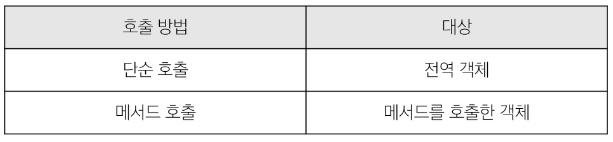

# 객체
## Object
- 키로 구분된 데이터 집합을 저장하는 자료형 (data collection)

### 객체 구조
- 중괄호 ('{ }')를 이용해 작성
- 중괄호 안에는 key : value 쌍으로 구성된 속성(property)를 여러 개 작성 가능
- key는 문자형만 허용
- value는 모든 자료형 허용
- 
```js
const user = {
  name : 'Alice',
  'key with space' : true, // 키 값에 공백이 필요하다면 '' 를 사용해 문자열 형태로 작성
  greeting : function () { // 객체 내부에서는 함수를 표현식으로 작성한다.
    return 'hello'
  },
}
// 조회
console.log(user.name)              // Alice
console.log(user['key with space']) // true - 공백이 있는 key 값은 대괄호를 사용해 valu에 접근

// 추가
user.address = 'korea'
console.log(user) // {name: 'Alice', key with space: true, address: 'korea', greeting: ƒ}

// 수정
user.name = 'Bella'
console.log(user.name) // Bella

// 삭제
delete user.name
console.log(user) // {key with space: true, address: 'korea', greeting: ƒ}

// in 연산자 - 속성이 객체에 존재하는지 여부를 확인
console.log('greeting' in user)  // true
console.log('country' in user)   // false

// 메서드 호출
console.log(user.greeting()) // hello
```

## Method
- 객체 속성에 정의된 함수
- object.method() 방식으로 호출
- 메서드는 객체를 '행동' 할 수 있게 함

### 'this' keyword
- 함수나 메서드를 호출한 객체를 가리키는 키워드
- 함수 내에서 객체의 속성 및 메서드에 접근하기 위해 사용
- 'this' 키워드를 사용해 객체에 대한 특정한 작업을 수행할 수 있음

JavaScript에서 this 는 함수를 **"호출하는 방법"**에 따라 가리키는 대상이 달라진다.


- JavaScript의 함수는 호출될 때 this를 암묵적으로 전달 받음
- this 함수가 "호출되는 방식" 에 따라 결정되는 현재 객체를 나타냄
- Python의 self 와 Java의 this 가 선언 시 이미 값이 정해진 것에 비해 JavaScirpt의 this 는 **함수가 호출되기 전까지 값이 할당되지 않고 호출시에 결정됨** (동적 할당)

### 구조 분해 할당
- 배열 또는 객체를 분해하여 객체 속성을 변수에 쉽게 할당할 수 있는 문법
- '함수의 매개변수'로 객체 구조 분해 할당 활용 가능

### 전개 구문
- 객체 복사
  - 객체 내부에서 객체 전개
- 얕은 복사에 활용 가능
```js
const obj = { b: 2, c: 3, d: 4 }
const newObj = { a: 1, ...obj, e: 5 }
console.log(newObj) // {a: 1, b: 2, c: 3, d: 4, e: 5}
```

### 객체 메서드
- Object.keys()
- Object.values()
```js
const profile = {
  name: 'Alice',
  age: 30
}

console.log(Object.keys(profile))   // ['name', 'age']
console.log(Object.values(profile)) // ['Alice', 30]
```

### Optional chaining ('?.')
- 속성이 없는 중첩 객체를 에러 없이 접근할 수 있는 방법
- 참조 대상이 null 또는 nudefined 라면 에러 발생 대신 평가를 멈추고 undefined를 반환
```js
// console.log(user.address.street) // Uncaught TypeError: Cannot read properties of undefined (reading 'street')
console.log(user.address?.street) // undefined

// console.log(user.nonMethod()) // Uncaught TypeError: user.nonMethod is not a function
console.log(user.nonMethod?.()) // undefined
```

- 참조가 누락 될 가능성이 있는 경우 연결된 속성으로 접근할 때 더 짧고 간단한 표현식으로 작성 가능
- 객체의 내용을 보다 편리하게 탐색할 수 있음

## 배열
### Array
- 순서가 있는 데이터 집합을 저장하는 자료구조
- 구조
  - 대괄호 ('[]') 를 이용해 작성
  - 요소의 자료형 제약 없음
  - length 속성을 사용해 배열에 담긴 요소 개수 확인 가능

### 배열 주요 메서드
- push / pop      : 배열 끝 요소를 추가 / 제거
- unshift / shift : 배열 앞 요소를 추가 / 제거

### Array Helper Methods
- 배열 조작을 보다 쉽게 수행할 수 있는 특별한 메서드 모음
- ES6에 도입
- 배열의 각 요소를 **순회**하며 각 요소에 대해 함수(**콜백함수**)를 호출
- 대표 메서드
  - forEach(), map(), filter(), every(), some(), reduce() 등
- 메서드 호출 시 인자로 함수(**콜백함수**)를 받는 것이 특징

## 콜백 함수
- 다른 함수에 인자로 전달되는 함수
- 외부 함수 내에서 호출되어 일종의 루틴이나 특정 작업을 진행

### forEach
- 배열 내의 모든 요소 각각에 대해 함수(콜백함수)를 호출
- 반환값 없음

### forEach 구조
```js
arr.forEach(callback(item[, index[, array]]))
```
- 3가지 매개변수로 구성
  1. item : 처리할 배열의 요소
  2. index : 처리할 배열 요소의 인덱스 (선택 인자)
  3. array : forEach를 호출한 배열 (선택 인자)
- 반환값
  - undefined

### map
- 배열의 모든 요소에 대해 함수를 호출하고, 반환 된 호출 결과 값을 모아 새로운 배열을 반환

### map 구조
```js
arr.map(callback(item[, index[, array]]))
```
- forEach의 매개변수와 동일
- 반환값
  - 배열의 각 요소에 대해 실행한 "callback의 결과를 모은 새로운 배열"

