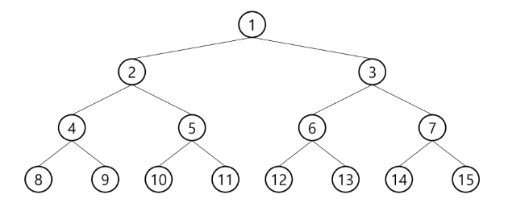
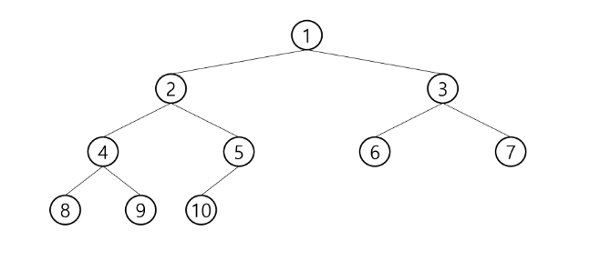
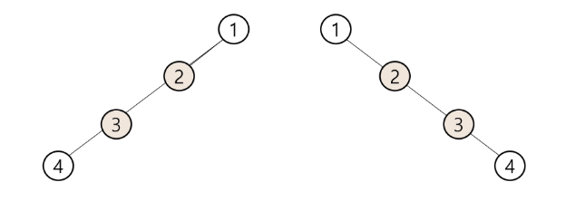

# 이진 트리
- 모든 노드들이 2개의 서브트리를 갖는 특별한 형태의 트리
- 각 노드가 자식을 최대한 2개 까지만 가질 수 있는 트리 
    - 왼족 자식 노드
    - 오른쪽 자식 노드
    
## 이진 트리 종류
### 포화 이진 트리 (Full Binary Tree)
- 모든 레벨에 노드가 포화상태로 차 있는 이진 트리
- 높이가 h일 때, 최대의 노드 개수인 (2^h+1)-1의 노드를 가진 이트리
  - 높이가 3 일때 (2^3+1) - 1 =15개의 노드 
- 루트를 1번으로 하여 (2^h+1)-1까지 정해진 위치에 대한 노드 번호를 가짐


  
### 완전 이진 트리 (Complete Binary Tree)
- 높이가 h이고 노드 수가 n개 일때, 포화 이진 트리의 노드 번호 1번부터 n번까지 빈 자리가 없는 이진 트리
img - 노드가 10개인 완전 이진 트리
  


### 편향 이진 트리 (Skewed Binray Tree)
- 높이 h에 대한 최소 개수의 노드를 가지면서 한쪽 방향의 자식 노드만을 가진 이진 트리
  - 왼쪽 편향 이진 트리
  - 오른쪽 편향 이진 트리
  


## 이진 트리 순회
- 순회란 트리의 각 노드를 중복되지 않게 전부 방문하는것으로 트리는 비선형 구조이기 때문에 선형구조에서와 같이 선후 연결 관계를 알 수 없으므로 특별한 방법이 필요함

- 순회 (traversal) : 트리의 노드를 체계적으로 방문하는 것
- 3가지의 기본적인 순회 방법
  - 전위순회(preorder traversal) : VLR
    - 부모노드 방문 후, 자식노드를 좌/우 순서로 방문
  - 중위순회(inorder traversal) : LVR
    - 왼쪽 자식노드, 부모노드, 오른쪽 자식노드 순서로 방문
  - 후위순회(postorder traversal) : LRV
    - 자식노드를 좌/우 순서로 방문한 후 부모노드를 방문
  
### 전위순회(preorder traversal) : VLR
- 수행 방법
  1) 현재 노드 n을 방문하여 처리 -> V
  2) 현재 노드 n의 왼쪽 서브트리로 이동 -> L
  3) 현재 노드 n의 오른쪽 서브 트리로이동 - > R
  
- 전위 순회 알고리즘
```python
def preorder_traverse(T): # 전위 순회
    if T:                 # 존재한다면
        visit(T)
        preorder_traverse(T.letf)   # 왼쪽  이동
        preorder_traverse(T.right)  # 오른족 이동
```

### 중위순회(inorder traversal) : LVR
- 수행 방법
 1) 현재 노드 n의 왼족 서브트리로 이동 -> L
 2) 현재 노드의 n을 방문하여 처리 -> V
 3) 현재 노도 n의 오른쪽 서브트리로 이동 -> R

- 중위 순회 알고리즘
```python
def inorder_traverse(T):
    if T:
        inorder_traverse(T.letf)
        visit(T)
        inorder_traverse(T.right)
```

### 후위순회(postorder traversal) : LRV
- 수행 방법
 1) 현재 노드 n의 왼족 서브트리로 이동 -> L
 2) 현재 노도 n의 오른쪽 서브트리로 이동 -> R
 3) 현재 노드의 n을 방문하여 처리 -> V

- 후위 순회 알고리즘
```python
def inorder_traverse(T):
    if T:
        inorder_traverse(T.letf)
        inorder_traverse(T.right)
        visit(T)
```

## 완전 이진 트리 노드 번호의 성질
- 노드 번호가 i 인 부모노드 번호 == i // 2
- 노드 번호가 i 인 노드의 왼쪽 자식노드 번호 == 2 * i
- 노드 번호가 i 인 노드의 오른쪽 자식노드 번호 == 2 * i + 1

