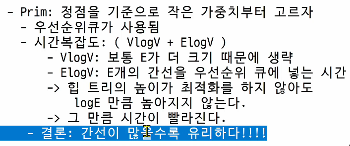
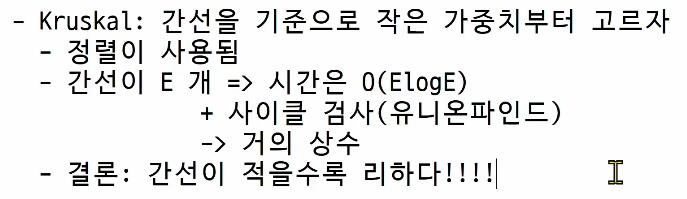

# 그래프 최소 비용문제
## 최소 비용 신장 트리 (MST)
- 그래프에서 최소 비용 문제
    1. 모든 정점을 연결하는 간선들의 가중치의 합이 최소가 되는 트리 (MST)
    2. 두 정점 사이의 최소 비용의 경로 찾기 (최단거리 문제)
    
- 신장 트리
    - n개의 정점으로 이루어진 무방향 그래프에서 n개의 정점과 n-1개의 간선으로 이루어진 트리
    - 하나의 그래프에서 여러 개가 나올 수 있다.
    - n이 3 이상일 때 사이클이 안 생긴다.
    

- 최소 신장 트리 (Minimum Spanning Tree)
    - 무방향 가중치 그래프에서 신장 트리를 구성하는 간선들의 가중치의 합이 최소인 신장 트리
    

### MST 구현 방법
1. Prim 알고리즘
    - 특정 정점을 기준으로 작은 것
    
2. Kruskal 알고리즘
    - 간선들을 기준으로 작은 것
    
## Prim 알고리즘
- 하나의 정점에서 연결된 간선들 중에 하나씩 선택하면서 MST 를 만들어가는 방식
    1) 임의 정점을 하나 선택
    2) 선택한 정점과 인접한 정점들 중 최소 비용의 간선이 존재하는 정점을 선택 (가중치가 가장 작은 것)
    3) 모든 정점이 선택 될 때 까지 1, 2 과정을 반복
    
- 서로소인 2개의 집합 (2 disjoint-sets) 정보를 유지
    - 트리 정점들(tree vertices) - MST를 만들기 위해 선택된 정점들
    - 비트리 정점들(nontree vertices) - 선택되지 않은 정점들
  
### 예시
[prim.py](../Algorithm_Problem_Solving/250320/prim.py)

## Kruskal 알고리즘
- 간선을 하나씩 선택해서 MST를 찾는 알고리즘
  1) 최초, 모든 간선을 가중치에 따라 오름차순으로 정렬
  2) 가중치가 가장 낮은 간선부터 선택해서 트리를 증가시킴
    - 사이클이 존재하면 다음으로 가중치가 낮은 간선 선택
        - union-find 활용 ( 같은 집합끼리 연결 하면 사이클이 발생 )
  3) n-1개의 간선이 선택될 때 까지 2를 반복
  
- 최소 신장 트리의 최소값은 항상 동일하지만 연결한 노드는 다를 수 있다. (동일한 가중치의 간선이 존재할 경우)

### 예시
[kruskal.py](../Algorithm_Problem_Solving/250320/kruskal.py)

### 프림 vs 크루스칼
- prim
    - 시간 복잡도 : O((V+E) log V)
    - 간선을 모두 고려하면서 우선순위 큐에 넣어야함
  

- kruskal 
    - 시간 복잡도 : 0(E log E)
    - 간선 위주로 정렬하는 시간만 필요
      

      

## 최단경로 (Dijkstra)
- 최단 경로 정의
    - 간선의 가중치가 있는 그래프에서 두 정점 사이의 경로들 중 간선의 가중치의 합이 최소인 경로
  
- 하나의 시작 정점에서 끝 정점까지의 최단 경로
    - 다익스트라(dijkstra) 알고리즘
        - 음의 가중치를 허용하지 않음 (음수 + 양수가 섞여있는 문제)
    - 벨만-포드(Bellman-Ford) 알고리즘
        - 음의 가중치 허용
  
- 모든 정점들에 대한 최단 경로 (임의의 정점들 중에서)
    - 플로이드-워샬(Floyd-Warshall) 알고리즘
  

### Dijkstra 알고리즘
- 시작 정점에서 거리가 최수인 정점을 선택해 나가면서 최단 경로를 구하는 방식
- 시작정점(s) 에서 끝정점(t) 까지의 최단 경로에 정점 x 가 존재한다.
- 이때, 최단경로는 s 에서 x 까지의 최단 경로와 x 에서 t 까지의 최단 경로로 구성된다.

- 그리디 기법을 사용한 알고리즘으르 MST의 프림 알고리즘과 유사.

- 시간 복잡도 : O((V + E) log V)