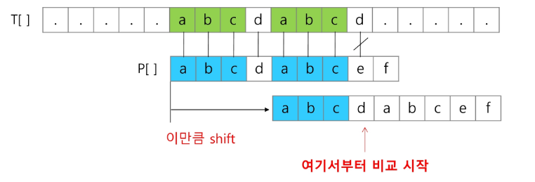
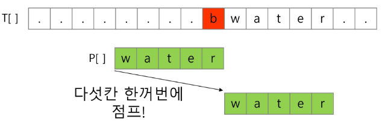
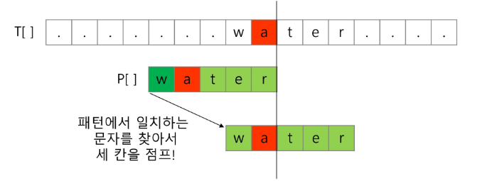
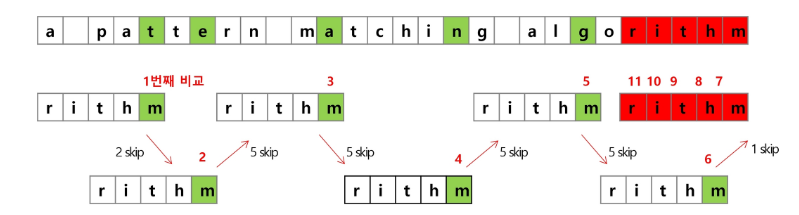

# 패턴 매칭에 사용되는 알고리즘
## 고지식한 알고리즘(Brute Force)
  - 본문 문자열을 처음부터 끝까지 차례대로 순회하면서 패턴내의 문자들을 일일이 비교하는 방식
  - 시간 복잡도
    - 최악의 경우 모든 패턴을 비교해야 하므로 O(MN)
    - [pattern_1](../Algorithm_Problem_Solving/250212/pattern_1.py)  

## KMP 알고리즘
  - 불일치가 발생한 텍스트의 앞 부분에 어떤 문자가 있는지 미리 알고 있으므로 불일치가 발생할 경우 앞 부분에 대해서는 비교하지 않고 매칭을 수행
  - 패턴을 전처리 하여 배열 next[M]을 구해 잘못된 시작을 최소화
    - next[M] : 불일치가 발생할 경우 이동할 다음 위치
 
      

 
  - 시간 복잡도
    - O(M+N)
    - [kmp](../Algorithm_Problem_Solving/250212/kmp.py)

## 보이어-무어 알고리즘
  - 오른쪽 끝에 있는 문자가 불일치하고 이 문자가 패턴 내에 존재하지 않는 경우, 이동거리는 패턴의 길이만큼 이동
  - 대부분의 상용 소프트웨어에서 채택하고 있는 알고리즘
 

    
 
  - 오른쪽 끝에 있는 문자가 불일치 하지만 이 문자가 패턴내에 존재할 경우
 

 

 

