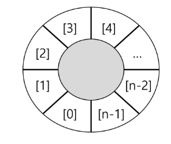
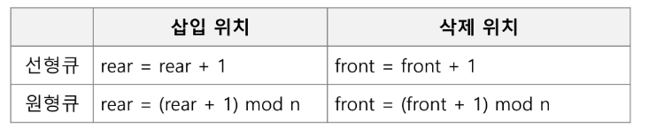
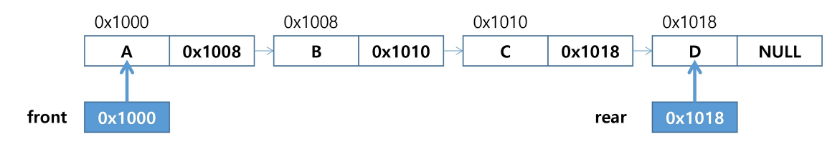
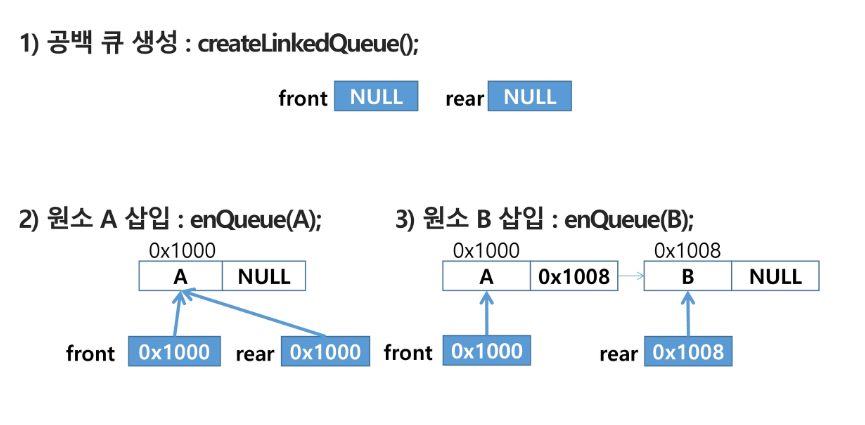
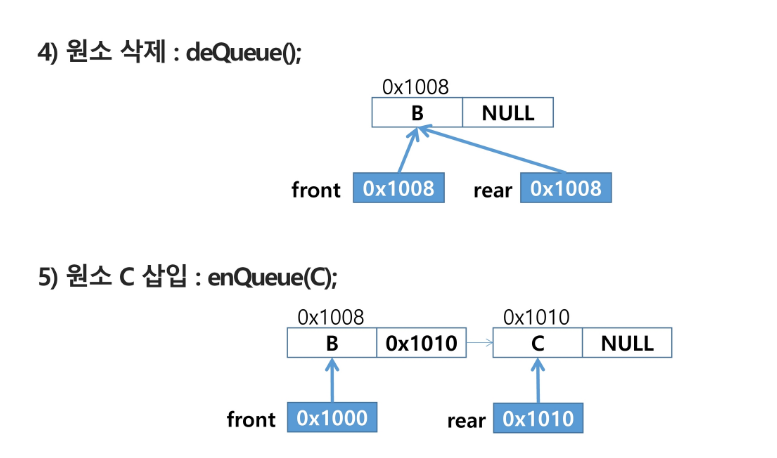

# Queue (큐)
### 큐의 특성
- 스택과 마찬가지로 삽입과 삭제의 위치가 제한적인 자료구조
    - 큐의 뒤에서는 삽입만 하고, 큐의 앞에서는 삭제만 이루어지는 구조
    
- 선입선출구조 (FIFO - First In First Out)
    - 큐에 삽입한 순서대로 원소가 저장되어, 가장 먼저 삽입된 원소는 가장 먼저 삭제된다.
    
### 큐의 선입선출 구조
- 머리(Front) : 저장된 원소 중 첫 번째 원소 (또는 삭제된 위치)
- 꼬리(Rear) : 저장된 원소 중 마지막 원소

### 큐의 기본 연산
- 삽입 : enQueue
- 삭제 : deQueue

### 큐의 사용을 위해 필요한 주요 연산
- enQueue(item) : 큐의 뒤쪽(rear 다음)에 원소를 삽입
- deQueue : 큐의 앞쪽(front)에서 원소를 삭제하고 반환
- createQueue() : 공백 상태의 큐를 생성
- isEmpty() : 큐가 공백인지 확인
- isFull() : 큐가 포화상태인지 확인
- Qpeek() : 큐의 앞쪽(front) 원소를 삭제없이 반환 (확인)

## 1. 선형 큐
- 1차원 배열을 이용한 큐
- 큐의 크기 = 배열의 크기
- front : 저장된 첫 번째 원소의 인덱스
- rear : 저장된 마지막 원소의 인덱스

### 상태 표현
- 초기상태 : front = rear = -1
- 공백상태 : front == rear
- 포화상태 : rear == n-1 (n: 배열의 크기, n-1: 배열의 마지막 인덱스)

### 초기 공백 큐 생성
- 크기가 n인 1차원 배열 생성
- front와 rear를 -1로 초기화
```python
# 큐 생성
queue = [0] * 3
front = rear = -1

```

### 선형 큐 삽입 : enQueue(item)
- 마지막 원소 뒤에 새로운 원소를 삽입하기 위해
  1) rear 값을 하나 증가시켜 새로운 원소를 삽입할 자리 마련
  2) 그 인덱스에 해당하는 배열원소 Q[rear]에 item을 저장
```python
# 1, 2, 3 enQueue
rear += 1
queue[rear] = 1     # enQueue 1

rear += 1
queue[rear] = 2     # enQueue 2

rear += 1
queue[rear] = 3     # enQueue 3
```

### 선형 큐 삭제 : deQueue()
- 가장 앞에 있는 원소를 삭제하기 위해
  1) front 값을 하나 증가시켜 큐에 남아있는 첫번째 원소로 이동
  2) 새로운 첫 번째 원소를 리턴함으로써 삭제와 동일한 기능
```python
# 1, 2, 3 deQueue
while front != rear:    # Queue에 원소가 남아있으면,
    front += 1          # front를 1 증가 시키고
    t = queue[front]    # t에 저장해서 활용
    print(t)
else:                   # Queue에 원소가 남아있지 않으면
    print("Queue is Empty")
```  

### 선형 큐 공백 및 포화 검사 : isEmpty() isFull()
- 공백 : front == rear
- 포화 : rear == n-1 (n:배열의 크기, n-1: 배열의 마지막 인덱스)

### 검색 : Qpeek()
- 가장 앞에 있는 원소를 검색하여 반환
- 현재 front의 한자리 뒤(front+1)에 있는 원소, 즉 첫 번째에 있는 원소를 반환

## 2. 원형 큐
- 선형큐를 이용해 원소의 삽입과 삭제를 계속 할 경우, 배열 앞 부분에 활용한 공간이 있음에도 
  rear = n-1인 호화상태로 인식하여 더 이상 삽입을 수행하지 않게된다. (포화상태로 잘못 인식)
  
### 해결방법 1.
- 매 연산이 이루어 질 때마다 저장된 원소들을 배열의 앞부분으로 모두 이동시킴
- 원소 이동에 많은 시간이 소요되어 큐의 효율성이 급격히 떨어진다.

### 해결방법 2.
- 1차원 배열을 사용하되, 논리적으로 배열의 처음과 끝이 연결되어 원형의 형태의 큐를 이룬다고 가정
- 원형 큐의 논리적 구조

  
### 원형큐 초기 공백 상태
- front = rear = 0

### 인덱스의 순환
- front와 rear의 위치가 배열의 마지막 인덱스 n-1을 가르킨 후 배열의 처음 인덱스인 0으로 이동해야함
- mod 연산자 활용

### front 변수
- 공백 상태와 포화 상태로 구분을 쉽게 하기 위해 front가 있는 자리는 사용하지 않고 항상 비워둠

### 삽입 위치 및 삭제 위치


### 원형 큐의 공백 및 포화 검사
- 공백 : front == rear
if (front+1) & n == rear : isEmpty
- 포화 : 삽입할 rear의 다음 위치 == 현재 front
  - (rear+1) % n == front
  - if (rear+1) % n == front : isFull
  
### 원형 큐 삽입
1) rear 값을 조정하여 새로운 원소를 삽입할 자리를 마련 (isFull이 아닐 때)
   - rear = (rear + 1) % n
2) 그 인덱스에 해당하는 배열원소에 item을 저장

### 원형 큐 삭제
1) front 값을 조정하여 삭제할 자리를 준비 (isEmpty가 아닐 때)
   - front = (front + 1) % n
2) 새로운 front 원소를 리턴

## 3. 연결 큐
### 단순 연결 리스트 (Linked List)를 이용한 큐
- 큐의 원소 : 단순 연결 리스트의 노드
- 큐의 원소 순서 : 노드의 연결 순서. 링크로 연결되어 있음
- front : 첫 번째 노드를 가리키는 링크
- rear : 마지막 노드를 가리키는 링크

### 상태 표현
- 초기 상태 : front = rear = null
- 공백 상태 : front = rear = null







### [참고] deque (덱)
- 컨테이너 자료형 중 하나
- deque 객체
  - 양쪽 끝에서 빠르게 추가와 삭제를 할 수 있는 리스트류 컨테이너
  
- 연산
  - append(x): 오른족에 x 추가
  - popleft(): 왼쪽 요소를 제거하고 반환, 요소가 없으면 IndexError
  
```python
from collections import deque

q = deque()
q.append(1)     # enQueue()
t = q.popleft() # deQueue()
```


## 4. 우선순위 큐 (Priority Queue)
### 우선순위 큐의 특성
- 우선순위를 가진 항목들을 저장하는 큐
- FIFO 순서가 아니라 우선순위가 높은 순서대로 먼저 나가게 된다.

### 우선순위 큐의 적용 분야
- 시뮬레이션 시스템
- 네트워크 트래픽 제어
- 운영체제의 테스크 스케줄링

### 우선순위 큐의 구현
- 배열을 이용한 우선순위 큐
- 리스트를 이용한 우선순위 큐

### 배열을 이용한 우선순위 큐
- 배열을 이용하여 자료 저장
- 원소를 삽입하는 과정에 우선순위를 비교하여 적절한 위치에 삽입
- 가장 앞에 최고 우선순위의 원소가 위치

### 문제점
- 배열을 사용하므로 삽입이나 삭제 연산이 일어날 때 원소의 재배치가 발생
- 소요되는 시간이나 메모리 낭비가 큼

## 큐의 활용 : 버퍼(Buffer)
### 버퍼
- 테이터를 한 곳에서 다른 한 곳으로 전송하는 동안 일시적으로 그 데이터를 보관하는 메모리의 영역
- 버퍼링 : 버퍼를 활용하는 방식 또는 버퍼를 채우는 동작을 의미

### 버퍼의 자료 구조
- 버퍼는 일반적으로 입출력 및 네트워크와 관련된 기능에서 이용
- 순서대로 입력/출력/전달되어야 하므로 FIFO 방식의 자류구조인 Queue 활용
