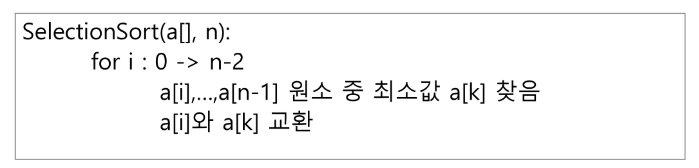
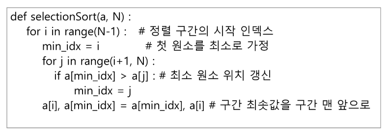

# 선택 정렬 (Selection Sort)
- 주어진 자료들 중 가장 작은 값의 원소부터 차례대로 선택하여 위치를 교호나하는 방식
  (오름차순의 경우)
  
## 정렬 과정
    1. 주어진 리스트 중 최소값을 찾는다.
    2. 그 값을 리스트의 맨 앞에 위치한 값과 교환한다.
    3. 맨 처음 위치를 제외한 나머지 리스트를 대상으로 1~2 과정을 반복한다.

## 시간 복잡도
    - O(n^2)
    
## 알고리즘
 
  
  
 
  
- 선택 정렬
 
  
  
 
  
# Selection Algorithm
- 저장되어 있는 자료로부터 k번째로 큰 혹은 작은 원소를 찾는 방법
- 최소값, 최대값 혹은 중간값을 찾는 알고리즘을 의미

## 선택 과정
- 셀렉션은 아래와 같은 과정을 통해 이루어짐
  1. 정렬 알고리즘을 이용하여 자료 정렬하기
  2. 원하는 순서에 있는 원소 가져오기
- 1번부터 k번째 까지 작은 원소들을 찾아 배열의 앞쪽으로 이동시키고, 배열의 k번째를 반환
- k가 비교적 작을 때 유용하며 O(kn)의 수행시간을 필요로 함