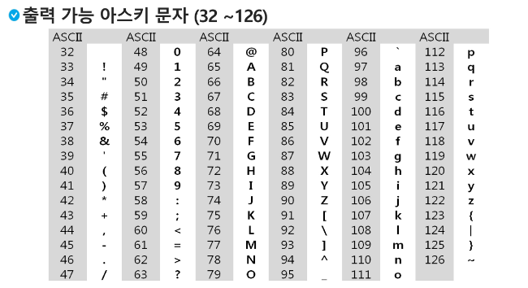
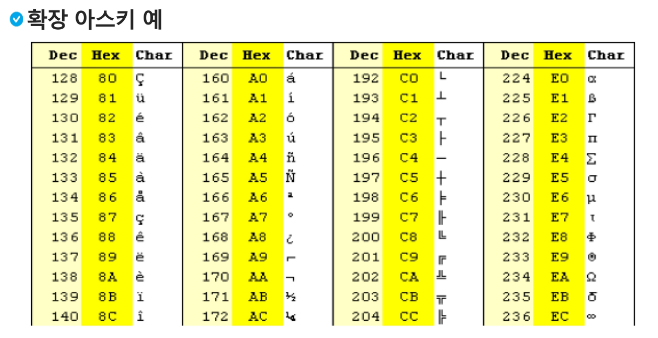
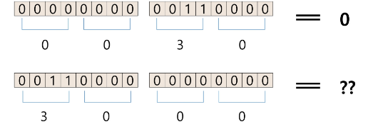
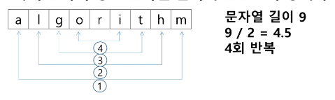

# 문자의 표현
- 네트워크가 발전되기 전 미국의 각 지역별로 코드 체계를 정해 사용하다가 네트워크(인터넷: 인터넷은 미국에서 발전했다.)가 발전하면서 서로 정보를 주고 받을 때 정보 해석이 달라지는 문제가 발생
하여 표준안을 제작하게 됐다. 
  
- 1967년 미국에서 ASCII(American Standard Code for Information Interchange)라는 문자 인코딩 표준이 재정 됨
- 7-bit 인코딩으로 128문자를 표현하며 33개의 출력 불가능한 제어 문자들과 공백을 비롯한 95개의 출력 가능한 문자로 이루어짐
 
  

 

- 확장 아스키는 표준 문자 이외의 악센트 문자, 도형 문자, 특수 문자, 특수 기호 등 부가적인 문자로 128개를 추가할 수 있게 하는 부호이다.
    - 표준 아스키는 7-bit를 사용하여 무자를 표현하는 것에 비해 확장 아스키는 1Byte내의 8-bit를 모두 사용함으로써 추가적 문자를 표현
    - 표준 아스키는 마이크로 컴퓨터 하드웨어 및 소프트웨어 사이에서 세계적으로 통용되지만 확장 아스키는 해독할 수 있도록 설계되어 있어야만 올바른 해독 가능
 

 

- 오늘날 대부분의 컴퓨터는 문자를 읽고 쓰는데 ASCII형식을 사용함
- 컴퓨터가 발전함에 따라 세계 각 국이 자국의 문자를 표현하기 위해 코드체계를 만들게 되면서 서로 정보를 주고 받을 때 자국의 코드체계를 타 국가가 가지고 있지 않으면 정보를 잘못 해석하는 오류가 발생
- 그래서 다국어 처리를 위한 표준 "유니코드"를 마련했다.

## big-endian, little-endian
 

 
## 유니코드 인코딩 (UTF: Unicode Transformation Format)
- UTF-8 (in web) # 가변 - 상대적으로 느림
    - MIN : 8bit , MAX : 32bit (1 Byte * 4)
    
- UTF-16 (in windows, java)
    - MIN : 16bit , MAX : 32bit (2 Byte * 2)
    
- UTF-32 (in unix) # 고정 - 상대적으로 빠름
    - MIN : 32bit , MAX : 32bit (4 Byte * 1)
    
## Python 인코딩
- 2.x 버전 - ASCII -> #-*-coding: utf-8-*- (첫 줄에 명시)
- 3.x 버전 - 유니코드 UTF-8 -> 생략 가능
- 다른 버전 인코딩 방식으로 처리 시 첫 줄에 작성하는 위 항목에 원하는 인코딩 방식을 지정해주면 된다.

## 문자열 뒤집기
- 자기 문자열을 이용할 경우 swap을 위한 임시 변수가 필요하며 반복 수행을 문자열 길이의 반만 수행해야 함
- 문자열 길이 9 일 경우 9/2 = 4.5 (4회 반복)
    for i in range(N//2):
   
  

 