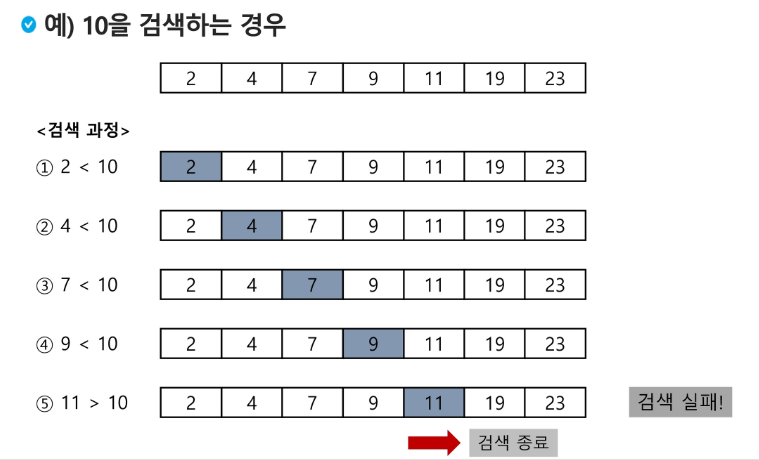

# 검색(Search)
- 저장되어 있는 자료 중에서 원하는 항목을 찾는 작업
- 목적하는 탐색 키를 가진 항목을 찾는 것
    - 탐색 키 (search key) : 자료를 구별하여 인식할 수 있는 키
    
- 검색의 종류
    - 순차검색 (sequential search)
    - 이진검색 (binary search)
    - 해쉬 (hash)
    
## 순차검색 (sequential search)
- 가장 간단하고 직관적인 검색 방법
- 배열이나 연결 리스트 등 순차구조로 구현된 자료구조에서 원하는 항목을 찾을 때 유용함
- 알고리즘이 단순하여 구현이 쉽지만 검색 대상의 수가 많으면 수행 시간이 급격히 증가하여 비효율적임

### 정렬이 되어있지 않은 경우
- 첫 번째 원소부터 순서대로 검색 대상과 키 값이 같은 원소가 있는지 비교
- 키 값이 동일한 원소를 찾으면 그 원소의 인덱스를 반환
- 자료구조의 마지막에 이를 때 까지 검색 대상을 찾지 못하면 검색 실패
    - sequential_search.py
    - sequential_search2.py
    
### 정렬되어 있는 경우
- 자료가 오름 차순으로 정렬 된 경우 
- 자료를 순차적으로 검색하면서 키 값을 비교하여 원소의 키 값이 검색 대상의 키 값보다 크면 찾는 원소가 없다는 것이므로 더 이상 검색하지 않고 검색을 종료
  - sequential_search3.py
 
  

 

## 이진검색 (Binary search)
- 자료의 가운데에 있는 항목의 키 값과 비교하여 다음 검색의 위치를 결정하고 검색을 진행하는 방법
  - 목적 키를 찾을 때 까지 이진 검색을 순환적으로 반복 수행 하며 검색 범위를 반으로 줄여가면서 보다 빠른 검색을 수행
- 이진 검색을 하기 위해서는 자료가 정렬된 상태여야 함

### 검색 과정
1. 자료의 중앙에 있는 원소를 고른다.
2. 중앙 원소의 값과 찾고자 하는 목표 값을 비교한다.
3. 목표 값이 중앙 원소의 값보다 작으면 자료의 왼쪽 반에 대해서 새로 검색을 수행하고, 크다면 자료의 오른쪽 반에 대해 새로 검색을 수행
4. 찾고자 하는 값을 찾을 때 까지 1~3 과정을 반복한다.
  - binary_seacrh.py

## 인덱스
- 원본 데이터 전체를 인덱스 탐색하면 오래 걸리기 때문에 필요한 컬럼을 가져와 정렬 한 뒤 탐색 후 원본의 인덱스를 찾아가면 빠르게 검색할 수 있다,
- 데이터베이스의 인덱스는 이진 탐색 트리 구조로 되어있다.
