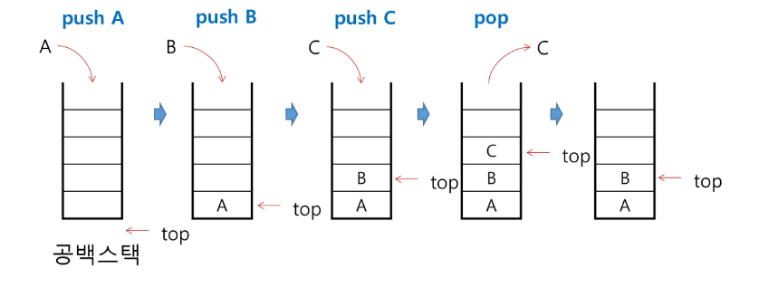
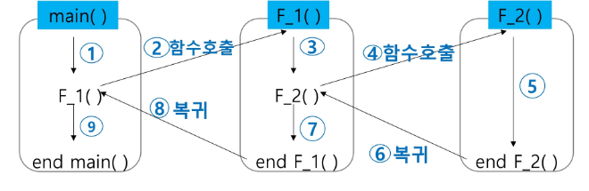
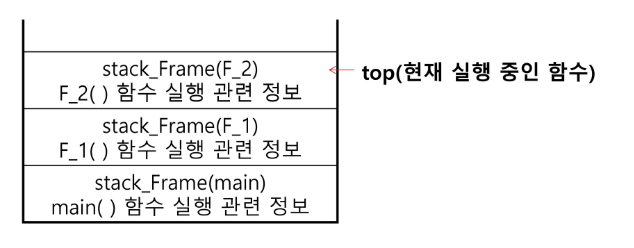
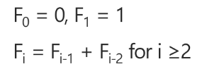

# Stack
## stack의 특성
- 물건을 쌓아 올리듯 자료를 쌓아 올린 형태의 자료구조
- 스택에 저장된 자료는 선형 구조를 갖는다.
    - 선형구조 : 자료 간의 관계가 1:1
    - 비선형 구조 : 자료 간의 관계가 1:N (ex. tree)
- 스택에 자료를 삽입하거나, 꺼낼 수 있다.
- 마지막에 삽입한 자료를 가장 먼저 꺼낸다.
    - 후입선출(LIFO - Last in First Out)
    - 1, 2, 3 순으로 자료 삽입 시 역순인 3, 2, 1 순으로 꺼낼 수 있다.
    
## 스택의 구현
### 필요한 자료구조와 연산
- 자료 구조 : 자료를 선형으로 저장할 저장소
    - 배열을 사용할 수 있음
    - 저장소 자체를 스택이라 부르기도 함
    - 스택에서 마지막에 삽입된 원소의 위치를 top(sp, stack pointer 등) 이라고 부른다.
    
- 연산
    - 삽입 : 저장소에 자료를 저장, 보통 "push" 라고 부른다.
    - 삭제 : 저장소에서 자료를 꺼냄, 삽입한 자료의 역순으로 꺼내고 보통 "pop" 이라고 부른다.
    - isEmpty : 스택이 비었는지 아닌지 확인
    - peek : 스택의 top에 있는 item(원소)를 반환

### 스택의 삽입/삭제 과정
- 빈 스택에 원소 A, B, C를 차례로 삽입 후 한번 삭제하는 연산 과정
<br>


<br>

### 스택의 push 알고리즘
- append 메소드를 통해 리스트의 마지막에 데이터를 삽입
```python
def push(item):
    s.append(item)
```

```python
def push(item, size)
    global top
    top += 1
    if top == size:
        print("스택이 가득 찼음") # 디버깅 목적
    else:
        stack[top] = item

size = 10           # 스택의 크기 설정
stack = [0] * size  # 스택 생성
top = -1            # 초기의 top 설정

push(10, size)

# 코드 중 간단하게 구현 시 아래와 같이 사용가능
top += 1            # push(20)의 의미
stack[top] = 20 
```

### 스택의 pop 알고리즘
```python
def pop():
    # 꺼낼 원소가 없을 경우
    if len(s) == 0:
        return 
    # 있으면 stack의 맨 마지막을 꺼냄
    else:
        return s.pop();
```

```python
def pop():
    global top
    if top == -1:
        print('underflow')
        return 0
    else:
        # top을 먼저 감소시킨 뒤 
        top -= 1
        return stack[top+1]

print(pop())

# 코드 중 간단하게 구현 시 아래와 같이 사용 가능
if top > -1: # pop()
    top -= 1
    print(stack[top+1])
```

## 스택 구현 시 고려 사항
- 1차원 배열을 사용하여 구현할 경우 구현이 용이하다는 장점이 있지만, 스택의 크기를 변경하기 어렵다
  - 이를 해결하기 위한 방법으로 저장소를 동적으로 할당하여 구현 (동적 연결리스트를 구현하는 것)
  - 동적 연결 리스트 : 구현이 복잡하지만 메모리를 효율적으로 사용함.

[스택 구현 연습문제](/DevStudy/TIL/Algorithm_Problem_Solving/250213/stack_1.py)

## 스택의 응용 1 : 괄호 검사
- 괄호의 종류 : 대괄호 ('[', ']'), 중괄호 ('{', '}'), 소괄호 ('(', ')')
- 여는 괄호가 나오면 스택을 쌓고, 닫는 괄호가 나오면 꺼낸 뒤 여는 괄호와 짝이 맞는지 확인
- 이 때, 스택이 비어있으면 조건 1 또는 조건 2 에 위배되고 괄호의 짝이 맞지 않으면 조건 3에 위배된다.
- 마지막 괄호까지 조사한 후에도 스택에 괄호가 남아 있으면 조건 1에 위배된다.
- 조건
  1. 외쪽 괄호 개수와 오른쪽 괄호 개수가 같아야 함
  2. 같은 괄호 왼쪽 괄호는 오른쪽 괄호보다 먼저 나와야 함
  3. 괄호 사이에는 포함 관계만 존재 함
  
[스택 괄호검사 연습문제](/DevStudy/TIL/Algorithm_Problem_Solving/250213/stack_2.py)

## 스택의 응용 2 : Function Call
### Function call
- 프로그램에서의 함수 호출과 복귀에 따른 수행 순서를 관리
  - 가장 마지막에 호출된 함수가 가장 먼저 실행을 완료하고 복귀하는 후입선출 구조
  - 스택을 이용하여 수행 순서를 관리
  - 함수 호출이 발생하면 호출한 함수 수행에 필요한 지역변수, 매개변수 및 수행 후 복귀할 주소 등의 정보를 스택 프레임에 저장하여 시스템 스택에 삽입
<br>



<br>

  - 함수의 실행이 끝나면 시스템 스택의 top 원소(스택 프레임)를 삭제, 프레임 저장되어 있는 복귀주소 확인 후 복귀
  - 함수 호출과 복귀에 따라 이 과정을 반복하여 전체 프로그램을 수행하고 종료 시 시스템 스택은 공백 스택이 된다.

## 재귀 호출
- 필요한 함수가 자신과 같은 경우, 자신을 다시 호출하는 구조
- 함수에서 실행해야 하는 작업의 특성에 따라 일반적인 호출방식보다 재귀호출방식을 사용해 함수를 만들면 프로그램의 크기를 줄이고 간단하게 작성 할 수 있다.
  
### n에 대한 factorial
- 1부터 n 까지의 모든 자연수를 곱하여 구하는 연산
```python
n! = n x (n-1)!
    (n-1)! = (n-1) x (n-2)!
    (n-2)! = (n-2) x (n-3)!
...
    2! = 2 x 1!
    1! = 1
```
  마지막에 구한 하위 값을 이용해 상위 값을 구하는 작업을 반복
  
### 피보나치 수열
- 0과 1로 시작하고 이전 두 수 합을 다음 항으로 하는 수열
  - 0, 1, 1, 2, 3, 5, 8, 13, ''''
  
- 피보나치 수열의 i번째 값을 계산하는 함수 F를 정의하면 다음과 같다.

  
- 위의 정으로부터 피보나치 수열의 i번째 항을 반환하는 함수를 재귀함수로 구현할 수 있다.

### 피보나치 수를 구하는 재귀함수
```python
def fibo(n):
    if n < 2:
        return n
    else:
        return fibo(n-1) + fibo(n-2)
```

