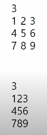

# Algorithm Problem Solving
# 250205
## APS 기본 학습 목표
- 입출력을 제외한 내장함수 사용하지 않기
- 기본적인 내장함수의 동작원리 이해 하기
- 좋은 알고리즘 이해하고 활용하기

## 알고리즘
- 문제를 해결하기 위한 절차나 방법.

- 의사코드와 순서도 크게 두 가지로 알고리즘을 표현
<br>


<br>

### 무엇이 좋은 알고리즘 인가?
1. 정확성 : 얼마나 정확하게 동작하는가
2. 작업량 : 얼마나 적은 연산으로 원하는 결과를 얻어내는가
3. 메모리 사용량 : 얼마나 적은 메모리를 사용하는가
4. 단순성 : 얼마나 단순한가
5. 최적성 : 더 이상 개선할 여지없이 최적화되었는가

### 알고리즘 성능 분석 필요
- 많은 문제에서 성능 분석의 기준으로 알고리즘의 작업량을 비교한다.
- 알고리즘의 작업량을 표현할 때 **시간복잡도**로 표현한다.
<br>


<br>

## 시간 복잡도 (Time Complexity)
- 실제 걸리는 시간을 측정
- 실행되는 명령문의 개수를 계산
<br>


<br>

### 시간복잡도 빅-오(O) 표기법
- 빅-오 표기법 (Big-O Notation)
- 시간 복잡도 함수 중에서 가장 큰 영향력을 주는 n에 대한 항만 표시
- 계수(Confficient) 는 생략하여 표시
<br>


<br>

### 시간 복잡도별 실제 실행 시간 비교
<br>


<br>

## 배열 (Array)
- 일정한 자료형의 변수들을 하나의 이름으로 열거하여 사용하는 자료구조
  
### 배열의 필요성
- 배열을 사용하면 하나의 선언을 통해 둘 이상의 변수를 선언할 수 있어 다수의 변수로 하기 힘든 작업을 배열을 활용해 쉽게 할 수 있다.

### 1차원 배열의 선언
```py
# 1차원 배열 선언의 예
arr = list()
arr = []
arr = [0] * 10 # 10칸짜리 일차원 배열

arr = [1, 2, 3]
```

### 1차원 배열의 접근
```py
arr[0] = 10 # 배열 arr의 0번 원소에 10을 저장
arr[idx] = 20 # 배열 arr의 idx번 원소에 20을 저장
```

### 배열 연습문제 1
- N 개의 양의 정수에서 가장 큰 수와 가장 작은 수의 차이 출력
[test_1.py](/TIL/Algorithm_Problem_Solving/0205/arr_test_1.py)

### 배열 연습문제 2
-  N개의 정수가 들어있는 배열에서 이웃한 M개의 합 계산
[test_2.py](/TIL/Algorithm_Problem_Solving/0205/arr_test_2.py)

## 정렬 (Sort)
- 2개 이상의 자료를 특정 기준에 의해 작은 값부터 큰 값 혹은 반대로 재배열 하는 것
- 키
  - 자료를 정렬하는 기준이 되는 특정 값
  
### 대표적인 정렬 방식
- 버블 / 카운팅 / 선택 / 퀵 / 삽입 / 병합

### 버블 정렬 (Bubble Sort)
- 인접한 두 개의 원소를 비교하며 자리를 계속 교환하는 방식
- 시간 복잡도
  - O(n^2)

# 250206
### 카운팅 정렬 (Counting Sort)
- 각 항목이 몇 개씩 있는지 세는 작업을 통해 선형 시간에 정렬하는 효율적인 알고리즘

- 제한사항
  - 정수나 정수로 표현할 수 있는 자료에 대해서만 적용 가능
  - 집합 내의 가장 큰 정수를 알아야 함

- 시간 복잡도
  - O(n+k) : n은 리스트 길이, k는 정수 최댓값

[counting_test_1.py](/TIL/Algorithm_Problem_Solving/0206/counting_test_1.py)

### 완전 검색
- 모든 경우의 수를 나열해 확인하는 기법
- Brute-force 혹은 generate-and-test 기법이라고 함
- 모든 경우의 수를 테스트 후 최종 해법을 도출
- 경우의 수가 상대적으로 작을 때 유용함
- 속도는 느리지만 해답을 찾아내지 못할 확률이 작다.

[permutation.py](/TIL/Algorithm_Problem_Solving/0206/permutation.py)

 
### 탐욕(Greedy) 알고리즘
- 최적해를 구하는 데 사용되는 근시안적인 방법
- 그 순간에 최적이라고 생각되는 것을 선택해 나가는 방식
- 최종 해답을 만들었다고 해서 그것이 최적이라는 보장은 없음
- 일반적으로 머릿속에 떠오르는 생각을 바로 구현하면 Greedy 접근이 된다.

### 탐욕 알고리즘 동작 과정
1. 해 선택 : 부분 문제의 최적의 해를 구한 뒤 이를 부분해집합에 추가
2. 실행 가능성 검사 : 새로운 부분해 집합이 실행 가능한지 확인 (문제의 제약 조건을 위반하지 않는지 검사)
3. 해 검사 : 새로운 부분해 집합의 해가 되는지 확인 (안된다면 1부터 반복)

[baby_gin.py](/TIL/Algorithm_Problem_Solving/0206/baby_gin.py)


# 2차원 배열
## 2차원 배열의 선언
- 1차원 List를 묶어놓은 List
- 2차원 이상의 다차원 List는 차원에 따라 Index를 선언
- 2차원 List의 선언 : 세로길이 (행의 수), 가로길이(열의 수)를 필요로 함
- Python 에서는 데이터 초기화를 통해 변수선언과 초기화 가능

## 2차원 배열 접근 & 저장
```python
arr = [[0, 1, 2, 3], [4, 5 ,6, 7]] # (2행 4열의 2차원 배열)
```
<br>


<br>

```python
N = int(input())
arr = [list(map(int, input().split())) for _ in range(N)]

N = int(input())
arr = [list(map(int, input())) for _ in rnage(N)]
```

### 배열 순회
- n X m 배열의 n * m 개의 모든 원소를 빠짐없이 조사하는 법

### 행 우선 순회


```py
arr = [[1 2 3], [4 5 6], [7 8 9]]

### 행 우선 순회
for i in range(N):      # 행
    for j in range(N):  # 열
        print(arr[i][j]) # arr[행][열]
        # 1 2 3 4 5 6 7 8 9
```

### 델타를 이용한 2차원 배열 탐색
- 2차 배열의 한 좌표에서 4방향 인접 배열 요소를 탐색하는 방법
- 인덱스 (i, j) 인 칸의 상하좌우 칸칸 (ni, nj)


## Jayden
### 전치 
matrix = [[1, 2, 3], [4, 5, 6], [7, 8, 9]]
reverse = list(map(list, zip(*matrix)))

### 90도 시계방향 회전
90_turn = list(map(list, zip(*matrix[::-1])))
