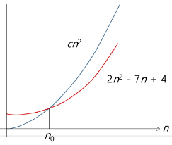
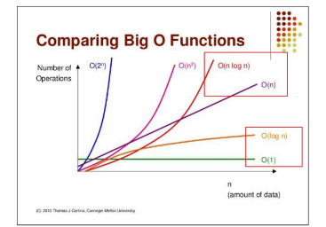

# 복잡도 분석
## 알고리즘의 효율
### 공간적 효율성과 시간적 효율성
- 공간적 효율성
    - 연산량 대비 얼마나 **적은 메모리 공간**을 요하는가?
    
- 시간적 효율성
    - 연산량 대비 얼마나 **적은 시간**을 요하는가?
    
- 효율성을 뒤집어 표현하면 복잡도(complexity)가 된다. 복잡도가 높을수록 효율성은 저하된다.

## 복잡도의 점근적 표기
- 시간(또는 공간) 복잡도는 입력 크기에 대한 함수로 표기하며 이 함수는 주로 여러개의 항을 가지는 다항식
- 이를 단순한 함수로 표현하기 위해 점근적 표기(Anymptotic Notation)를 사용
- 입력 크기 n이 무한대로 커질 때의 복잡도를 간단히 표현하기 위해 사용
    - O(Big-Oh)-표기
    - Ω(Big-Omega)-표기
    - Θ(Big-Theta)-표기
    
### O(Big-Oh) 표기
- 복잡도의 점근적 상한을 나타냄
- 복잡도가 f(n) = 2n^2-7n+4 라면 f(n)의 O-표기는 O(n^2)이다.
- 단순회된 함수 n^2에 임의의 상수 c를 곱한 cn^2이 n 증가함에 따라 f(n)의 상한이 된다. (단, c>0)

  
### 자주 사용하는 O-표기
- O(1) : 상수 시간
- O(logn) : 로그(대수)시간
- O(n) : 선형 시간
- O(nlogn) : 로그 선형 시간
- O(n ** 2) : 제곱 시간
- O(n ** 3) : 세제곱 시간

O(lonn) 은 O(1) 보다는 느리지만, 유사한 성능을 보인다고 결론을 낼 수 있다.
O(nlogn) 은 O(N) 보다는 느리자만, 유사한 성능을 보인다고 결론을 낼 수 있다.

