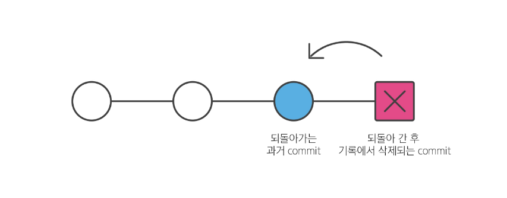
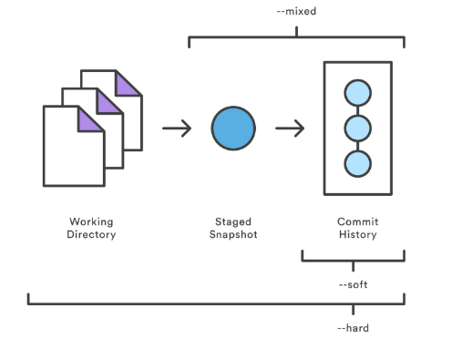

# Git Reset

- Git reset
    - 특정 commit 으로 되돌아가는 작업
    - 명령어 : git reset **[옵션] commit id**
    - 작동원리
        - 특정 commit으로 되돌아 갔을 때, 되돌아 간 commit 이후의 commit은 모두 삭제됨
        

    - 3가지 옵션
    - **--soft**, **--mixed**, **--hard**
    - reset은 과거 commit으로 돌아간 이후 commit들이 삭제 되지만, 삭제되는 commit들의 기록을 어떤 영역에 남겨둘 것인지 위 옵션을 활용해 조정할 수 있음
        - **--soft**
            - 삭제 된 commit의 기록을 staging area에 남김
        - **--mixed**
            - 삭제 된 commit의 기록을 working directory에 남김 (기본 옵션)
        - **--hard**
            - 삭제 된 commit의 기록을 모두 삭제, 남기지 않음
            

    