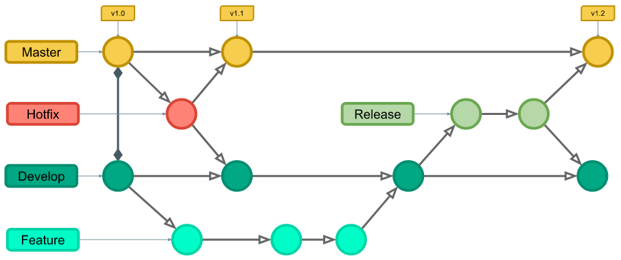

# Git Branch
## 장점
1. 독립 된 개발 환경을 형성하기 때문에 원본(master)에 대해 한전함.
2. 하나의 작업은 하나의 브랜치로 나누어 진행되므로 체계적으로 협업과 개발이 가능
    - dev라는 브랜치에서 다시 login 브랜치를 만든 뒤 작업을 진행하고 다른 작업을 해야하면 다시 dev에서 다른 브랜치를 만들어서 작업하는 방식
3. 손쉽게 브랜치를 생성하고 브랜치 사이를 이동할 수 있음

## 충돌이 발생 할 수 있음
- 시각 마커를 통해서 알려 줌 어떤 코드를 사용할지 지정 가능

# Git branch 명령어
**브랜치 조회, 생성, 삭제 등 브랜치와 관련된 git 명령어**
- git branch : 브랜치 목록 확인
- git branch -r : 원격 저장소의 브랜치 목록 확인
- git branch <브랜치 이름> : 새로운 브랜치 생성
- git branch -d <브랜치 이름> : 브랜치 삭제 (병합 된 브랜치만 삭제 가능)
- git branch -D : 브랜치 삭제 (강제 삭제)

**현재 브랜치에서 다른 브랜치로 HEAD를 이동시키는 명령어**
- git switch <다른 브랜치 이름> : 다른 브랜치로 전환
- git switch -c <브랜치 이름> : 새 브랜치 생성 후 전환
- git switch -c <브랜치 이름> <commit ID> : 특정 커밋에서 새 브랜치 생성 후 전환

# Git-flow 이해하기

- Git-flow는 Git 브랜치 관리 모델 중 하나로 하나의 프로젝트에서 팀원들이 원할하게 협업하기 위해 브랜치를 활용하는데 이 Git 브랜치를 쉽게 관리 할 수 있도록 적용한 모델.

- 핵심 브랜치
    - Master - 실제 서비스에 배포되는 브랜치
    - Develop - 새 버전에 대한 개발을 진행하는 브랜치
- 인스턴스 브랜치
    - Feature - 개발의 기본 단위인 기능을 추가하기 위한 브랜치 (Develop 에서 분리되어 Develop으로 머지)
    - Release - Develop에서 새 버전에 대한 개발이 마무리 되어 출시하기 위한 브랜치 (Develop 에서 분리되어 Master와 Develop으로 머지)
    - Hotfix - Master에서 생긴 버그를 급하게 해결하기 위한 브랜치 (Master에서 시작되어 Master와 Develop으로 머지)

- Master, Develop 브랜치는 실제 배포하거나 개발자들이 공유하기 위해 보존되는 브랜치
- Feature, Release, Hotfix 브랜치는 Develop 또는 Master 브랜치를 업데이트 하기위한 수단이 되는 브랜치

- 내용 출처 : https://goo-gy.github.io/2022-07-24-git-flow
- 이미지 출처 : https://www.campingcoder.com/2018/04/how-to-use-git-flow/