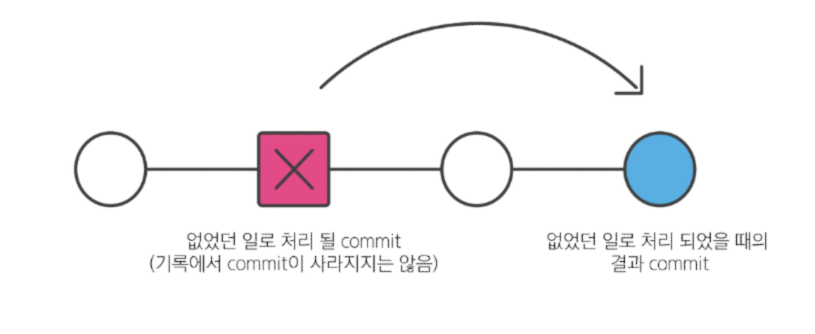

# Git Revert

- Git revert
    - 특정 commit을 없었던 일로 만드는 작업
    - 명령어 : git revert **commit id** 
    - 작동원리
        - 단일 commit을 없었던 일로 처리 후 그 결과를 새로운 commit으로 추가함.
        

- 변경 사항을 안전하게 실행 취소할 수 있도록 도와주는 순방향 실행 취소 작업
- commit 기록에서 commit을 삭제 또는 분리가 아닌 지정된 변경 사항을 기록하는 **새 commit을** 생성
- git 에서 기록이 손실되는 것을 방지하고 기록의 무결성과 협업의 신뢰성을 높이는 효과