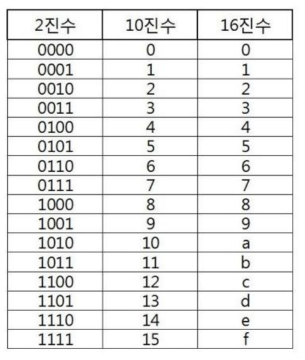

# 진수(진법)
- 숫자를 이용해 수를 셀 때, 자릿수가 올라가는 단위를 기준으로 하는 셈법의 총칭이다. 
  '위치기수법(positional numeral systems)'이라고도 한다.

## 2진수, 8진수, 10진수, 16진수
- 10진수 : 사람이 사용하는 진수, 수 하나를 0~9로 표현
- 2진수 : 컴퓨터가 사용하는 진수, 수 하나를 0, 1로 표현
- 8진수 : 2진수를 더 가독성 있게 사용
- 16진수 : 2진수를 더 가독성 있게 사용, 수 하나를 0,1 ... 8, 9, A, B, C, D, E, F로 표현

## 16진수를 사용하는 이유
- 2진수를 사람이 이해하기 편하도록 10진수로 변환 시
    - 인간이 이해하기는 편하지만 연산이 오래 걸린다.
    
- 16진수로 변환시
    - 인간이 이해하기 어렵지만 연산 속도가 매우 빠르다.
    
    ### 용어
    HEX : 16진수
    DEC : 10진수
    OCT : 8진수
    BIN : 2진수
  
## 진법 변환
- 원하는 타진법의 수로 나눈 뒤 나머지를 거꾸로 읽는다.

### 10진수 -> 2진수로 변환
- 10진수를 지속적으로 2로 나누어 구현
- 마지막에 list를 거꾸로 뒤집기

```python
tar = 149 
result = []

while tra != 0:
    result.append(tar % 2)
    tra //= 2

result.reverse()
print(result)

# 아래와 같음
bin(149)
```

### 2진수를 10진수로 변환
```python


int(x, base)
```

### 16 <-> 2 진수 변환
- 2진수, 16진수 변환은 연산이 많으나 2진수, 16진수간 변환은 연산이 없다.
- 표 참고
