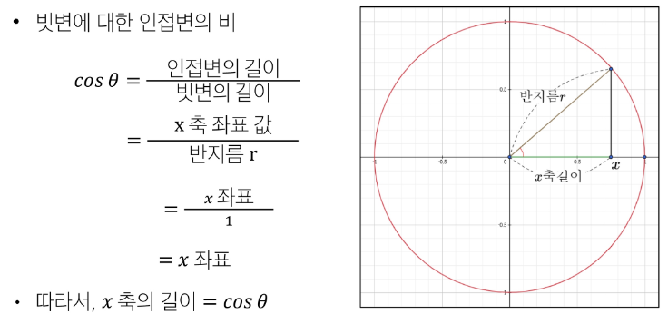
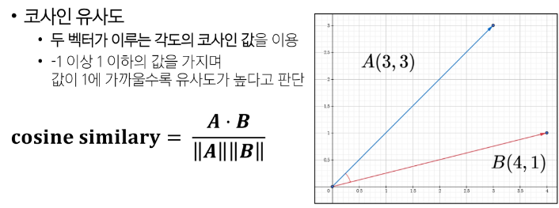
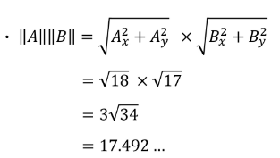
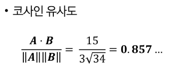
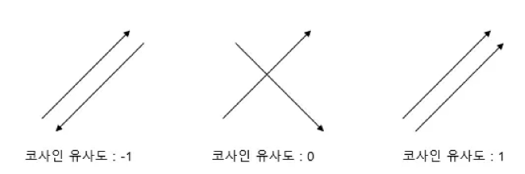

# 문서 유사도
- 여러 개의 문서(문장) 중 얼마나 "비슷한 내용을 담고 있는지"를 **수치로 표현**한 것

## 문서 유사도란
- 추천 시스템
  - 도서, 영화, 금융 상품 등에서 사용자의 관심사와 유사한 콘텐츠를 찾아 추천

- 검색 및 정보 탐색
  - 입력 쿼리(질문)와 유사한 문서를 빠르게 찾고, 검색 결과 품질을 높임

- 분류/군집 및 중복 검출
  - 뉴스 기사/논문 등이 서로 얼마나 유사한지 계산
      - 중복 기사 묶음 처리, 토픽별 문서 분류

- 의사 결정 지원
  - 방대한 문서(보고서, 계약서 등) 중 유사 문서나 핵심 정보를 신속히 파악 가능

## 문서 유사도 계산 방법
1. 코사인 유사도
  - 두 벡터가 이루는 각도의 코사인 값을 이용
  - -1 이상 1 이하의 값을 가지며 값이 1 에 가까울수록 유사도가 높다고 판단
2. 자카드 유사도
  - 두 집합의 교집합 크기를 합집합 크기로 나눈 값
  - 텍스트 유사도 측정시 단어 존재 여부만 고려
3. 유클리드 거리
  - 공간적 거리 측정 방식으로 n 차원 공간에서 두 점 사이의 직선 거리를 계산
  - 거리가 0에 가까울수록 유사도가 높다고 판단

## 코사인 유사도
### 벡터
- 여러 수치를 일렬로 나열
- "방향과 크기"를 나타내는 수학적 표현

### 코사인


### 코사인 유사도


- 두 벡터의 내적 계산
  - 동일 차원끼리 모두 곱한 후 모두 더한 값
  - (Ax * Bx) + (Ay * By) == (3 * 4) + (3 * 1) == 15

- 두 벡터의 크기(노름) 계산
  - 벡터의 크기는 피타고라스 정리를 이용
  - 각 좌표의 제곱의 합에 루트를 씌운 것
  - 





### 코사인 유사도 코드
```py
from numpy import dot           # 벡터 내적
from numpy.linalg import norm   # 벡터 크기

def cosine_similarity(A, B):
  return dot(A, B) / (norm(A) * norm(B))
```

### 카운트 기반 문서 유사도
- 코사인 유사도 방식을 사용하기 위헤서는 벡터 값이 필요함
- 주어진 데이터는 텍스트(문서) 형태의 데이터
- 텍스트 기반 데이터를 벡터 데이터로 변환할 수 있는 방법이 필요함

#### Bag of Words
- 고유 단어 추출
  - 불용어(조사, 접속사 등)를 제거 -> 더 높은 정확도

- 각 단어에 인덱스 부여
  - 사전순 혹은 등장 순서대로 인덱스를 부여

- 문자 별 각 단어의 등장 빈도수 기록
  - 문서 내 등장 횟수를 해당 단어의 인덱스 위치에 기록

### 카운트 기반 문서 유사도 한계점
- Bag of Words로는 문서 벡터 간 유의미한 유사도를 계산할 수 없다 (단순 등장 횟수 기반이기 때문)

## 임베딩 기반 문서 유사도
### 워드 임베딩
- 텍스트를 "의미"를 반영한 숫자 벡터로 변환하는 기법
- 임베딩 과정을 통해 서로 의미가 비슷한 단어/문장이 고차원 벡터 공간 상에서 가까이 위치하도록 학습 시킴
- 임베딩 된 벡터들은 서로 코사인 유사도 등으로 간단히 비교 가능하며 정교한 문서 간 유사도 계산이 가능해짐

### 데이터 전처리
- 토큰화 : 띄어쓰기(또는 형태소) 기준으로 분리
- 불용어 제거 : 벡터로 만들 필요가 없거나지나치게 많이 사용되는 단어 제거 (조사 등)
- 한글이 아닌 표현 (이모지, 꺽쇠 등) 제거

### 임베딩용 딥러닝 모델 사용
- Word2Vec, Doc2Vec 등

### Word2Vec
1. 분포 가설에 기반하여 단어의 의미를 벡터로 '학습'
  - 서로 비슷한 맥락에서 등장하는 단어들은 의미도 비슷하다.
2. 주변 단어를 보고 중심 단어를 맞히거나 학습하면 단어 간 의미 관계가 유사한 벡터로 학습
3. 학습 방식
  - CBOW : 주변 단어들을 입력으로 받고(맥락), **그 중심 단어를 예측**하는 방식
  - Skip-gram : 중심 단어를 입력으로 받고, **주변 단어들을 예측**하는 방식

### Word2Vec 활용
- 필요 라이브러리
  - Gensim
    - 자연어 처리 라이브러리
    - Word2Vec, Doc2Vec 등 임베딩 관련 알고리즘 지원
  - Konlpy
    - 한국어 자연어 처리(NLP) 특화 라이브러리
    - 형태소 분석기, 불용어 제거 등 기초 전처리 지원

1. 필요한 라이브러리 import
2. 데이터 수집
3. 데이터 전처리
  1. 불필요한 문자 제거
    - 데이터를 문장별로 분리 후 정규표현식을 통한 한글 외 문자 제거
  2. 토큰화 (문장을 단어로 분리)
    - 불용어 목록을 미리 정의 후 형태소 분석 진행 -> 정제된 단어로 토큰화

4. 한글 토큰을 100차원의 워드 임베딩 벡터로 변환
5. 가장 많은 빈도수를 보이는 단어 출력 후 결과 확인
  - 불용어 재정의 (불용어 처리 시 상황에 따라 적절한 처리가 필요함)
    - 언어별 특성을 반영해야하며, 문서/도메인 특성을 반영해야 함


### Doc2Vec
### 도큐먼트 임베딩
- 여러 단어로 이루어진 문자, 문서를 임베딩 하는 방법

- 문서별로 고유 문서 태그(문서 ID)를 부여
- Word2Vec과 유사하게 중심 단어 주변 단어를 예측
  - 문서(문장)를 대표하는 문서 태그를 은닉층에 함께 학습
  - 태그 임베딩이 문서를 대표하는 벡터가 됨

- 문서의 단어들을 입력 받고 Doc2Vec 모델을 사용하여 "문서 태그 + 단어 임베딩"을 동시에 업데이트

### Doc2Vec 활용
1. 필요한 라이브러리 import
2. 데이터 수집
3. 데이터 전처리
4. 한국어 문장을 임베딩 벡터로 변환
  - 한글 문장을 300차원 벡터로 변환하기 위한 Doc2Vec 모델 생성
  - alpha(학습률) : 모델이 학습을 통해 가중치를 업데이트 하는 정도
    - 학습률이 높을수록 가중치 업데이트가 크게 이루어짐
5. 모델이 학습할 문서 빌드 및 Doc2Vec 학습


## 생성형 AI 기반 임베딩
- GPT 계열 같은 대규모 언어 모델(LLM) 에서 제공하는 임베딩 기능 활용
  - LLM 은 이미 엄청난 텍스트 코퍼스로 사전 학습이 되어 있음
  - 복잡한 자연어 처리 불필요 (토큰화, 불용어 제거 등)

- 문장/문서를 입력하면 모델 내부의 숨은 표현을 활용해 의미가 반영된 벡터를 얻을 수 있음
- API로 텍스트 전달 => 임베딩 벡터 반환
  - Open AI, upstage 등


### OpenAI Embedding Model 활용
1. OpenAI client 및 문서 정보 정의
```py
from openai import OpenAI

# OpenAI API 키 설정
client = OpenAI(api_key="API_KEY")
passage_list = [
    "먹고 싶은 사과",
    "먹고 싶은 바나나",
    "길고 노란 바나나 바나나",
    "봄이 와서 날씨가 좋습니다",
]
```

2. OpenAI Embedding 요청
```py
# passage_list에 있는 각 문장을 벡터로 변환
response = client.embeddings.create(
    model="text-embedding-3-small",
    input=passage_list
).data
```

3. embedding 벡터만 추출
  - 문장이 각각 1536 차원 벡터로 변환되었음을 확인
```py
# 결과에서 'embedding' 벡터만 추출
passage_embedding_list = [item.embedding for item in response]

# 임베딩 차원 확인
# 문장이 각각 1536 차원 벡터으로 변환 되었음을 확인
print(len(passage_embedding_list[0]),
      len(passage_embedding_list[1]),
      len(passage_embedding_list[2]),
      len(passage_embedding_list[3]))

# 1536 1536 1536 1536
```

4. 문서간 코사인 유사도 분석
```py
from numpy import dot
from numpy.linalg import norm

def cosine_similarity(A, B):
    # 코사인 유사도 = (A 내적 B) / (A 길이 x B 길이)
    return dot(A, B) / (norm(A) * norm(B))

# 문서(문장)들 간의 코사인 유사도 출력
for i in range(len(passage_embedding_list)+1):
    for j in range(i+1, len(passage_embedding_list)):
        similarity = cosine_similarity(passage_embedding_list[i],
                                       passage_embedding_list[j])
        print(f'문서 {i+1}과 문서 {j+1}의 유사도 : {similarity}')

# 문서 1과 문서 2의 유사도 : 0.576752989913253
# 문서 1과 문서 3의 유사도 : 0.2569738830820692
# 문서 1과 문서 4의 유사도 : 0.24192071136918056
# 문서 2과 문서 3의 유사도 : 0.5222393629864581
# 문서 2과 문서 4의 유사도 : 0.1538771261942334
# 문서 3과 문서 4의 유사도 : 0.17555152019323236
```

## 생성형 AI 기반 임베딩 2
### upstage
- AI 솔루션 제공 플랫폼
- 구글 계정을 통해 회원가입
  - 개인용 api_key 가 예시에 작성되어 있음

### upstage 활용
1. Open AI API를 활용한 client 및 embedding 생성
```py
from openai import OpenAI

client = OpenAI(
    api_key="up_q9xQqZBLPBKGY3KMXIc6EBATuhfg1",
    base_url="https://api.upstage.ai/v1/solar"
)

response = client.embeddings.create(
    model = "embedding-passage",
    input = doc5_desc
).data

embedding_vectors = [i.embedding for i in response]
```

2. 응답 데이터에서 벡터 데이터 추출, 벡터 차원 확인
```py
# 임베딩 벡터 데이터만 리스트로 추출
embedding_vectors = [i.embedding for i in response]
# 생성된 벡터 데이터수 == 문서 수
print(len(embedding_vectors))
# 업스테이지 임베딩 모델의 벡터 차원 == 4096
print(len(embedding_vectors[0]))
```

3. 문서 간 코사인 유사도 계산 (sklearn 제공 consine_similarity 활용)
```py
from sklearn.metrics.pairwise import cosine_similarity

similarities = cosine_similarity(embedding_vectors, embedding_vectors)
print(similarities)
```

4. 유사도를 활용한 정렬
```py
# 첫번째 책의 각 책과의 유사도 정보 (index, 유사도)
sim_scores = list(enumerate(similarities[0]))

# 유사 기준 내림차순 정렬
sim_scores.sort(key = lambda x: x[1], reverse = True)

# 자기 자신은 제외한 상위 3개 문서 출력
print(sim_scores[1:4] )
```

### 임베딩 기반 문서 유사도 응용
- 데이터 고유의 값을 활용해 추천 기능 구현이 가능함
- 아래 예는 index를 활용한 유사 도서 추천

```py
books_titles = doc5_titles

def recommendations(title):
    # 책의 제목을 입력하면 해당 제목의 인덱스를 리턴받아 idx에 저장.
    if title in books_titles :
        idx=books_titles.index(title)
        similar_doc = similarities[idx]
    else :
        print("도서 정보가 존재하지 않습니다.")
        return []

    # 입력된 책과 줄거리(document embedding)가 유사한 책 3개 선정.
    sim_scores = list(enumerate(similar_doc)) # (index, 유사도) 튜플의 리스트
    sim_scores = sorted(sim_scores, key = lambda x: x[1], reverse = True) # 유사도 높은 순서로 sorting
    sim_scores = sim_scores[1:4] # 자기 자신은 제외한 상위 3개
    print(sim_scores)

    similar_books_titles = []
    # 유사한 책 제목 출력
    for index, book_info in sim_scores:
        title=books_titles[index]
        similar_books_titles.append(title)

    return similar_books_titles
```

## 참고
### pickle
- 파이썬 객체 구조의 직렬화와 역 직렬화를 위한 바이너리 프로토콜을 구현
