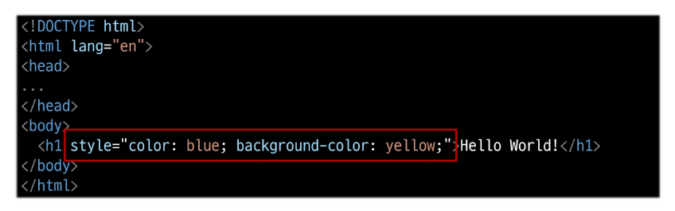
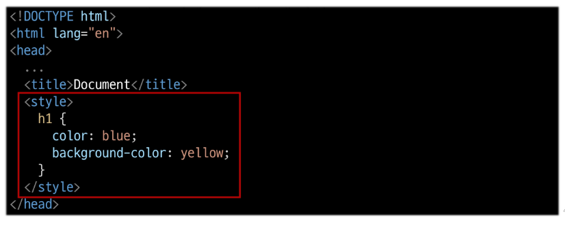
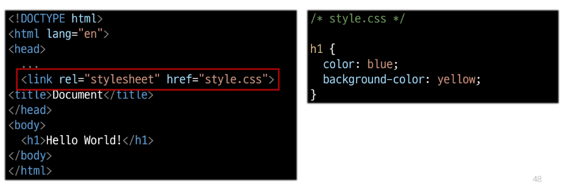
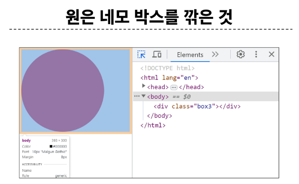
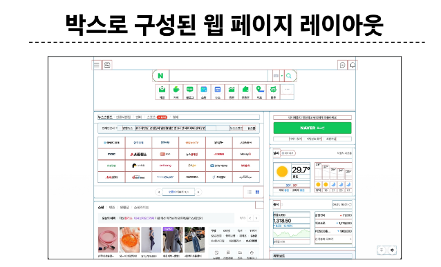
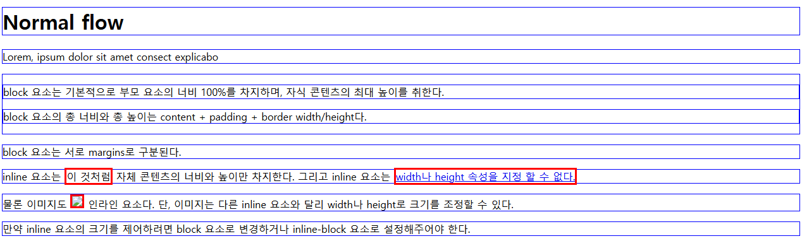

# Web

## World Wide Web (www)
- 인터넷으로 연결된 컴퓨터들이 정보를 공유하는 거대한 정보 공간

## Web
- Web site, Web application 등을 통해 사용자들이 정보를 검색하고 상호 작용하는 기술
    - Web site
        - 인터넷에서 여러개의 Web page가 모인것으로 사용자들에게 정보나 서비스를 제공하는 공간
      
    - Web page
        - HTML, CSS 등 웹 기술을 이용해 만들어진 "Web Site"를 구성하는 하나의 요소
    

## HTML
- **H**yper **T**ext **M**arkup **L**anguage
- 웹 페이지의 의미와 구조를 정의하는 언어
    - **Hypertext** 
        - 웹 페이지를 다른 페이지로 연결하는 링크
        - 비선형성 / 상호연결성 / 사용자 주도적 검색
    
    - **Markup****Language**
        - 태그 등을 이용하여 문서나 데이터의 구조를 명시하는 언어 (ex. HTML, Markdown)
    
### HTML 구조
- \<!DOCTYPE html>
    - 해당 문서가 html 문서라는 것을 나타 냄
    
- \<html>\</html>
    - 전체 페이지의 콘텐츠를 포함

- \<title>\</title>
    - 브라우저 탭 및 즐겨찾기 시 표시되는 제목으로 사용
  
- \<head>\</head>
    - HTML 문서에 관련된 설명, 설정 등 컴퓨터가 식별하는 메타데이터를 작성
    - 사용자에게 보이지 않음
    
- \<body>\</body>
    - HTML 문서의 내용을 나타냄
    - 페이지에 표시되는 모든 콘텐츠를 작성
    - 한 문서에 하나의 body 요소만 존재
    
### HTML Element (요소)
- 하나의 요소는 **여는 태그**, **닫는 태그** 그리고 그 안의 **내용(컨텐츠)** 으로 구성된다.
- 닫는 태그는 태그 이름앞에 슬래시가 포함됨. (\/)
    - 닫는 태그가 없는 태그도 존재한다 (보통 컨텐츠가 없음)
    
### HTML Attributes (속성)
- 사용자가 원하는 기준에 맞도록 요소를 설정하거나 다양한 방식으로 요소의 동작을 조절하기 위한 값으로 여는 태그에 작성
- 목적
    - 나타내고 싶지 않지만 추가적인 기능, 내용을 담고싶을 때 사용
    - CSS에서 스타일 적용을 위해 해당 요소를 선택하기 위한 값으로 활용
    
- 작성 규칙
    - 속성은 요소 이름과 속성 사이에 공백이 있어야 함
    - 하나 이상의 속성들이 있는 경우 속성 사이에 공백으로 구분
    - 속성 값은 열고 닫는 따옴표로 감싸야 함

### HTML Text structure
- HTML의 주요 목적 중 하나는 텍스트 구조와 의미를 제공하는 것
- 태그별로 의미하는 바가 있음 
  - 대표적인 HTML Text structure
    - Heading & Paragraphs
      - h1~6, p
    - Lists
      - ol, ul, li
    - Emphasis & Importance
      - em, strong

## CSS
- Cascading Style Sheet
- 웹 페이지의 디자인과 레이아웃을 구성하는 언어

### CSS 적용 방법
1. 인라인 (Inline) 스타일
   - HTML 요소 안에 Style 속성 값으로 작성
   - 
    
2. 내부 (Internal) 스타일 시트
   - head 태그 안에 style 태그에 작성
   - 
    
3. 외부 (External) 스타일 시트
   - 별도 CSS 파일 생성 후 HTML link 태그를 사용해 불러오기
   - 
    
### CSS Selectors
- HTML 요소를 선택하여 스타일을 적용할 수 있도록 하는 선택자
    - 기본 선택
        - 전체(*) 선택자
        - 요소(tag) 선택자
        - 클래스(class) 선택자
        - 아이디(id) 선택자
        - 속성(attr) 선택자
    
    - 결합자 (Combinators)
        - 자손 결합자 (" "(space))
        - 자식 결합자 (">")
    
### CSS Selectors 특징
- 전체 선택자 (*)
    - HTML 모든 요소를 선택
    
- 요소 선택자
    - 지정한 모든 태그를 선택
    
- 클래스 선택자 (',' (dot))
    - 주어진 클래스 속성을 가진 모든 요소를 선택
    
- 아이디 선택자 ('#')
    - 주어진 아이디 속성을 가진 요소 선택
    - 문서에는 주어진 아이디를 가진 요소가 하나만 있어야 함
    
### CSS 결합자 특징
- 자손 결합자 (" "(space))
    - 첫 번째 요소의 자손 요소들 선택
    - ex) p span은 
 안에 있는 모든 를 선택 (하위 레벨 상관 없이)
    
- 자식 결합자 (">")
    - 첫 번째 요소의 직계 자식만 선택
    - ex) ul > ui 은 <ul> 안에 있는 모든 <li>를 선택 (한 단계 아래 자식들만)
    
## Specificity (명시도)
- 결과적으로 요소에 적용할 CSS 선언을 결정하기 위한 알고리즘
- 선택자에 가중치를 계산하여 어떤 스타일을 적용할지 결정
    - 동일한 요소를 가리키는 2개 이상의 CSS규칙이 있는 경우 가장 높은 명시도를 가진 선택자가 승리하여 스타일이 적용됨

### 명시도 순서
1. Importance
    - !important
    
2. Inline 스타일
3. 선택자
    - id 선택자 > class 선택자 > 요소 선택자
    
4. 소스 코드 선언 순서

**!important**
- 다른 우선 규칙보다 우선하여 적용하는 키워드
- Cascade의 구조를 무시하고 강제로 적용하는 방식이므로 사용을 권장하지 않음

## CSS 상속
- 기본적으로 CSS는 상속을 통해 부모 요소의 속성을 자식에게 상속해 재사용성을 높임

### CSS 상속 2가지 분류
- 상속 되는 속성
    - Text 관련 요소 (font, color, text-align), opactiy(불투명도), visibility 등

- 상속 되지 않는 속성
    - 보통 레이아웃, 배치에 관련된 속성
    - Box model 관련 요소(width, height, border, box-sizing...) 등
    - position 관련 요소(position, top/right/bottom/left, z-index) 등
    
## CSS Box Model
- 웹 페이지의 모든 HTML 요소를 감싸는 사각형 상자 모델

  

### 박스 타입
<h4>Block Box
<h4>Inline Box
- 박스 타입에 따라 페이지에서의 배치 흐름 및 다른 박스와 관련하여 박스가 동작하는 방식이 달라짐

### 박스 표시(Display) 타입
- Outer display type
    - 박스가 문서 흐름에서 어떻게 동작할지 결정
    - 속성
        - block, inline
    
#### Outer display type - block 특징
- 항상 새로운 행으로 나뉨
- width와 height 속성 사용 가능
    - width 속성을 지정하지 않으면 박스는 항상 inline 방향으로 사용 가능한 공간을 모두 차지함
        - 상위 컨테이너 너비 100%로 채우는 것
    - 대표적인 block 타입 태그
        - h1~6, p, div 
    
#### Outer display type - inline 특징
- 새로운 행으로 넘어가지 않음
- width와 height 속성 사용 불가
- 수직 방향
    - padding, margin, border 가 적용되지만 다른 요소를 밀어낼 수 없음
    
- 수평 방향
    - padding, margins, borders 가 적용되어 다른 요소를 밀어낼 수 있음
    
- 대표적 inline 태그
    - a, img, span, strong, em
    
### Normal flow
- 일반적인 흐름 또는 레이아웃을 변경하지 않은 경우 웹 페이지 요소가 배치되는 방식

  
## MDN Web Docs
- Mozilla Developer Network에서 제공하는 온라인 문서로, 웹 개발자와 디자이너를 위한 종합적인 참고 자료
    - HTML, CSS, JavaScript, 웹 API, 개발도구 등 웹 기술에 대한 정보를 제공
    - 구글링 시 ! 검색어 맨 뒤 mdn을 같이 검색해 mdn 자료를 우선 참고 할 것.