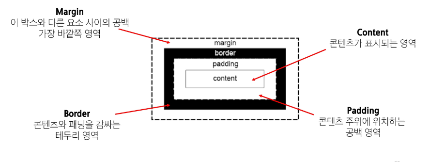
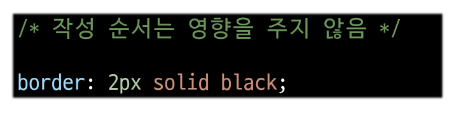
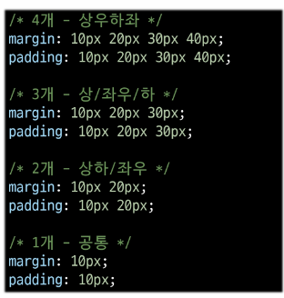
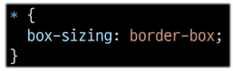
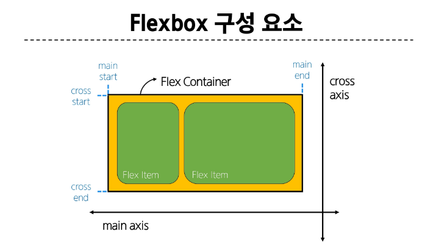

# Web2
### CSS Box Model
- 웹 페이지의 모든 HTML 요소를 감싸는 사각형 상제 모델
    - 내용(content), 안쪽 여백(padding), 테두리(border), 외부 간격(margin)으로 구성되어 요소의 크기와 배치를 결정
  

### shorthand 속성
- border
  - border-withd, border-style, border-color를 한 번에 설정하기 위한 속성

- margin & padding
  - 4방향 속성을 각각 지정하지 않고 한번에 지정할수 있는 속성
  

### box-sizing 속성
- 표준 상자 모델의 width와 height 속성 값을 설정하면 이 값은 content box의 크기를 조정하게 되는데 border 기준 크기에 맞춰 설정할 수 있다
- 대체 상자 모델로 변경
  - box-sizing 속성
  
  
    
### 기타 display 속성
  1. inline-block
  - inline과 block 요소 사이의 중간 지점을 제공하는 display 값
  - width 및 height 속성 사용 가능
  - padding, margin 및 border 로 인해 다른 요소가 상자에서 밀려남
  - 새로운 행으로 넘어가지 않음
    - 요소가 줄 바꿈 되지 않는 것을 원하지 않으면서 너비와 높이를 적용하고 싶은 경우

2. none
  - 요소를 화면에 표시하지 않고 공간조차 부여되지 않음

## CSS Layout
- 각 요소의 위치와 크기를 조정하여 웹 페이지의 디자인을 결정하는 것
  - Display, Position, Flexbox 등
  
### CSS Position
- 요소를 Normal flow 에서 제거하여 다른 위치로 배치하는 것
  - 다른 요소 위에 올리기, 화면의 특정 위체에 고정시키기 등 
  - 5가지 방향, z축이 존재함(겹쳤을 때 우선 순위)
  
### Position 유형
1. static - 기본
   - 요소를 Normal Flow에 따라 배치
    - top, right, bottom, left 속성이 적용되지 않음
2. relative - 상대 위치
   - 요소를 Normal Flow에 따라 배치
   - 자신의 d원래 위치(static)을 기준으로 이동
   - top, right, bottom, left 속성으로 위치를 조정
   다른 요소의 레이아웃에 영향을 주지 않음
3. absolute - 절대 위치
   - 요소를 가까운 Normal Flow에서 제거
   - 가장 가까운 relative 부모 요소를 기준으로 이동
      - 만족하는 부모 요소가 없다면 body 태그를 기준으로 함
   - top, right, bottom, left 속성으로 위치를 조정
   - 문서에서 요소가 차지하는 공간이 없어짐
4. fixed - 고정 위치
    - 요소를 가까운 Normal Flow에서 제거
   - 현재 화면 영역(viewport)을 기준으로 이동
   - 스크롤해도 항상 같은 위치에 유지됨
   - top, right, bottom, left 속성으로 위치를 조정
   - 문서에서 요소가 차지하는 공간이 없어짐
5. sticky
    - relative와 fixed의 특성을 결합한 속성
    - 스크롤 위치가 임계점에 도달하기 전에는 relative처럼 동작
    - 스크롤이 특정 임계점에 도달하면 fixed처럼 동작하여 화면에 고정됨
    - 다음 sticky 요소가 등장하면 이전 sticky 요소의 자리를 대체 (겹쳐지기 때문)
  
### z-index
- 요소의 쌓임 순서를 정의하는 속성
- 정수 값을 사용해 z축 순서를 지정
- 값이 클수록 요소가 위에 쌓이게 됨
- static이 아닌 요소에서만 적용

### z-index 특징
- 기본값은 auto
- 부모 요소의 z-index 값에 영향을 받음
- 같은 부모 내에서만 z-index 값을 비교
- 부모의 z-index가 낮으면 자식의 z-index가 아무리 높아도 부모 위로 올라갈 수 없음
- z-index가 같으면 HTML문서 순서대로 쌓임

### Position의 목적
- 전체 페이지에 대한 레이아웃 구성 보다는 페이지 특정 항목의 위치를 조정하는 것

## CSS Flexbox
- 요소를 행과 열 형태로 배치하는 1차원 레이아웃 방식
- 공간 배열 & 정렬
### 박스 표시(Display) 타입
2. Inner display type
    - 박스내부의 요소들이 어떻게 배치될지를 결정
    - 속성
        - flex
  
### Flexbox 구성 요소

- main axis (주 축)
    - flex item들이 배치되는 기본 축
    - main start에서 시작하여 main edn 방향으로 배치 (기본 값)
    
- cross axis (교차 축)
    - main axis에 수직인 축
    - cross start에서 싲가하여 cross end 방향으로 배치 (기본 값)
    
- Flex Container
    - display : flex; 혹은 display: inline-flex; 가 설정된 부모 요소
    - 이 컨터이너의 1차 자식 요소들이 Flex Item이 됨
    - flexbox 속성 값들을 사용하여 자식 요소 Flex Item들을 배치하는 주체
    
- Flex Item
    - Flex container 내부에 레이아웃 되는 항목
    
### Flexbox 속성
- Flex Container 관련 속성
  - display, flex-direciton, flex-wrap ...
- Flex Item 관련 속성
    - align-self, flex-grow, flex-basis, order ...
    
### 목적에 따른 속성 분류
- 배치 : flex-direction(축), flex-wrap(래핑)
- 공간 분배 : justify-content(주축), align-content(교차축)
- 정렬 : align-items, align-self

#### flex-grow
- 남은 행 여백을 비율에 따라 각 flex item에 분배
    - 아이템이 컨테이너 내에서 확장하는 비율을 지정
    
#### flex-basis
- flex item의 초기 크기값을 지정
- flex-basis와 width값을 동시에 적용한 경우 flex-basis가 우선

### flex-wrap 응용
#### 반응형 레이아웃
- 다양한 디바이스와 화면 크기에 자동으로 적응하여 콘텐츠를 최적으로 표시하는 웹 레이아웃 방식
