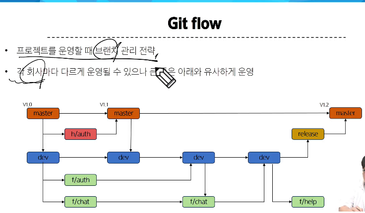

# 기획과 설계
## 기획 (Planning)
- 프로젝트 목표와 전략을 수립하는 과정

## 설계 (Design)
- 기획된 목표를 구현하기 위한 구조와 방법을 정의하는 과정

## 요구사항 분석
- 사용자와 이해 관계자의 필요, 요구를 수집하고 명세화하는 과정
  - 무엇을 어떻게 해야하는지를 정의
  - 기획 단계에서 설정된 목표를 구체적 실혱 계획으로 전환
  - 설계 단계의 정확성과 효율성 확보

- 기능적 요구사항
  - 이메일로 가입 가능해야 함
  - 상품 목록을 페이지네이션해서 보여줘야 함 등

- 비기능적 요구사항
  - 로딩시간 N 초 이내 등

- 핵심 기능 식별
  - 시스템이 꼭 해야 할 기능 과 추가될 수 있는 기능을 구분
    - 우선순위를 매겨 무엇부터 구현할지 결정

- 사용자 정의
  - 사용자 유형(페르소나) 설정
  - 그들이 서비스를 어떻게 사용할지(사용자 여정) 파악

- 제약 사항 파악
  - 기술(사용할 스택), 일정(개발 기간), 예산, 법적 요건 등

## 아키텍처와 기술스택 결정
### 아키텍처 결정의 의미
- 유지 보수성과 확장성 확보
  - 팀 역할 분담 명확화

- 스택 선택 기준
  - 학습 곡선
  - 커뮤니티 지원
  - 성능 

## 프로젝트 구조 및 코드 컨벤션
- 코드 가독성/유지 보수성을 확보
  - 팀원 간 협업 시 혼선을 최소화하여 업무의 효율화

- 필요에 따라 각 기능별로 폴더의 구조화 작업
- 네이밍 컨벤션
  - 핵심은 일관된 스타일을 유지하는 것
  - 협업 시 작업 편의성이 증가되고 응답 데이터의 네이밍 컨벤션 준수 시 업무 효율성 증가

## 프로젝트 세부 설계 과정
1. 라우팅 설계
  - Route Tree 구상
  - 중첩 라우팅 vs 단일 라우팅 결정
  - 라우터 가드 전력
  - RESTful URL 설계

2. 상태 관리 계획
  - 로컬 컴포넌트 상태 vs 전역 상태 분리 기준
    - 어떤 데이터를 pinia에 두어야 할까
    - 로컬 상태 : 단일 컴포넌트가 독립적으로 관리하고, 부모/자식 간 props/emits 로 소통
    - 전역 상태 : 여러 곳에서 읽고 쓰는 값
  - 성능 고려하기
    - lazy-loading store

3. 컴포넌트 분리 및 책임 정의
  - View 컴포넌트 vs UI 컴포넌트 구분
  - 하나의 컴포넌트는 하나의 역할만 책임
  - Props/Emits 설계
    - 데이터 소유 주체 명확하게 하기

4. API 설계 및 연동 구조
  - BackEnd API 문서화
    - 응답 데이터 명세서 작성
  - AJAX 기술 결정
    - 공통 인스턴스 설정 (API_URL, headers 등)
    - 올바른 예외 / 예외 처리

5. UI/UX 스타일 가이드
  - 디자인 시스템
    - 컬러, 타이포그래피, Spacing 정리
    - 응답 데이터 명세서 작성
  - 전역 CSS vs Scoped CSS
  - 공통 레이아웃 (Header, Footer) 컴포넌트
  - 스타일 가이드 문서 (Figma)

6. GIT Flow
  - 원할한 협업과 버전관리를 위해 사용하는 브랜치 관리 전략
  - 
   

7. 문서화
  - Notion 등으로 문서화 방안
    - 일정 관리 (작업 진행도 등)
    - 업무 분담 (담당자 배정)
    - API 문서화 대체
    - 전반적인 기획안
  - README.md 작성

### README
- "프로젝트의 얼굴" 이자 "사용자/기여자 안내서" 역할
- 설치/실행 방법부터 주요 기능 사용법 까지 README 에서 바로 참고 가능
- 변경 이력, 지원 버전, 라이선스 정보를 기록 -> 유지 보수에 편리
- GitHub 등에서 README를 통해 검색 결과 상위 노출 가능

