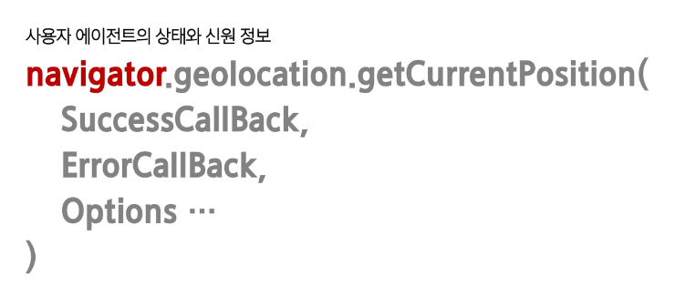
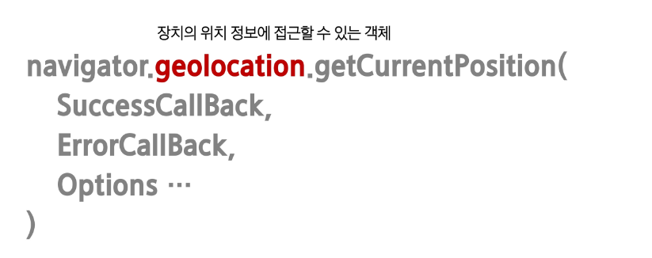
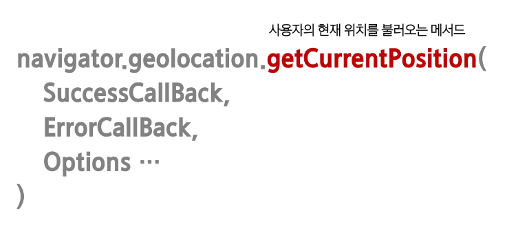
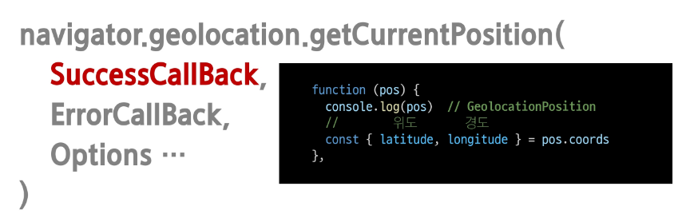
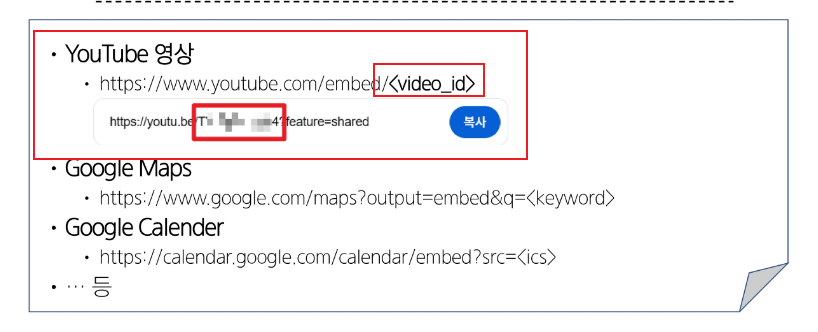
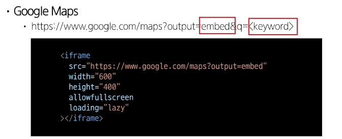
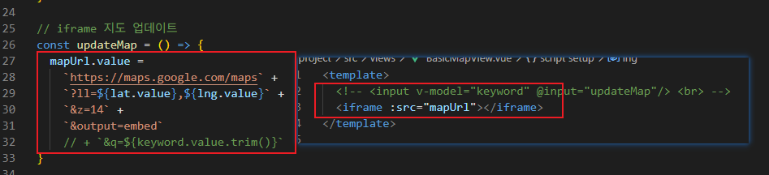

# Geolocation API
- 사용자의 현재 위치 정보를 브라우저를 통해 간편하게 얻을 수 있는 인터페이스
  - 지도, 내비게이션, 위치 기반 서비스 등 구현
  - 
  <br>

  - 
  <br>

  - 
  <br>

  - 
  <br>


# iframe
- inline Frame 의 줄임말
- HTML 문서 안에 또 다른 HTML 문서를 삽입하는 태그
- 외부 페이지를 현재 페이지에 임베드(embedded) 할 때 사용

## iframe 기본 문법
- src
  - 삽입할 문서의 URL
- width, height
  - iframe 크기
- allowfullscreen
  - 전체화면 전환 허용 여부
- loading
  - lazy 설정 시 화면에 보여야 할 때 최초 로딩

## iframe 활용 예시
  - 
  <br>

  - 
  <br>

  - 
  <br>

## jsdiff
- 이전 텍스트와 새 텍스트를 받아 두 텍스트의 차이를 구분
  - JavaScirpt 로 텍스트 구분을 구현

### 패키지 설치
```bash
$ npm install diff
```

### diff 메서드 종류
- Diff.diffChars(oldStr, newStr[, options])
  - 두 텍스트를 비교해 각 문자를 토큰으로 취급

- Diff.diffWords(oldStr, newStr[, options])
  - 두 텍스트를 비교해 각 단어와 구두점을 토큰으로 처리

- Diff.diffWordsWithSpace(oldStr, newStr[, options])
  - 두 텍스트를 비교하여 각 단어, 구두점, 줄 바꿈 또는 공백을 토큰으로 처리
